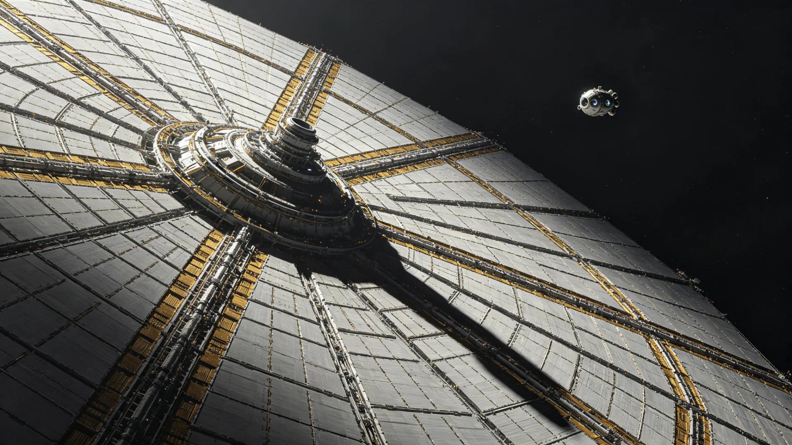

# 跨星系光帆中继站第九代帆面热控与原位老化检测技术报告

**报告单位**：三恒星系文明联合体跨星系通信工程署
**检测对象**：跨星系光帆脉冲通信阵列第八代中继站（见GS-3127-01）首批布设之第十二号、第十七号节点
**报告日期**：3203年4月12日
**密级**：工程公开

## 一、检测背景

跨星系光帆脉冲通信阵列自第三代起以光帆为中继节点，将光脉冲接力转发于三恒星系与第四恒星系之间。第八代节点于3127年前后批量布设（见GS-3127-01），至3203年已在轨七十余年。光帆帆面长期承受恒星直射、微流星撞击与原子氧侵蚀，其反射率与姿态稳定性逐年衰减。第五代量子链路升级（见GS-3160-01）对中继站光程精度提出更高要求，旧帆面若继续使用，将使跨系脉冲误码率逼近告警阈值。本次检测即在上述背景下进行。

## 二、检测方法

1. **原位光学检测**：由检测船"察微"号贴近帆面至五十米，以窄带激光扫描帆面全幅，逐格测量反射率与表面粗糙度；
2. **姿态热振测试**：在不同恒星张角下记录帆面微振动频谱，与3127年出厂基线比对；
3. **抽样回收**：经联合体航行安全程序（见GS-2986-01）批准，将第十二号节点一块0.4平方米试验帆片以回收舱取回地面，在真空舱内作拉力疲劳与原子氧侵蚀比对；
4. **误码率实测**：以第四恒星系方向下行链路连续七十二小时采集脉冲误码率，与预测模型对照。

## 三、检测数据

| 检测项 | 出厂基线(3127) | 第十二号节点(3203) | 第十七号节点(3203) | 限值 |
|---|---|---|---|---|
| 帆面平均反射率 | 94.2% | 86.1% | 87.5% | ≥85% |
| 表面粗糙度增量(纳米) | 0 | 18 | 14 | ≤25 |
| 姿态微振动幅度 | 基准 | +19% | +12% | ≤+20% |
| 光程误差(纳秒) | 基准 | +3.1 | +2.4 | ≤4.0 |
| 下行误码率 | 1.2e-6 | 8.7e-6 | 6.9e-6 | ≤1.0e-5 |

抽样回收帆片断面显示：帆面聚合物表层出现约两微米厚之原子氧侵蚀层，微流星撞击留下直径0.1至0.8毫米之凹坑一百余处，最深一处穿透表层三分之二，未伤及承力层。

## 四、结论与处置建议

1. 第十二号、第十七号节点整体仍在限值之内，但第十二号节点反射率已逼近85%下限，姿态微振动亦近+20%，建议在3204年内更换为第九代帆面；
2. 第九代帆面在聚合物表层外增镀一层原子氧阻挡膜，并将承力纤维加粗，检测船预测试可使反射率七十年衰减控制在六个百分点以内；
3. 鉴于第四恒星系方向时延较长，更换作业宜利用现有货运航班（见GS-3222-01）顺次实施，不必专设工程航线；
4. 其余同批第八代节点，按本次数据补做在轨反射率抽测，劣化接近限值者列入3205—3207年更换计划。

## 四点五代节点与第九代对比

| 项目 | 第八代(3127) | 第九代(预计3204换装) |
|---|---|---|
| 表层材料 | 聚酰亚胺 | 聚酰亚胺+原子氧阻挡膜 |
| 承力纤维 | 基准直径 | 加粗12% |
| 设计寿命 | 七十年 | 一百二十年 |
| 预计反射率七十年衰减 | 约八个百分点 | 不超过六个百分点 |
| 在轨维护周期 | 十年 | 二十年 |

检测船"察微"号在帆面五米距离测得，旧帆面在恒星直射区局部温度达一百零六摄氏度，边缘区仅零下四十余摄氏度，温差达一百四十度，此为聚合物表层疲劳之主因。第九代帆面在受热区增设微流道水冷（工质为常压水蒸气），预期可将直射区温度压至八十摄氏度以内。

## 五、遗留事项

本报告未涉及量子纠缠链路（见GS-2910-01）之同步检测，该部分由通信署量子组另立报告。回收帆片已封存于文枢中心工程实物库（见GS-3015-01），供后续材料比对。

## 六、对航道整体的影响

本次检测之意义，不止于更换两个节点。第九代帆面若按检测结论批量换装，跨系光程中继之误码率可望再降一个量级，为下一代量子通信（见GS-3160-01）与跨系政务专线（见GS-3003-01）预留余量。检测船"察微"号在作业中未干扰正常航道，周边货运艇按罗盘系统（见GS-3028-01）绕行，未发生剐蹭（对照GS-3128-01类事故）。报告末尾强调：帆面是消耗品，老化检测应制度化，不可等到误码告警再修。

## 七、更换计划与运力影响

按检测结论，第十二号节点列入3204年更换，其余同批节点补做在轨反射率抽测。更换作业借货运航班顺次实施，不专设工程航线，对跨系货运（罗盘系统，见GS-3028-01）影响降至最低。通信署测算：若第九代帆面全批换装，跨系光程中继误码率可再降一个量级，政务专线（见GS-3003-01）与量子通信（见GS-3160-01）将更稳。检测船"察微"号作业期间未干扰航道，周边货艇按调度绕行。本报告数据存文枢（见GS-3015-01），供后续材料比对。

## 八、检测成本与归档

本次检测由"察微"号在轨作业二十三日，动用窄带激光扫描、真空舱比对与回收舱回送。检测成本经财政署（见GS-3007-01）核定，列为跨系通信基础设施年度维护项。回收帆片断面、显微照片与误码率原始数据，全部存文枢工程实物库（见GS-3015-01），编号归档，供后续第九代帆面批量换装时对照。通信署说明：帆面老化非突发事故，而是慢性衰退；把检测做在告警之前，正是工程成熟之处。

---

**检测负责**：通信工程署光帆组 闻人卓
**审核**：通信工程署总工程师室
**日期**：3203年4月12日
**报告编号**：OPT-SAIL-3203-012
