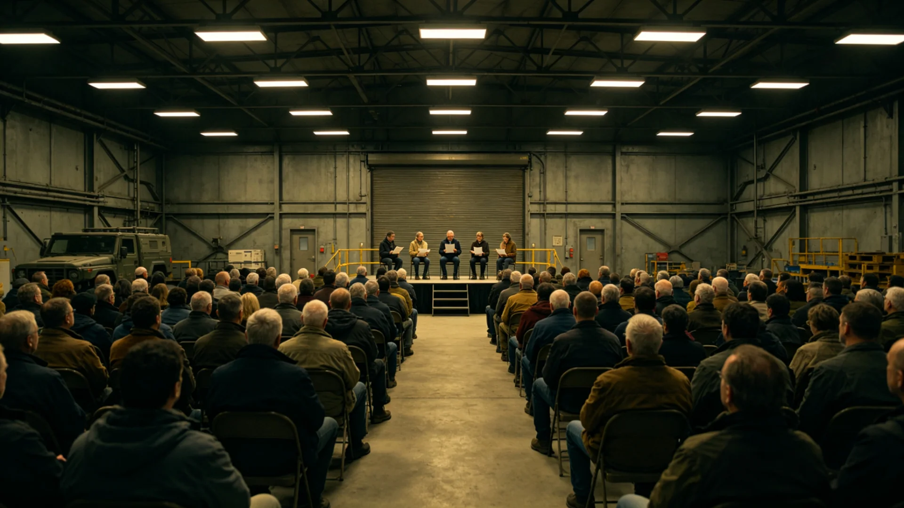

# 联合体"跨星系共祖日"确立与三系同源纪念仪式首次举办公报

**发布机构**：三恒星系文明联合体文化与公共礼仪署
**发布日期**：3205年9月1日
**文件等级**：跨星系公开

## 一、设立缘起

联合体成立已逾二百零五年。三恒星系各定居点之公民，籍贯可远溯地球、可生于比邻星b、鲸港地下或第四恒星系新拓前哨，跨系通婚所生之第三、第四代子女，往往一人之家族谱系横跨两个乃至三个恒星系。在统一基础教育课程标准（见GS-3173-01）推行两百年后，"我们从何处同源"已成为各地校园与社区频繁讨论而未有定日的话题。文化署遂于3204年发起"共祖日"倡议，经议会文化委员会审议、三系公民意见征询，于3205年正式确立。

## 二、节日规程

1. **日期**：定在每年协星历秋分日，取昼夜均分、三系同此一日之意；
2. **主旨**：不纪念某一具体事件，而纪念三恒星系全体公民"同出一脉、分而复合"之共同来历；
3. **仪式**：各地于当日傍晚举行"同源点灯"——公民以本地火种点燃一盏灯，送至社区纪念台；新海市主仪式设三系火炬台，分别代表地球、比邻星、鲸鱼座τ三处发源地，三火合一后传向各定居点；
4. **与既有节日关系**：本节日与"文明传承日"（GS-2972-01、GS-3093-01）、"联合体日"（GS-3002-01）并行不悖：传承日重制度之继，联合体日重体制之立，共祖日重血脉与谱系之同源。

## 三、首次举办情况（3205年秋分）

- 主仪式在新海市中央广场举行，到场公民约十二万人，另有三系各地以光程同步转播，线上参与逾四千万；
- 主仪式上宣读《同源谱》序：简述地球—比邻星b—鲸鱼座τ—火星—主带—第四恒星系之移民脉络，不褒扬个人，只述人群；
- 三系火炬合一后，火种经光程传至新拓前哨（GS-3101-01）、谷神星、下都等地，因光程时延，各地点灯时刻按本地傍晚安排，不强行同时；
- 仪式未安排领导人长篇演说，代之由五位不同籍贯之普通公民各读一段家书中关于"祖先从何处来"的文字（纸质书信复兴见GS-3176-01）。

## 四、意见与反响

公示期间，亦有第四恒星系部分青年公民提出："共祖"是否仍以地球为唯一源头，对生于斯长于斯、从未见地球之一代是否公平。文化署回应：共祖日所言之"祖"，非指地理上之地球一处，而指"我们这一群人共同的来历"；第四恒星系拓荒者之来历，同样写入《同源谱》，并在仪式中单列一席。此点在首次举办中已作安排。

## 四点五、各地分场情况

首次共祖日，除新海市主仪式外，各地分场如下：下都在中央深井灯座（见GS-3227-01规程）设同源分场，以井下长明火迎火种；谷神星第二矿站在旧矿口设点，矿工以井下作业灯汇入；火星地下城市在第二代生态闭环主舱（见GS-3163-01）设点；新拓前哨（GS-3101-01）因光程延迟，于当地次日傍晚迎到火种，拓荒者以"锚定夜"（见GS-3105-01）旧礼续接。各分场均不设商业摊位，仅设饮水与座椅。

## 五、后续

自3206年起，共祖日列为联合体年度公共节日之一，轮休安排另行通知。各地可依本地风俗增设仪式环节，但不得将本节日用于商业广告之噱头。

## 六、首年费用与轮休

首次共祖日主仪式及各地分场，费用由文化与公共礼仪署文化文化基金列支，未新增公民税负。因首次适逢跨系通勤高峰，新海市周边轮休一日，不另设长假。文化署说明：共祖日意在"同此一心"，不在"同此一假"，轮休安排应随实际客流调整，不搞一刀切。

## 七、首年费用与轮休

首次共祖日主仪式及各地分场，费用由文化基金列支，未新增公民税负。新海市周边因逢通勤高峰轮休一日，不另设长假。文化署说明：共祖日意在"同此一心"，不在"同此一假"。第四恒星系部分青年关心的"是否以地球为唯一源头"问题，已在《同源谱》中单列拓荒一席；3206年起此节固定保留。

## 八、后续年度安排

自3206年起，共祖日每年秋分举办。各地分场可依本地风俗增设环节，不得商业广告。文化署说明：共祖日所言之"祖"，非指地球一处，而指"我们这一群人共同的来历"；第四恒星系拓荒者之来历同列《同源谱》。首年线上参与逾四千万，为联合体成立以来最大规模之文化事件。

## 九、不设商业摊位

首次共祖日各地分场均不设商业摊位，仅设饮水与座椅。新海市主仪式未安排领导人长篇演说，代之五位不同籍贯之普通公民各读一段家书中关于"祖先从何处来"之文字（纸质书信复兴见GS-3176-01）。文化署说明：仪式之庄重，正在于不喧哗。

## 十、立卷说明

首次共祖日主仪式及各地分场费用由文化基金列支，未新增公民税负。新海市周边轮休一日，不另设长假。仪式未安排长篇演说，代之五位不同籍贯之普通公民各读一段家书中关于"祖先从何处来"之文字。首年线上参与逾四千万，为联合体成立以来最大规模之文化事件。文化署在卷末说明：共祖日所言之"祖"非指地球一处，而指"我们这一群人共同的来历"；自3206年起每年秋分举办，各地分场可依本地风俗增设环节，不设商业摊位。

---

**签发**：文化与公共礼仪署署长 方同尘
**日期**：3205年9月1日
**归档编号**：CUL-ORIG-3205-008
