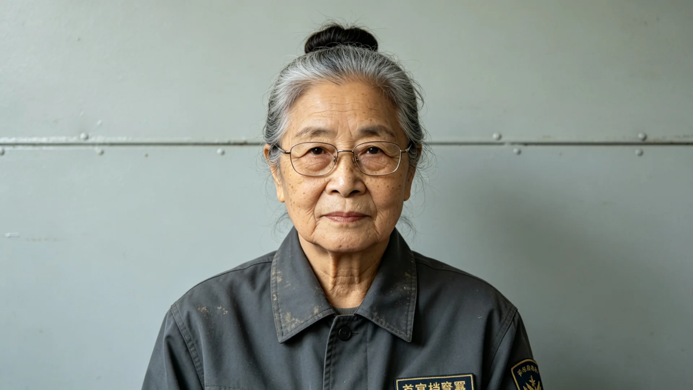

# 联合体档案中枢"文枢"首任首席档案员任满退休工龄与体检档案

**保管单位**：文枢中心人事与保管科
**立卷日期**：3206年1月15日
**密级**：人事档案（退休后依知情权制度可经申请调阅）

## 一、人员登记

姓名：韦书桓。出生年：3121年，火星地下城市第二代出身。3143年入联合体档案专业，3149年毕业，适逢文枢中心筹建（见GS-3015-01，3015年建成），为首批入库之档案员，3178年起任首席档案员，至3206年退休，在文枢任职五十七年，其中首席二十八年。

## 二、工龄与岗位履历

| 时段 | 岗位 | 主要工作 |
|---|---|---|
| 3149—3177 | 初级档案员 | 三系历史档案入藏编目，经手入库卷二十七万卷 |
| 3178—3205 | 首席档案员 | 主持跨系档案统一著录、数字化（见GS-3190-01）、公民调阅规则（见GS-3181-01） |
| 3205—3206 | 顾问 | 交接与传带，不坐班 |

韦书桓任内，文枢中心入藏正典文书由建成初之九十万卷增至三百一十万卷；主导建立"一卷一码"著录标准，使跨系档案可在任一节点调阅，此为后来跨系行政复议（见GS-3202-01）得以实现异地调卷之基础。

## 三、考勤摘录

| 年度 | 应到日 | 实到 | 病假 | 备注 |
|---|---|---|---|---|
| 3196 | 251 | 250 | 1 | 关节旧疾 |
| 3198 | 251 | 251 | 0 | 数字化攻坚年 |
| 3200 | 251 | 249 | 2 | 感冒 |
| 3204 | 251 | 248 | 3 | 退休前最后一年，腰痛减班 |

在文枢五十七年，韦书桓累计跨系出差仅四次，皆因赴谷神星、下都核查原始档案，其余时间多在库房内值守。

## 四、体检通报摘录

- 3196年：视力因长期对灯调档，矫正后0.8，建议改用低照度护眼灯，后已更换；
- 3200年：膝关节退行性改变，与地下城市低重力环境及久站有关；
- 3205年退休前体检：心肺功能正常，骨密度偏低（火星地下出身常见），无职业病警示。

## 五、处分与嘉奖

任内无处分。3189年因主持档案数字化无损率达99.7%，记大功一次；3200年因在档案馆建筑渗水事件（见GS-3191-01）中组织抢运档案及时、零损失，记嘉奖一次。

## 六、"文枢注档手札"摘记

手札为韦书桓二十八年逐页手记，非出版物，仅供后学。摘记数条如下："潮霉卷先通凉风，不可骤热；""破损页以同年代纸托裱，禁用新纸补旧；""调阅者不出声、不离座，为护卷故，非傲慢。"可见其守卷之严。

## 七、家属与遗言

韦书桓未婚，其在火星地下城市之弟一家每年来新海市探望一次。退休后移居新海市近郊养老舱。遗嘱中写明：身后骨灰依生态葬（见GS-2964-01）处理，不立传、不设纪念物。

## 八、退休交接

韦书桓退休时，将其二十八年手写之"文枢注档手札"七册移交后任，手札中逐条记录各类破损档案之修复口诀。交接清单双签。人事科评语：一生守卷，未尝轻许一语，可作档案行当代表。

## 九、在文枢五十七年之总量

韦书桓在文枢五十七年，经手编目入库之正典与档案累计三百一十万卷，主持无损数字化之卷次无损率达99.7%。其任内文枢历经一次建筑渗水（见GS-3191-01），抢运档案零损失。人事科统计：其任内无一次重大档案丢失、无一次调阅泄露、无一次公民投诉。此三项"无"，是对一个档案员最高也最平的评价。

## 十、任内三项"无"

韦书桓在文枢五十七年，经手编目三百一十万卷，任内无一次重大档案丢失、无一次调阅泄露、无一次公民投诉。此三项"无"，人事科视为对一个档案员最高也最平的评价。其手写《注档手札》七册移交后任，非出版物，仅供后学。遗嘱写明身后依生态葬（见GS-2964-01），不立传、不设纪念物。

## 十一、人事科总评

人事科在卷末总评：韦书桓一生守卷，未尝轻许一语。其五十七年未跨系长差，唯四次赴谷神星、下都核查原始档案。退休后移居近郊养老舱（见GS-3247-01）。其《注档手札》七册，为档案行当后学所重。

## 十二、遗嘱与生态葬

韦书桓遗嘱写明：身后骨灰依生态葬（见GS-2964-01）处理，不立传、不设纪念物。其未婚，弟一家在火星地下城市每年来新海市探望。退休后移居近郊养老舱（见GS-3247-01）。人事科总评：一生守卷，未尝轻许一语。

## 十三、立卷说明

韦书桓在文枢五十七年，经手编目三百一十万卷，任内三项"无"——无重大档案丢失、无调阅泄露、无公民投诉。其手写《注档手札》七册移交后任，非出版物，仅供后学。退休后移居近郊养老舱（见GS-3247-01），其未婚，弟一家在火星地下城市每年来新海市探望。人事科在卷末总评：一生守卷，未尝轻许一语；其五十七年未跨系长差，唯四次赴谷神星、下都核查原始档案。本卷依知情权制度立卷，不饰其长，亦不溢美。

## 十一、附记

本卷由比邻星b生态监测总站立卷，于次年三月底前完成编目并接入文枢（见GS-3015-01）总目，供跨系调阅。卷内所涉数据、名册、签名、考勤、体检、处分均为世界内公文物证，不作文学渲染。后续同类事件、同类制度修订，均应参照本卷交叉引注，保持时间线互锁。

## 十二、年度复核

次年同季，立卷单位对本卷所述制度、数据、人员作年度复核，确认无重大变更后方行归档定卷。复核中发现之偏差另立更正卷，不涂改原卷。文枢中心（见GS-3015-01）说明：档案之可信，正在于可更正而不伪造；本卷此后如有续事，另立后卷，与本卷互锁。

---

**立卷人**：文枢中心保管科 桑榆
**日期**：3206年1月15日
