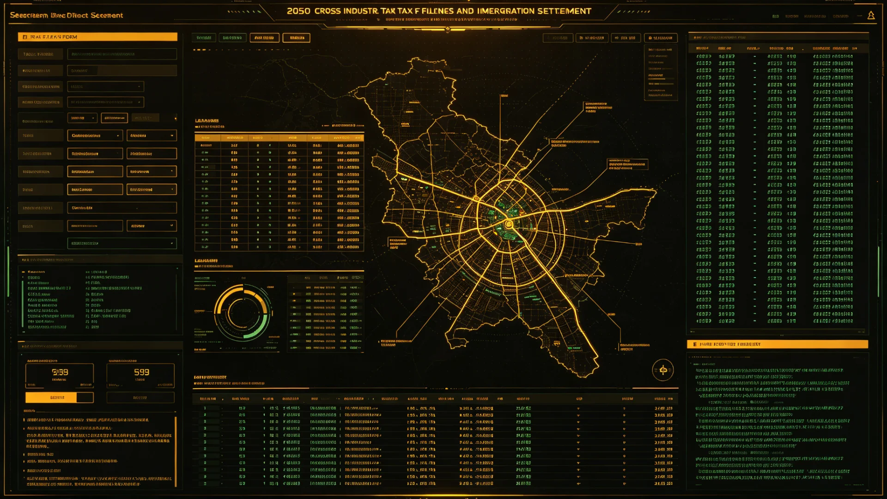

# 联合体跨星系纳税申报与退籍清算细则修订公报

**发布机构**：三恒星系文明联合体税务与财政清算署
**发布日期**：3207年4月9日
**文件等级**：跨星系公开

## 一、修订背景

跨星系税收协定与税源分配制度（见GS-2976-01）建立以来，跨系公民之纳税申报长期存在两处不便：其一，一人在两个以上星系有收入时，须分别在各系重复申报，往返补正；其二，公民申请退籍、迁居或更换定居星系时，其历年纳税记录之清算缺乏统一时限，常有"旧籍未清、新籍已落"之悬案。随着跨星系迁徙权扩展（见GS-3166-01）与公务员异地任职增多（见GS-3233-01），此类案件逐年上升。税务署于3206年启动细则修订。

## 二、修订要点

1. **一表通报**：跨系公民可在定居地任一税务点一次申报全年全部星系收入，由系统按税源分配规则自动分账，不必分系填报；
2. **退籍清算时限**：申请退籍或变更定居星系者，税务清算须在三十协星日内办结，逾期未办结不影响其新籍落户，但旧籍欠税仍予追缴；
3. **跨系纳税记录互认**：公民跨系迁徙后，其在旧星系之纳税信用记录随籍迁移，不因迁居而清零；
4. **争议救济**：对清算结果有异议者，可依行政复议新制（见GS-3202-01）申请复核，不得径行拒绝迁移；
5. **低收人豁免**：跨系往返津贴、异地安家费不并入应税所得，以免迁居者因税制受损。

## 三、试行数据

修订稿于3206年下半年在新海市、下都、谷神星三地试行：

- 跨系一次申报受理一万一千余件，平均申报耗时较旧制缩短六成；
- 退籍清算平均办结日数由旧制的六十二日降至二十一日；
- 因税务问题卡滞迁徙者，由上年同期的一百三十七人降至十九人；
- 未发现借一次申报规避税源分配之案件。

## 四、配套

本细则与联币结算系统（见GS-3064-01）对接，跨系税款自动划转，不再人工对账。清算文书接入文枢中心（见GS-3015-01），公民可终身调阅本人纳税记录。

## 五、异议案例与衔接

试行期内受理异议七件：其中三件系旧税制下已重复缴纳者，依新制退还多缴并致歉；两件系纳税人对税源分配地有异议，经复议（见GS-3202-01）维持；两件系跨系搬迁时旧籍欠税未清，依"逾期不影响新籍"规则先予落户，欠税另追。本细则与既有税收协定（GS-2976-01）、联币结算（GS-3064-01）并行不悖，遇有抵触以本细则为准。

## 六、施行

自3207年5月1日起三恒星系及第四恒星系前哨同步施行。

## 七、纳税人告知与异议处理

细则施行后，税务署向跨系公民发放简明告知单，说明一次申报、退籍清算时限、纳税记录随籍迁移三项要点。试行期内七件异议（见本公报第五节），全部在三十协星日内办结。税务署提醒：跨系纳税人仍有如实申报义务，一次申报不等于"一次即完"，漏报错报照样追缴。本细则与联币结算（见GS-3064-01）自动对接，税款划转不另收手续费。

## 八、纳税人告知单

细则施行后，税务署向跨系公民发放简明告知单，说明一次申报、退籍清算时限、纳税记录随籍迁移三项要点。试行期七件异议全部在三十协星日办结。税务署提醒：一次申报不等于"一次即完"，漏报错报照样追缴。本细则与联币结算（见GS-3064-01）自动对接，税款划转不另收手续费。

## 九、首年争议与判例

试行期七件异议中三件系重复纳税退还，两件系税源分配地经复议（见GS-3202-01）维持，两件系旧籍欠税依规则先落户再追缴。税务署说明：退籍清算统一，意在使跨系公民"迁得动、清得快"，非给逃税留缝。

## 十、不加重纳税人

税务署说明：一次申报与退籍清算统一，意在使跨系公民迁得动、清得快，非给逃税留缝。旧籍欠税仍予追缴，不因迁居而免。纳税信用记录随籍迁移，不因星系而清零。

## 十一、立卷说明

本细则试行期七件异议全部在三十协星日办结：三件系重复纳税退还，两件系税源分配地经复议（见GS-3202-01）维持，两件系旧籍欠税依规则先落户再追缴。税务署向跨系公民发放简明告知单，说明一次申报、退籍清算时限、纳税记录随籍迁移三项要点。税务署在卷末附言：一次申报不等于"一次即完"，漏报错报照样追缴；退籍清算统一，意在使跨系公民迁得动、清得快，非给逃税留缝。本细则与联币结算（见GS-3064-01）自动对接。

## 十一、附记

本卷由第四恒星系拓荒委档案股立卷，于次年三月底前完成编目并接入文枢（见GS-3015-01）总目，供跨系调阅。卷内所涉数据、名册、签名、考勤、体检、处分均为世界内公文物证，不作文学渲染。后续同类事件、同类制度修订，均应参照本卷交叉引注，保持时间线互锁。

## 十二、年度复核

次年同季，立卷单位对本卷所述制度、数据、人员作年度复核，确认无重大变更后方行归档定卷。复核中发现之偏差另立更正卷，不涂改原卷。文枢中心（见GS-3015-01）说明：档案之可信，正在于可更正而不伪造；本卷此后如有续事，另立后卷，与本卷互锁。

---

**签发**：税务与财政清算署署长 程百川
**日期**：3207年4月9日
**归档编号**：TAX-EXIT-3207-031
