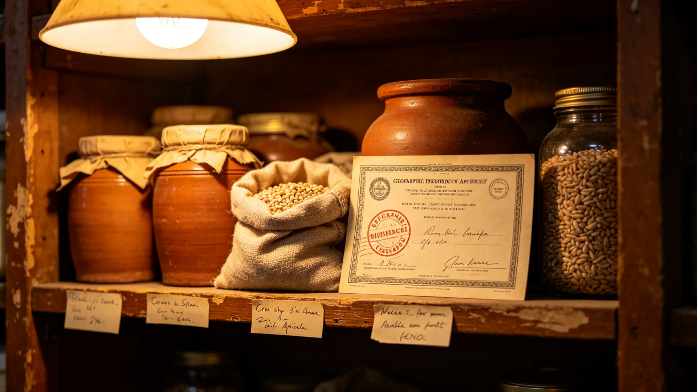

# 联合体跨星系原乡食品与地方特产地理标志注册首年公报

**发布机构**：三恒星系文明联合体知识产权与产业登记署
**发布日期**：3208年11月20日
**文件等级**：跨星系公开

## 一、设立背景

跨星系贸易自由化（见GS-3032-01、GS-3056-01）百年后，各地地方特产随航线流通。比邻星b滨海之茶、谷神星矿站之麦、下都地下之菌、新拓前哨之根茎，因风味独特而渐有名声，却无统一标记，常有他地仿冒、异地贴牌之事。联合数字资产与文化版权交易平台（见GS-3177-01）建成后，具备了为地方特产注册"地理标志"之技术条件。产业登记署遂于3207年设立跨星系原乡食品与地方特产地理标志注册制度。

## 二、注册规程

1. **申请主体**：须为某一地理范围内之生产共同体，单一作坊不得独占地名；
2. **核标内容**：须证明产品之风味、工艺与产地水土、气候、工坊传统有实质关联；
3. **专用标识**：核准后授予统一"原乡标"，标注产地与生产共同体，仿冒者依知识产权公约（见GS-2988-01）处理；
4. **不得滥用**：地理标志不得用于宣传与产地无关之功效，不得暗示有治病之效。

## 三、首年核准名录（节选）

| 标志名 | 产地 | 产品 |
|---|---|---|
| 新海雾芽 | 比邻星b新海岸 | 滨海高海拔茶 |
| 谷神矿麦 | 主小行星带谷神星 | 地下温室麦粉 |
| 下都灰菌 | 鲸鱼座τ下都 | 地下暗室食用菌 |
| 新拓根 | 第四恒星系新拓 | 红矮星弱光根茎 |
| 火星苔粉 | 火星地下城市 | 水培苔类调味粉 |

首年共受理申请一百八十三件，核准六十七件，驳回四十二件（多为工艺与产地关联不足），余在审。

## 四、经济效果

获标产品首年跨系售价平均上浮一成二，其中新海雾芽出口第四恒星系订单增长三成。各生产共同体反映，注册商标后仿冒投诉量下降七成。登记署提醒：地理标志仅为风味保证，不等于品质担保，消费者仍应看生产批次。

## 六、仿冒处置与消费提示

首年受理仿冒投诉十九件：其中七件系他地作坊冒用"新海雾芽"名号贴本地茶，经知识产权公约（GS-2988-01）勒令下架并赔偿；五件系外包装近似误导，责令整改；余七件证据不足未立案。登记署提示消费者：原乡标为风味与产地保证，不代表绝对品质，购买时仍应看生产批次与检验号；不得以"原乡"名义夸大宣传功效。

## 七、后续

3209年起开放第二批申请，重点受理手工业与饮品；与数字版权平台（见GS-3177-01）对接后，每批产品可扫码溯源至生产共同体。

## 八、地理标志保护边界

登记署再次明确：地理标志为风味与产地保证，不构成功效保证，不得以"原乡"之名暗示治病强身之效。首年核准之六十七个标志中，有十二个因生产共同体申请材料不全而暂缓，补正后再议。登记署同时提醒：地理标志不得被单一作坊垄断，须为生产共同体共有，避免"地标变私标"。

## 九、暂缓与补正

首年受理申请一百八十三件，核准六十七件，驳回四十二件，余七十四件在审。暂缓核准之十二个标志，系生产共同体申请材料不全，补正后再议。登记署明确：地理标志须为生产共同体共有，不得被单一作坊垄断，以免"地标变私标"；不得以"原乡"之名暗示功效。

## 十、溯源扫码

获标产品自3209年起与数字版权平台（见GS-3177-01）对接，每批可扫码溯源至生产共同体。登记署提示消费者：原乡标为风味与产地保证，不代表绝对品质，购买仍看生产批次与检验号。

## 十一、不夸大功效

登记署再次明确：原乡标为风味与产地保证，不构成功效保证，不得以"原乡"之名暗示治病强身之效。首年仿冒投诉十九件中七件勒令下架赔偿，五件责令整改，七件证据不足未立案。

## 十二、立卷说明

首年受理申请一百八十三件，核准六十七件，驳回四十二件，余七十四件在审；暂缓核准之十二个标志系生产共同体申请材料不全，补正后再议。获标产品自3209年起与数字版权平台（见GS-3177-01）对接，每批可扫码溯源至生产共同体。仿冒投诉十九件中七件勒令下架赔偿，五件责令整改，七件证据不足未立案。登记署在卷末附言：原乡标为风味与产地保证，不构成功效保证，不得以"原乡"之名暗示治病强身之效；地理标志须为生产共同体共有，不得被单一作坊垄断。

## 十一、附记

本卷由下都市档案处立卷，于次年三月底前完成编目并接入文枢（见GS-3015-01）总目，供跨系调阅。卷内所涉数据、名册、签名、考勤、体检、处分均为世界内公文物证，不作文学渲染。后续同类事件、同类制度修订，均应参照本卷交叉引注，保持时间线互锁。

## 十二、年度复核

次年同季，立卷单位对本卷所述制度、数据、人员作年度复核，确认无重大变更后方行归档定卷。复核中发现之偏差另立更正卷，不涂改原卷。文枢中心（见GS-3015-01）说明：档案之可信，正在于可更正而不伪造；本卷此后如有续事，另立后卷，与本卷互锁。

---

**签发**：产业登记署署长 甘味和
**日期**：3208年11月20日
**归档编号**：GI-FOOD-3208-045
