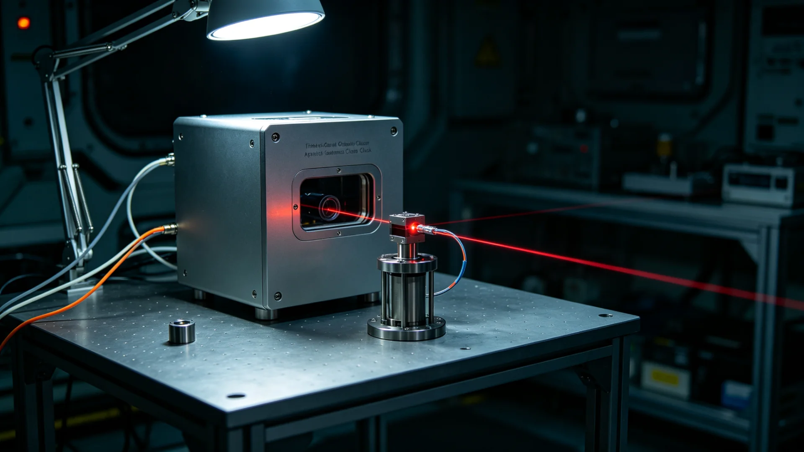

# 三恒星系协时网第五代光频标升级与全链校时验收报告

**报告单位**：三恒星系文明联合体计量与标准署
**工程名称**：协时网第五代光频标升级与全链校时
**报告日期**：3209年8月21日
**密级**：工程公开

## 一、工程背景

三恒星系标准时统一与跨星系钟差网"协时网"自3009年建成（见GS-3009-01）以来，为三系同步跨年（见GS-3012-01）、跨系表决（见GS-3066-01）、光程通信授时提供基准。初代协时网以铯微波钟为频标，跨系钟差长期稳定度约每日纳秒级，在建成之初足以应付政务与民生之需。然近百年来，量子通信中继网历经第四、第五代扩容（见GS-3061-01、GS-3160-01），无人货运自动交会对接（见GS-3090-01、拟升级GS-3222-01）对时间窗精度要求越来越窄，跨系金融结算（见GS-3083-01）亦要求授时误差不可超过毫秒。旧频标在多次跨系表决时差争议（见GS-2953-01）中已显吃力。计量署遂于3205年立项，将全网主钟由铯微波钟整体升级为光频标，并作全链校时。

## 二、升级内容

1. **主钟换型**：新海市、下都、谷神星三处主站，各置两台第五代光频标（锶晶格光钟），互为热备；任一台检修或漂移时，另一台不间断授时；
2. **光纤链路**：三系间钟差比对由激光脉冲改走校准光纤，链路噪声降低一个量级，受恒星活动（见GS-3034-01）影响亦减小；
3. **钟差预报**：全网钟差预报周期由七日缩至一日，预报残差控制在零点三纳秒内；
4. **授时接口**：向政务、金融、航运三类授时用户提供统一接口，旧接口并行两年后停用，停用前逐户通知迁移。

## 三、验收数据

| 项目 | 第四代(3009) | 第五代(3209验收) | 指标 |
|---|---|---|---|
| 主钟日稳定度 | 1.2e-15 | 3.4e-17 | ≤5e-17 |
| 跨系钟差预报残差(纳秒) | 2.1 | 0.28 | ≤0.5 |
| 授时链路可用率 | 99.7% | 99.95% | ≥99.9% |
| 同步跨年共时误差(毫秒) | 11 | 0.4 | ≤1 |
| 单次授时跳变次数(九十日内) | 3 | 0 | 0 |

全链校时连续运行九十日，未发生主钟跳变。3209年秋分共祖日（见GS-3205-01）三系同步点灯时刻误差实测零点四毫秒，满足典礼要求；3209年跨系预算表决（见GS-3066-01）计时戳误差较上年缩小九成。

## 四、用户联调意见

- 政务侧：跨系表决时序戳更准，未再发生"时差争议"类僵局；
- 金融侧：联币结算（见GS-3064-01）对时更严，三日延迟故障（见GS-3083-01）类事件未再复发；
- 航运侧：无人货运交会对接时间窗可缩窄约三成，运力相应提升；
- 通信侧：量子中继（见GS-3160-01）纠缠分发时间标记更精确，误码率下降。

## 五、遗留与建议

光频标对环境震动敏感，三处主站均设于地下减震基座，新海主站另增主动隔振台。第四恒星系方向因光程限制，暂以中继授时，不置主钟，待航线再稳后议。旧铯钟保留作冷备，至少再运行二十年。建议各地授时用户于3210年内完成接口迁移。

## 六、验收结论

工程达到设计指标，准予验收投运。

## 七、用户迁移时间表

第五代光频标授时接口切换，安排如下：3209年内政务系统先行迁移；3210年上半年金融系统迁移；3210年下半年航运系统迁移；旧接口并行至3210年底。各用户迁移前由计量署派人对接，不影响业务连续。协时网换型期间，三系跨年共时（见GS-3012-01）未受影响，共祖日同步点灯（见GS-3205-01）误差实测合格。

## 八、用户迁移时间表

第五代光频标授时接口切换分三批：3209年内政务系统先行；3210年上半年金融系统；3210年下半年航运系统；旧接口并行至3210年底。各用户迁移前由计量署派人对接，不影响业务连续。换型期间三系跨年共时（见GS-3012-01）未受影响，共祖日同步点灯（见GS-3205-01）误差实测合格。

## 九、主站选址说明

第五代光频标三处主站均设地下减震基座，新海主站另增主动隔振台。第四恒星系方向因光程限制不置主钟，待航线再稳后议。旧铯钟保留冷备二十年。计量署说明：授时之准，是跨系立法、结算、航行之共同地基。

## 十、跨系授时之意义

计量署说明：授时之准，是跨系立法（见GS-3066-01）、金融结算（见GS-3064-01）、无人船交会（见GS-3222-01）之共同地基。第五代光频标使三系共时误差缩至毫秒级，此为文明深度整合之隐性基石。

## 十一、立卷说明

第五代光频标授时接口分三批切换：3209年内政务系统先行，3210年上半年金融系统，下半年航运系统，旧接口并行至3210年底。三处主站均设地下减震基座，新海主站另增主动隔振台；第四恒星系方向因光程限制不置主钟，旧铯钟保留冷备二十年。计量署在卷末附言：授时之准，是跨系立法（见GS-3066-01）、金融结算（见GS-3064-01）、无人船交会（见GS-3222-01）之共同地基；第五代光频标使三系共时误差缩至毫秒级，此为文明深度整合之隐性基石。换型期间共祖日同步点灯（见GS-3205-01）误差实测合格。

## 十一、附记

本卷由联合体法律署档案股立卷，于次年三月底前完成编目并接入文枢（见GS-3015-01）总目，供跨系调阅。卷内所涉数据、名册、签名、考勤、体检、处分均为世界内公文物证，不作文学渲染。后续同类事件、同类制度修订，均应参照本卷交叉引注，保持时间线互锁。

---

**验收主持**：计量与标准署署长 钟守恒
**日期**：3209年8月21日
**编号**：METR-OPT-3209-014
