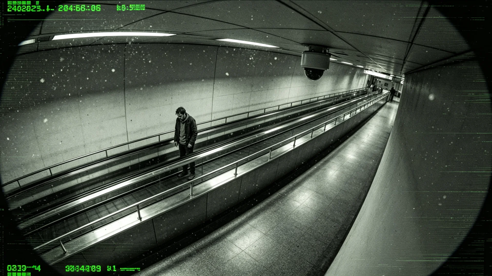

# 新海市跨星系中央换乘枢纽自动步道夹伤乘客应急处置与整改公报

**发布机构**：新海市市政与交通安全署
**事件日期**：3210年7月上旬
**发布日期**：3210年7月19日
**密级**：跨星系公开

## 一、事件经过

新海市跨星系中央换乘枢纽为三系旅客换乘客运飞船、轨道电梯（见GS-3198-01）与城市磁列之大型交汇体，日均换乘逾八十万人次。3210年7月8日早高峰，A段自动步道入口处，一名携带跨系行李之乘客，其行李轮较大且带拖杆，在踏上步道时拖杆未收好、行李轮卷入步道梳齿板；乘客在拉扯中左手指被梳齿夹伤。旁侧工作人员于十三秒内拍下急停，步道断电。乘客送医，诊断为左手中指近节指骨裂纹，无生命危险，一周后出院。事发段随即隔离，A段全段停机。

## 二、处置时间线

| 时刻 | 处置 |
|---|---|
| 7-08 08:12 | 乘客行李卷入，夹伤发生 |
| 7-08 08:13 | 旁侧工作人员拍下急停，步道断电 |
| 7-08 08:15 | 乘警与急救到场，送医 |
| 7-08 08:40 | A段全段停机，B、C段改道运行 |
| 7-08—7-10 | 停业检修，调取监控，走访同乘 |
| 7-11 | 事故段复检合格，A段恢复运行 |
| 7-19 | 公布整改公报 |

停机三日内，换乘枢纽通过磁列加开班次、B段临时双向分流，未造成大面积滞留。受影响旅客由志愿者引导，无二次事故。

## 三、原因初查

监控与检修报告显示三点：其一，该乘客跨系行李轮较大，超出步道入口行李限宽提示；其二，梳齿板已使用十六年，局部磨损致防护间隙偏大，未按周期更换；其三，入口限宽提示为旧版印刷，高峰人流中不易察觉。工作人员急停及时，为未酿成更重后果之直接原因。

## 四、整改措施

1. 全枢纽自动步道梳齿板统一更换为新型防夹结构，磨损件三年一换，建立台账，不得超期服役；
2. 入口限宽、限重提示由印刷改为声光提示，行李超宽者声光双警，并设引导线；
3. 高峰时段A段增派一名引导员，帮助跨系旅客分流至坡道或升降梯；
4. 对受伤乘客依公共交通人身保障规则予以医疗与误工补偿，乘客接受，未提诉讼；
5. 三系各换乘枢纽、各轨道电梯换乘点于三十日内自查同类设备，结果报市政署，逾期未报者通报批评。

## 五、安全提示与长效

市政署同时将"跨系行李轮大者请走坡道或升降梯"纳入启航前旅客告知（参见GS-3204-01同类告知）。遇设备异常，先按急停再呼救。事故虽轻，然发生于二百周年后客流高峰之年，市政署以此为戒，将全市自动步道纳入季度巡检。

## 六、全系统自查结果

三十日内，三系各换乘枢纽与轨道电梯换乘点共报送自查报告一百一十七份，其中发现同类磨损梳齿板三处、旧版印刷提示十二处，均已当场更换。新海市市政署将此轮自查纳入季度巡检，并在中央换乘枢纽设"急停按钮位置图"，供旅客随时查看。事故受伤乘客恢复良好，已重返工作岗位。

## 七、全系统自查结果

三十日内，三系各换乘枢纽与轨道电梯换乘点报送自查报告一百一十七份，发现同类磨损梳齿板三处、旧版印刷提示十二处，均当场更换。新海市市政署将此轮自查纳入季度巡检，并在中央换乘枢纽设"急停按钮位置图"供旅客查看。事故受伤乘客恢复良好，已重返工作岗位。

## 八、对旅客之提示

市政署另刊提示：跨系行李轮大者请走坡道或升降梯；遇设备异常先按急停再呼救。事故虽轻，然发生于客流高峰之年，市政署以此为戒，全市自动步道纳入季度巡检。

## 九、急停之要

新海市市政署强调：本事件未致重伤，源于工作人员十三秒内急停。急停按钮位置图自此在全枢纽公示。自动步道为城市设施，跨系行李轮大者请走坡道或升降梯，遇异常先按急停再呼救。

## 十、立卷说明

三十日内三系各换乘枢纽与轨道电梯换乘点报送自查报告一百一十七份，发现同类磨损梳齿板三处、旧版印刷提示十二处，均当场更换。事故未致重伤，源于工作人员十三秒内急停。新海市市政署在卷末附言：急停按钮位置图自此在全枢纽公示；自动步道为城市设施，跨系行李轮大者请走坡道或升降梯，遇异常先按急停再呼救。市政署将此轮自查纳入季度巡检，事故受伤乘客恢复良好，已重返工作岗位。

## 十一、附记

本卷由联合体经济署档案股立卷，于次年三月底前完成编目并接入文枢（见GS-3015-01）总目，供跨系调阅。卷内所涉数据、名册、签名、考勤、体检、处分均为世界内公文物证，不作文学渲染。后续同类事件、同类制度修订，均应参照本卷交叉引注，保持时间线互锁。

## 十二、年度复核

次年同季，立卷单位对本卷所述制度、数据、人员作年度复核，确认无重大变更后方行归档定卷。复核中发现之偏差另立更正卷，不涂改原卷。文枢中心（见GS-3015-01）说明：档案之可信，正在于可更正而不伪造；本卷此后如有续事，另立后卷，与本卷互锁。

---

**签发**：新海市市政与交通安全署 路平章
**日期**：3210年7月19日
**事件编号**：TRANSIT-INC-3210-009
