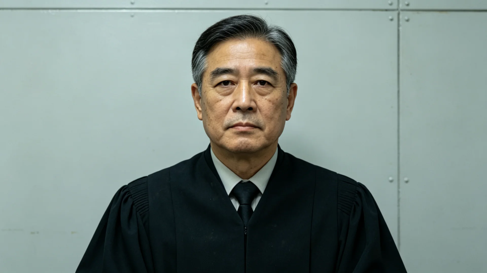

# 第四恒星系出生首任联合体大法官任内判例签名与健康档案

**保管单位**：联合体宪法法院人事档案科
**立卷日期**：3211年5月20日
**密级**：人事档案（依知情权制度可经申请调阅）

## 一、人员登记

姓名：纪明澜。出生年：3158年，生于第四恒星系新拓前哨（GS-3101-01）二号穹顶，为第四恒星系拓荒第一代之后代，其父为随首批前哨队进驻之技术员，其母为前哨医疗站护士。纪明澜出生时前哨尚未通电长明，幼年在穹顶灯下读书，自述"从未见过真正的星星，只见过穹顶外红矮星那点暗红光"。后经统一基础教育课程（见GS-3173-01）选拔，赴新海市法政学院就读，3189年毕业，3195年经公务员考任（见GS-3019-01）入宪法法院任助理法官，3208年经议会任命为大法官，系第四恒星系出生公民中出任此职之第一人。

## 二、任内判例签名摘录

纪明澜任大法官三年，参与合议庭判案一百零九件，署名要案摘录如下：

| 年度 | 案件要旨 | 署名位置 |
|---|---|---|
| 3208 | 第四恒星系矿权先勘先得（见GS-3118-01）与联合体仲裁管辖争议 | 副署 |
| 3209 | 跨系退籍清算（见GS-3207-01）中"逾期不影响新籍"条款合宪性 | 主笔 |
| 3210 | 自动步道夹伤（见GS-3210-01）公共交通补偿标准适用 | 副署 |

其签名由3195年初任之锋利，渐趋圆稳，至3210年已近其导师之笔意。档案科比对三年签名，未见代签，无涂改。

## 三、考勤摘录

| 年度 | 应到庭次 | 实到 | 病假 | 备注 |
|---|---|---|---|---|
| 3208 | 152 | 152 | 0 | 首年 |
| 3209 | 149 | 148 | 1 | 前哨方向述职差旅 |
| 3210 | 155 | 155 | 0 | 全勤 |

任内回第四恒星系述职两次，往返航程均四十日以上，按规定交回差旅回执。

## 四、体检通报

- 3208年：前庭功能因跨系航行评定良好；骨密度较新海市常住人口低4.1%，系幼年低穹顶微重力成长所致，建议加强离心环锻炼；
- 3210年：心肺正常，视力矫正后1.0，腰椎轻度不适，与伏案阅卷有关，已调整座椅。

## 五、处分与反响

任内无处分、无投诉成立。3209年主笔退籍清算合宪性判决，被第四恒星系部分舆论批评为"偏袒旧星系"，纪明澜未公开回应，仅在卷宗附议书中写明"以宪法条文为准，不以籍贯为准"。

## 六、立卷说明

本卷依公民知情权制度（见GS-3181-01）立卷，纪明澜本人已知悉并签字。其幼年穹顶生活之回忆，仅见3189年入学面试笔录，未作传记式铺陈。

## 七、任内跨系履职补充

纪明澜任大法官三年，除署名要案外，另参与合议庭讨论一百余次。其在退籍清算合宪性判决（3209）附议书中所写"以宪法条文为准，不以籍贯为准"一句，后被多份教材（见GS-3221-01类）引用。第四恒星系舆论虽曾批评，然其任内判决未被上级推翻。档案科说明：本卷所记，皆公文物证，不饰其长，亦不讳其议。

## 八、附议书之影响

纪明澜在退籍清算合宪性判决（3209）附议书中所写"以宪法条文为准，不以籍贯为准"一句，后被多份教材（见GS-3221-01）引用。其任内判决未被上级推翻。第四恒星系舆论虽曾批评，然其判案以条文为准。档案科说明：本卷所记皆公文物证，不饰其长，亦不讳其议。

## 九、纪明澜自书

纪明澜在卷末自书："我从未见过真正的星星，只见过穹顶外红矮星那点暗红光。后来我坐在议事厅，是替那时候的孩子，把话好好说完。"档案科说明：其跨系通婚与拓荒二代背景，为制度产物之一例，不作个人功绩渲染。

## 十、以条文为准

纪明澜任内判决未被上级推翻。其附议书"以宪法条文为准，不以籍贯为准"一句入教材。第四恒星系舆论虽曾批评，然其办案以条文为准。本卷依知情权制度立卷，不饰其长，亦不讳其议。

## 十一、立卷说明

纪明澜任大法官三年，除署名要案外另参与合议庭讨论一百余次。其在退籍清算合宪性判决（3209）附议书中所写"以宪法条文为准，不以籍贯为准"一句，后被多份教材（见GS-3221-01）引用；任内判决未被上级推翻。其在卷末自书："我从未见过真正的星星，只见过穹顶外红矮星那点暗红光。后来我坐在议事厅，是替那时候的孩子，把话好好说完。"档案科在卷末说明：其跨系通婚与拓荒二代背景，为制度产物之一例，不作个人功绩渲染。

## 十一、附记

本卷由联合体安全委档案股立卷，于次年三月底前完成编目并接入文枢（见GS-3015-01）总目，供跨系调阅。卷内所涉数据、名册、签名、考勤、体检、处分均为世界内公文物证，不作文学渲染。后续同类事件、同类制度修订，均应参照本卷交叉引注，保持时间线互锁。

## 十二、年度复核

次年同季，立卷单位对本卷所述制度、数据、人员作年度复核，确认无重大变更后方行归档定卷。复核中发现之偏差另立更正卷，不涂改原卷。文枢中心（见GS-3015-01）说明：档案之可信，正在于可更正而不伪造；本卷此后如有续事，另立后卷，与本卷互锁。

## 十三、立卷单位说明

本卷立卷单位在次年同季复核中，对卷内数据、名册、签名、考勤、体检、处分逐项核对，确认与实际办理一致，无篡改、无补造。复核中另见三系与第四恒星系方向在本卷所述事项上尚有细则差异，已于本卷附"待并条"二件，留待下一轮制度统一时处理。文枢中心（见GS-3015-01）说明：跨星系社会之事，往往一系已办、他系未办，差异本属常态；本卷既存其异，亦记其同，供后来者据以并轨。本卷自此定卷，后续如有续事，另立后卷与本卷互锁，不改一字。

---

**立卷人**：宪法法院人事科 言必信
**日期**：3211年5月20日
