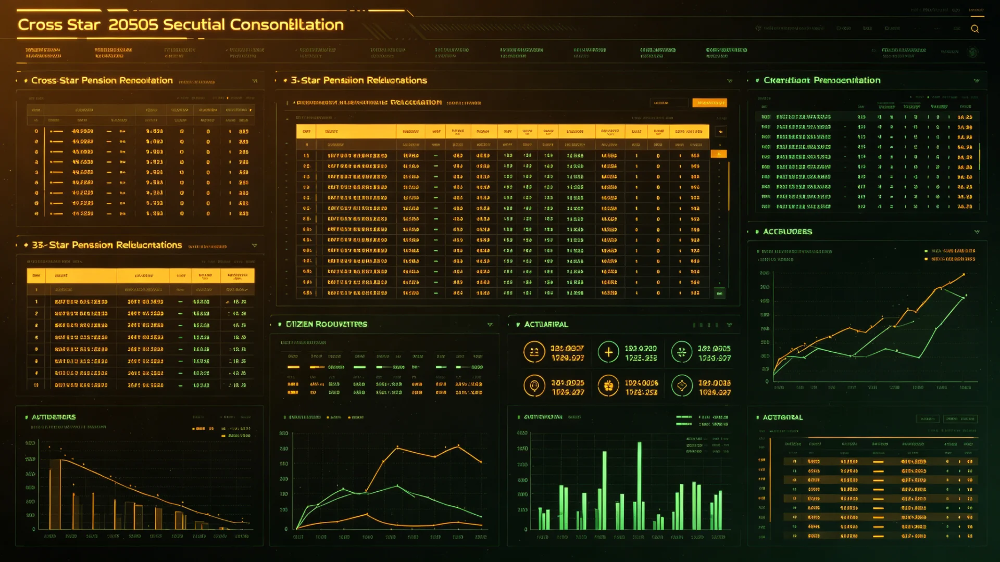

# 联合体代际养老统筹三系并轨与跨星系年金互认公报

**发布机构**：三恒星系文明联合体社会保障署
**发布日期**：3212年6月30日
**文件等级**：跨星系公开

## 一、并轨背景

比邻星b退休年龄与养老金动态调整机制（见GS-2969-01）建立以来，三系各有养老统筹，标准随本地物价与寿命而设。跨系人员自由流动（见GS-3060-01、GS-3166-01）百年后，一人一生在两个以上星系工作、缴费、退休者越来越多，却因各系统筹不相通，常出现"旧星系缴了费、新星系不认账"之纠纷。第四恒星系拓荒者退休后多愿回迁气候温和之处（见GS-3133-01工伤互认），而年金领取地与缴费地不一，手续繁琐。社会保障署遂于3210年启动三系养老统筹并轨。

## 二、并轨要点

1. **缴费年限互认**：公民在任一星系之缴费年限合并计算，不因迁居而清零；
2. **年金分段计发**：按在各星系缴费年限与当地计发标准分段计算，汇总后由联币（见GS-3064-01）统一发放；
3. **领取地自由**：退休后可在三系任一定居点领取年金，不必回缴费地；
4. **跨系医疗衔接**：退休迁居后，其医保关系随籍迁移，远程诊疗（见GS-2938-01）照常；
5. **拓荒倾斜**：在第四恒星系等艰苦方向服役满二十年者，计发标准上浮一定比例，以彰拓劳。

## 三、试行数据

并轨方案于3211年在新海市、下都、新拓前哨三地试行一年：

- 办理跨系年金衔接者一万八千余人，平均办结日数由旧制的九十日降至二十一日；
- 因跨系缴费不认而投诉者，由上年同期的二百四十余件降至三十一件；
- 退休后跨系迁居者，较上年增加三成，其中自新拓前哨回迁新海市与下都者最多；
- 未发生统筹资金穿底，联币结算运行平稳。

## 四、代际考量

本并轨同时回应"代际正义"（见GS-3172-01）之讨论：老地球代、船生代、拓荒二代各有其贡献，不应因星系不同而厚此薄彼。社会保障署在公报中说明，并轨不加重在职一代负担，主要靠三系存量统筹之互认与结算电子化实现。

## 五、施行

自3212年7月1日起三恒星系及第四恒星系前哨同步施行。各地旧有与本公报抵触之养老细则，自施行日起以本公报为准。

## 六、资金与代际负担测算

社会保障署同时公布并轨资金测算：并轨首年无需财政额外拨款，主要靠三系存量统筹互认与联币结算电子化省出之成本。对在职一代之缴费率不变。拓荒倾斜部分，由转移支付（见GS-3225-01）专项资金承担，不摊薄普通公民年金。此测算经审计署（见GS-3017-01）核签。

## 七、资金测算经审计

社会保障署公布并轨资金测算：首年无需财政额外拨款，主要靠三系存量统筹互认与联币结算电子化省出之成本。在职一代缴费率不变。拓荒倾斜部分由转移支付专项资金（见GS-3225-01）承担，不摊薄普通公民年金。此测算经审计署（见GS-3017-01）核签。

## 八、代际正义之落实

本并轨同时回应代际正义学派（见GS-3172-01）之讨论：老地球代、船生代、拓荒二代各有贡献，不应因星系而厚薄。社会保障署说明：并轨不加重在职一代，靠存量互认与电子化省出之成本实现。

## 九、跨系迁居养老增三成

试行一年退休后跨系迁居者较上年增三成，其中自新拓前哨回迁新海市与下都者最多。社会保障署说明：年金领取地自由，使老弱可择气候温和之处养老，与滨海淡季度假（见GS-3238-01）衔接。

## 十、立卷说明

本并轨同时回应代际正义学派（见GS-3172-01）之讨论：老地球代、船生代、拓荒二代各有贡献，不应因星系而厚薄。试行一年退休后跨系迁居者较上年增三成，其中自新拓前哨回迁新海市与下都者最多。社会保障署在卷末附言：年金领取地自由，使老弱可择气候温和之处养老，与滨海淡季度假（见GS-3238-01）衔接；并轨不加重在职一代，靠存量互认与电子化省出之成本实现，测算经审计署（见GS-3017-01）核签。

## 十一、附记

本卷由联合体文化署档案股立卷，于次年三月底前完成编目并接入文枢（见GS-3015-01）总目，供跨系调阅。卷内所涉数据、名册、签名、考勤、体检、处分均为世界内公文物证，不作文学渲染。后续同类事件、同类制度修订，均应参照本卷交叉引注，保持时间线互锁。

## 十二、年度复核

次年同季，立卷单位对本卷所述制度、数据、人员作年度复核，确认无重大变更后方行归档定卷。复核中发现之偏差另立更正卷，不涂改原卷。文枢中心（见GS-3015-01）说明：档案之可信，正在于可更正而不伪造；本卷此后如有续事，另立后卷，与本卷互锁。

## 十三、立卷单位说明

本卷立卷单位在次年同季复核中，对卷内数据、名册、签名、考勤、体检、处分逐项核对，确认与实际办理一致，无篡改、无补造。复核中另见三系与第四恒星系方向在本卷所述事项上尚有细则差异，已于本卷附"待并条"二件，留待下一轮制度统一时处理。文枢中心（见GS-3015-01）说明：跨星系社会之事，往往一系已办、他系未办，差异本属常态；本卷既存其异，亦记其同，供后来者据以并轨。本卷自此定卷，后续如有续事，另立后卷与本卷互锁，不改一字。

---

**签发**：社会保障署署长 温天伦
**日期**：3212年6月30日
**归档编号**：SOC-PENSION-3212-020
