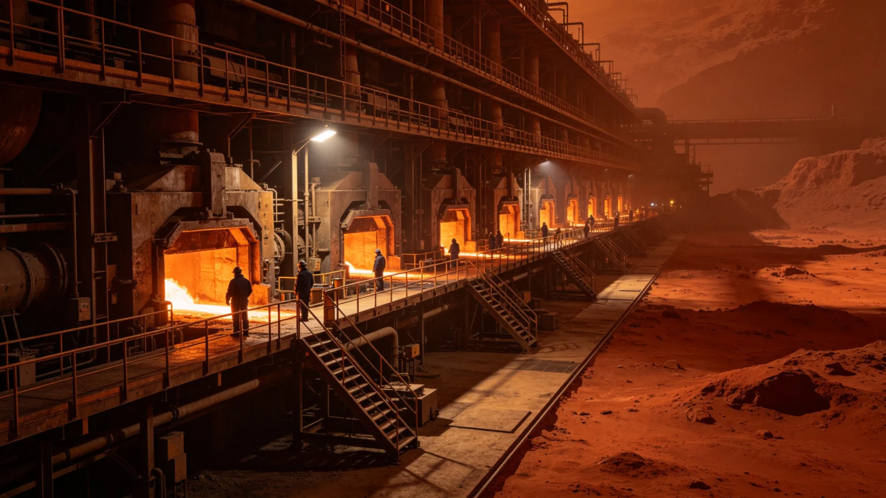

# 第四恒星系铂族金属本地深加工产业链替代跨系进口三年决算报告

**编制单位**：第四恒星系拓荒事务委员会产业组
**决算区间**：3212—3214三年
**报告日期**：3214年12月8日
**密级**：跨星系公开

## 一、背景

第四恒星系铂族金属矿自3106年投产（见GS-3106-01）以来，长期以原矿与粗炼锭形式跨系出口，运至新海市、谷神星精炼后再制品回销。这一模式利润薄、运距远，且受跨系运费指数（见GS-3114-01）波动影响大。拓荒委于3211年决策：在新拓前哨就地建设精炼—深加工—制品一体化链条，逐步替代跨系进口之精炼铂族制品。3212年首期投产，至3214年已满三年。

## 二、三年产能与替代

| 指标 | 3212 | 3213 | 3214 |
|---|---|---|---|
| 本地精炼产能(吨/年) | 40 | 75 | 120 |
| 本地制品占比(%) | 18 | 39 | 63 |
| 跨系进口精炼制品量(相对3211) | 100 | 71 | 42 |
| 产业链就业人数 | 1200 | 2600 | 4300 |
| 单吨利润(相对原矿出口) | 1.0 | 1.6 | 2.3 |

## 三、技术与成本

本地精炼采用低能耗低温工艺，适配第四恒星系红矮星弱光电力（见GS-3123-01光敏育种所同区域电力条件）。三年间累计投入设备改造两次，精炼纯度由99.95%提升至99.99%，达到联合体统一标准。制品主要为催化剂靶材、传感器触点与航天用高触点件，回销三系。因省去跨系精炼品往返运费，单吨成本较旧制下降约两成。

## 四、问题与对策

三年来亦暴露两处问题：其一，本地熟练技工不足，初期限从三系聘请教员，已通过本地职业学校（见GS-3173-01统一课程）自行培养第二批；其二，本地电力在红矮星黑子年偏紧，已与本系农业用电错峰调度。未发生重大安全事故，未发生污染事故。

## 五、决算结论

三年间，本地深加工对跨系进口精炼制品之替代率已由零升至六成三，产业链就业逾四千，单吨利润较原矿出口提升一点三倍。拓荒委建议3215年继续扩产至年产精炼一百六十吨，并论证制品就地配套本地造船（见GS-3149-01）之可能。

## 六、就业与人才

三年间产业链就业增至四千三百人，其中本地培养技工二千八百人，自三系聘请教员逐年减少。本地职业学校（统一课程，见GS-3173-01）已设铂族精炼专业两届毕业生。拓荒委说明：产业链之要，不在建厂，在育人；工厂可建，人须本地长出来。

## 七、本地人才培养

三年间产业链就业增至四千三百人，本地培养技工二千八百人，自三系聘请教员逐年减少。本地职业学校（统一课程，见GS-3173-01）已设铂族精炼专业两届毕业生。拓荒委说明：产业链之要不在建厂，在育人；工厂可建，人须本地长出来。

## 八、环保与安全

本地精炼采用低温工艺，适配红矮星弱光电力。三年间未发生重大安全事故、未发生污染事故。农业与工业用电错峰调度。拓荒委建议3215年扩产，并论证制品配套本地造船（见GS-3149-01）。

## 九、为拓荒者增收

三年间本地深加工替代跨系进口精炼制品由零升至六成三，单吨利润较原矿出口提升一点三倍。拓荒委说明：此产业链使第四恒星系不再只卖原矿，而能留住更多利润于本地，与转移支付（见GS-3225-01）相彰。

## 十、立卷说明

三年间本地深加工替代跨系进口精炼制品由零升至六成三，单吨利润较原矿出口提升一点三倍；就业增至四千三百人，本地培养技工二千八百人。本地精炼采用低温工艺，适配红矮星弱光电力，三年间未发生重大安全与污染事故。拓荒委在卷末附言：产业链之要不在建厂，在育人；工厂可建，人须本地长出来。此产业链使第四恒星系不再只卖原矿，而能留住更多利润于本地，与转移支付（见GS-3225-01）相彰。3215年论证扩产并制品配套本地造船（见GS-3149-01）。

## 十一、附记

本卷由联合体社会保障署档案股立卷，于次年三月底前完成编目并接入文枢（见GS-3015-01）总目，供跨系调阅。卷内所涉数据、名册、签名、考勤、体检、处分均为世界内公文物证，不作文学渲染。后续同类事件、同类制度修订，均应参照本卷交叉引注，保持时间线互锁。

## 十二、年度复核

次年同季，立卷单位对本卷所述制度、数据、人员作年度复核，确认无重大变更后方行归档定卷。复核中发现之偏差另立更正卷，不涂改原卷。文枢中心（见GS-3015-01）说明：档案之可信，正在于可更正而不伪造；本卷此后如有续事，另立后卷，与本卷互锁。

## 十三、立卷单位说明

本卷立卷单位在次年同季复核中，对卷内数据、名册、签名、考勤、体检、处分逐项核对，确认与实际办理一致，无篡改、无补造。复核中另见三系与第四恒星系方向在本卷所述事项上尚有细则差异，已于本卷附"待并条"二件，留待下一轮制度统一时处理。文枢中心（见GS-3015-01）说明：跨星系社会之事，往往一系已办、他系未办，差异本属常态；本卷既存其异，亦记其同，供后来者据以并轨。本卷自此定卷，后续如有续事，另立后卷与本卷互锁，不改一字。

---

**编制**：拓荒委产业组 金相济
**审核**：拓荒委主任室
**日期**：3214年12月8日
**编号**：FRT-IND-3214-033
