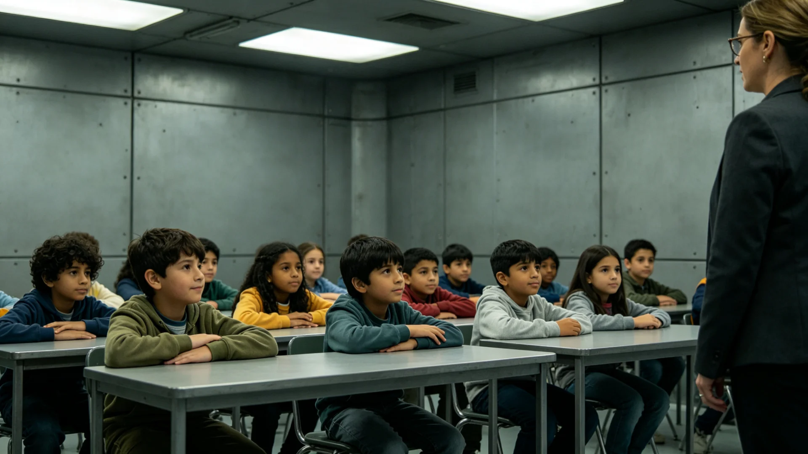

# 联合体跨星系未成年人监护与学籍迁移统一规则公报

**发布机构**：三恒星系文明联合体教育总署
**发布日期**：3219年4月26日
**文件等级**：跨星系公开

## 一、规则背景

跨星系家庭（见GS-3189-01代际抚养与家庭法）日趋普遍，未成年人随父母在星系间迁徙者渐多。统一基础教育课程标准（见GS-3173-01）虽已颁行，然各地教材进度、学年起止、升留级标准仍有差异；未成年人跨系转学时常出现"学分不认、年级不接"之苦。教育总署遂制定跨星系未成年人监护与学籍迁移统一规则，使孩子随父母迁徙而学业不中断。

## 二、统一规则要点

1. **学籍随迁**：未成年人随父母跨系迁居，学籍随籍迁移，原校就读年限一律承认，不得要求重读；
2. **课程互认**：依统一课程标准（见GS-3173-01），三系及第四恒星系前哨同名课程学分互认，进度差异由新校在一学年内补足；
3. **监护衔接**：父母跨系工作而子女暂留原就读地者，须指定本地监护人，并报教育总署备案，不得使未成年人无人照管；
4. **特殊照顾**：来自第四恒星系弱光环境（见GS-3123-01光敏育种同区域）之转学生，新校应在采光、视力保健上予照顾；
5. **不得歧视**：不得以学生籍贯、出身星系区别对待，跨系通婚家庭子女（参见GS-3216-01一类）尤受保护；
6. **救济**：对学籍迁移受阻者，可依行政复议新制（见GS-3202-01）申请，且此类事项可申请暂停原决定之执行。

## 三、试行数据

规则于3218年在新海市、下都、新拓前哨试行一年：

- 受理跨系学籍迁移四千二百余件，平均办结十日；
- 因转学而要求重读者，由上年的一成二降至不足百分之一；
- 跨系通婚家庭子女转学无障碍率达98%；
- 未发生因学籍迁移纠纷之诉讼。

## 四、与既有制度之衔接

本规则与跨系行政复议（见GS-3202-01）、公民身份法出生地条款（见GS-3074-01）配套。教育总署强调：学籍迁移之统一，是跨星系社会深度整合期"孩子不为迁徙所苦"之具体落实。

## 五、施行

自3219年5月1日起三恒星系及第四恒星系前哨同步施行。

## 六、转学生适应跟踪

试行一年内，跨系转学生四千二百余名中，教育总署跟踪一百名样本：九成以上一学年内适应新校课程，无一要求重读。来自第四恒星系弱光环境之转学生，新校均在采光上予照顾。教育总署说明：学籍迁移统一之终的，是让孩子随父母迁徙而学业不中断，不因星系而歧。

## 七、转学生适应跟踪

试行一年内跨系转学生四千二百余名中，跟踪一百名样本：九成以上一学年内适应新校课程，无一要求重读。来自第四恒星系弱光环境之转学生，新校均在采光上予照顾。教育总署说明：学籍迁移统一之终的，是让孩子随父母迁徙而学业不中断。

## 八、不得歧视之保护

规则明确：不得以学生籍贯、出身星系区别对待，跨系通婚家庭子女（参见GS-3216-01一类）尤受保护。来自第四恒星系弱光环境之转学生，新校应在采光、视力保健上予照顾。

## 九、孩子不为迁徙所苦

教育总署说明：学籍迁移统一之终的，是让孩子随父母迁徙而学业不中断，不因星系而歧。跨系转学生九成以上一学年内适应，无一要求重读。此为文明深度整合期"孩子不为迁徙所苦"之具体落实。

## 十、立卷说明

试行一年内跨系转学生四千二百余名中，跟踪一百名样本：九成以上一学年内适应新校课程，无一要求重读。规则明确：不得以学生籍贯、出身星系区别对待，跨系通婚家庭子女（参见GS-3216-01一类）尤受保护；来自第四恒星系弱光环境之转学生，新校应在采光、视力保健上予照顾。教育总署在卷末附言：学籍迁移统一之终的，是让孩子随父母迁徙而学业不中断，不因星系而歧；此为文明深度整合期"孩子不为迁徙所苦"之具体落实。

## 十一、附记

本卷由第四恒星系拓荒委档案股立卷，于次年三月底前完成编目并接入文枢（见GS-3015-01）总目，供跨系调阅。卷内所涉数据、名册、签名、考勤、体检、处分均为世界内公文物证，不作文学渲染。后续同类事件、同类制度修订，均应参照本卷交叉引注，保持时间线互锁。

## 十二、年度复核

次年同季，立卷单位对本卷所述制度、数据、人员作年度复核，确认无重大变更后方行归档定卷。复核中发现之偏差另立更正卷，不涂改原卷。文枢中心（见GS-3015-01）说明：档案之可信，正在于可更正而不伪造；本卷此后如有续事，另立后卷，与本卷互锁。

## 十三、立卷单位说明

本卷立卷单位在次年同季复核中，对卷内数据、名册、签名、考勤、体检、处分逐项核对，确认与实际办理一致，无篡改、无补造。复核中另见三系与第四恒星系方向在本卷所述事项上尚有细则差异，已于本卷附"待并条"二件，留待下一轮制度统一时处理。文枢中心（见GS-3015-01）说明：跨星系社会之事，往往一系已办、他系未办，差异本属常态；本卷既存其异，亦记其同，供后来者据以并轨。本卷自此定卷，后续如有续事，另立后卷与本卷互锁，不改一字。

---

**签发**：教育总署教育总监 学无涯
**日期**：3219年4月26日
**归档编号**：EDU-MIG-3219-008
