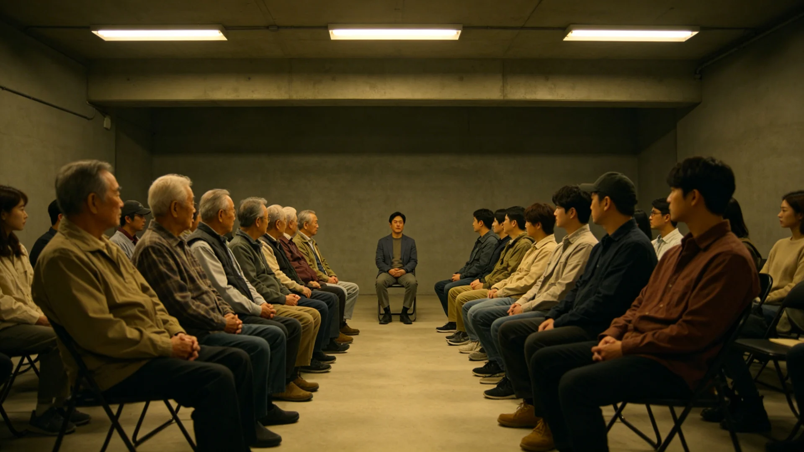

# 联合体"代际对话周"制度化与老船人口述史公开宣讲首年公报

**发布机构**：三恒星系文明联合体文化与公共礼仪署
**发布日期**：3220年11月11日
**文件等级**：跨星系公开

## 一、制度化背景

联合体成立已逾二百二十年。当年亲历飞船启航、比邻星落地、联合体筹建之"老船人"，多已谢世，尚存者亦年事极高。年轻一代——船生代、拓荒二代、通婚混血一代——对前辈所历之艰，多从课本得知，缺乏直接听闻。3144年船生代工会代表任勤（见GS-3144-01）一类代际冲突之往事，已渐被淡忘。文化署遂将民间"老人讲古"之举制度化，设"代际对话周"，组织老船人向青年公开讲述亲身经历，录音录像存档（与公共记忆法案，见GS-3145-01，衔接）。

## 二、规程

1. **时间**：每年共祖日（见GS-3205-01）后一周为"代际对话周"；
2. **形式**：各地社区设宣讲点，邀请健在之老船人、拓荒前辈自愿讲述，青年可问；
3. **存档**：讲述经本人同意后录音录像，存文枢中心（见GS-3015-01），作为口述史；
4. **不夸大**：讲述不设台词，不树英雄，只记事实与感受，老船人可讲自己之畏、悔、误；
5. **自愿**：老人不被安排作巡回演讲，讲与不讲、讲多久悉听其便。

## 三、首年记录（3220）

首年共组织宣讲四百余场，参与老人六百余人，青年逾十万。录音录像存档二百三十余段。摘录数条讲述大意如下：

- 一位前远航船轮机长："启航时我怕得很，不敢讲，怕年轻人嫌我怂。今天讲了，原来他们也怕。"
- 一位拓荒第一代母亲："我们那时候觉得苦，是怕孩子看不到蓝天。现在孩子看到了，我这苦就不算苦。"
- 一位老工会代表（与GS-3144-01同类人物）："当年我们闹，不是要反谁，是要有人听见。现在有人听见了。"

## 四、反响与边界

公示期间有青年提出：代际对话周是否会变成"老人忆苦、青年被动听训"。文化署回应：对话为双向，青年可问可辩，老人不被预设为"正确一方"。首年记录中，亦有青年问出"你们当年是否也做错了"，老船人答"做错了的，今天才跟你们说"。

## 五、后续

3221年起固定举办，口述史逐季向社会公开。本制度与公共记忆法案（见GS-3145-01）、原乡文献朗读（见GS-3192-01）互为补充。

## 六、首年存档与检索

首年二百三十余段口述，存文枢中心（见GS-3015-01），按讲述人籍贯、年代、主题编目。青年可经申请调阅，老船人未同意公开之段落不开放。文化署说明：口述史不是戏剧，不剪辑、不配乐、不渲染；老人讲到"怕""悔""误"处，原样保留。

## 七、首年存档

首年二百三十余段口述存文枢（见GS-3015-01），按讲述人籍贯、年代、主题编目。青年可经申请调阅，老船人未同意公开之段落不开放。文化署说明：口述史不是戏剧，不剪辑、不配乐、不渲染；老人讲到"怕""悔""误"处，原样保留。

## 八、双向对话

文化署回应"老人忆苦、青年被动听训"之担心：对话为双向，青年可问可辩，老人不被预设为"正确一方"。首年记录中亦有青年问"你们当年是否也做错了"，老船人答"做错了的，今天才跟你们说"。

## 九、老船人不被表演

文化署强调：讲述不设台词、不树英雄，老船人可讲自己之畏、悔、误。老人不被安排作巡回演讲，讲与不讲、讲多久悉听其便。口述史存文枢，未同意公开之段落不开放。

## 十、立卷说明

首年二百三十余段口述存文枢（见GS-3015-01），按讲述人籍贯、年代、主题编目；青年可经申请调阅，老船人未同意公开之段落不开放。文化署在卷末附言：口述史不是戏剧，不剪辑、不配乐、不渲染；老人讲到"怕""悔""误"处，原样保留。讲述不设台词、不树英雄，老船人可讲自己之畏、悔、误，不被安排作巡回演讲。首年记录中亦有青年问"你们当年是否也做错了"，老船人答"做错了的，今天才跟你们说"——对话为双向，老人不被预设为"正确一方"。

## 十一、附记

本卷由下都市档案处立卷，于次年三月底前完成编目并接入文枢（见GS-3015-01）总目，供跨系调阅。卷内所涉数据、名册、签名、考勤、体检、处分均为世界内公文物证，不作文学渲染。后续同类事件、同类制度修订，均应参照本卷交叉引注，保持时间线互锁。

## 十二、年度复核

次年同季，立卷单位对本卷所述制度、数据、人员作年度复核，确认无重大变更后方行归档定卷。复核中发现之偏差另立更正卷，不涂改原卷。文枢中心（见GS-3015-01）说明：档案之可信，正在于可更正而不伪造；本卷此后如有续事，另立后卷，与本卷互锁。

## 十三、立卷单位说明

本卷立卷单位在次年同季复核中，对卷内数据、名册、签名、考勤、体检、处分逐项核对，确认与实际办理一致，无篡改、无补造。复核中另见三系与第四恒星系方向在本卷所述事项上尚有细则差异，已于本卷附"待并条"二件，留待下一轮制度统一时处理。文枢中心（见GS-3015-01）说明：跨星系社会之事，往往一系已办、他系未办，差异本属常态；本卷既存其异，亦记其同，供后来者据以并轨。本卷自此定卷，后续如有续事，另立后卷与本卷互锁，不改一字。

---

**签发**：文化与公共礼仪署署长 方同尘
**日期**：3220年11月11日
**归档编号**：CUL-GEN-3220-021
