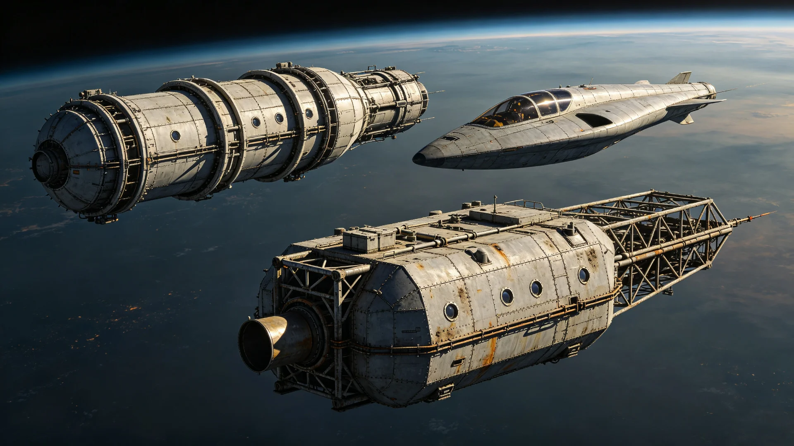

# 跨星系无人货运船队第九代自主避碰与自动交会对接算法鉴定公报

**发布机构**：三恒星系文明联合体航道安全与机器人工程署
**发布日期**：3222年9月9日
**文件等级**：跨星系公开

## 一、鉴定背景

跨星系无人货运船队自主避碰算法历经第三代升级（见GS-3090-01），配合协元模数货箱标准（见GS-3021-01），已使大半跨系货运无人化。然随航道繁忙（参见罗盘调度，GS-3028-01），货运艇密度上升，旧算法在复杂交会场景下偶有保守减速，影响运力。本署遂组织第九代算法鉴定，重点考察避碰与自动交会对接之精度、运力与安全。

## 二、鉴定方法

1. **仿真**：在仿真舱内复现十年间航道全部险肇场景，含碎片云剐蹭（见GS-3128-01）、机械臂脱落（见GS-3217-01）类场景；
2. **实航**：在新海市—谷神星航线，以十艘无人货艇实航三百航次，考察自动交会对接；
3. **人在回路**：操作员在监控室只作监督，不干预，仅在算法请求时介入；
4. **时间基准**：授时采用第五代光频标协时网（见GS-3209-01）。

## 三、鉴定数据

| 项目 | 第三代(3090) | 第九代(3222鉴定) | 指标 |
|---|---|---|---|
| 避碰响应时间(秒) | 4.2 | 1.1 | ≤2 |
| 自动对接一次成功率(%) | 91 | 99.2 | ≥99 |
| 复杂场景误判率(%) | 3.1 | 0.4 | ≤1 |
| 运力提升(相对第三代) | 基准 | +23% | ≥+15% |
| 操作员人工介入次数/百航次 | 14 | 2 | ≤3 |

## 四、结论

第九代算法在避碰、对接精度与运力上均达标，且未出现"过度自信"——在算法判断不清时主动请求人工，而非强行决策。鉴定组认为：安全并未因无人化而降低，反而因算法可重复而更稳。

## 五、部署与提示

第九代算法拟于3223年起分批次换装现役无人货艇。换装期间新旧算法并行，人在回路监督不撤。本署提示：无人化不等于无人管，监控室仍须有人。

## 六、换装计划与人在回路

第九代算法自3223年起分批次换装现役无人货艇，新旧并行一年。换装期间，监控室人在回路监督不撤。鉴定组特别说明：算法可请求人工，人工亦可随时接管；无人化不等于无人管，这是底线。换装后运力提升约两成三，跨系运费（见GS-3114-01）相应略降。

## 七、换装与人在回路

第九代算法自3223年起分批次换装现役无人货艇，新旧并行一年。换装期间监控室人在回路监督不撤。鉴定组特别说明：算法可请求人工，人工亦可随时接管；无人化不等于无人管，这是底线。换装后运力提升约两成三，跨系运费（见GS-3114-01）相应略降。

## 七、不冒进鉴定

鉴定组特别肯定：第九代算法未出现"过度自信"，在判断不清时主动请求人工，而非强行决策。安全并未因无人化而降低，反因算法可重复而更稳。换装后跨系运费（见GS-3114-01）相应略降。

## 八、人在回路不撤

第九代算法换装期间，监控室人在回路监督不撤。鉴定组肯定其未"过度自信"——判断不清时主动请求人工。无人化不等于无人管，这是底线。换装后运力升两成三，运费略降。

## 九、立卷说明

第九代算法自3223年起分批次换装现役无人货艇，新旧并行一年，换装期间监控室人在回路监督不撤。鉴定组肯定其未"过度自信"——判断不清时主动请求人工，而非强行决策。鉴定组在卷末附言：算法可请求人工，人工亦可随时接管；无人化不等于无人管，这是底线。换装后运力提升约两成三，跨系运费（见GS-3114-01）相应略降。安全并未因无人化而降低，反因算法可重复而更稳。

## 十一、附记

本卷由联合体经济署档案股立卷，于次年三月底前完成编目并接入文枢（见GS-3015-01）总目，供跨系调阅。卷内所涉数据、名册、签名、考勤、体检、处分均为世界内公文物证，不作文学渲染。后续同类事件、同类制度修订，均应参照本卷交叉引注，保持时间线互锁。

## 十二、年度复核

次年同季，立卷单位对本卷所述制度、数据、人员作年度复核，确认无重大变更后方行归档定卷。复核中发现之偏差另立更正卷，不涂改原卷。文枢中心（见GS-3015-01）说明：档案之可信，正在于可更正而不伪造；本卷此后如有续事，另立后卷，与本卷互锁。

## 十三、立卷单位说明

本卷立卷单位在次年同季复核中，对卷内数据、名册、签名、考勤、体检、处分逐项核对，确认与实际办理一致，无篡改、无补造。复核中另见三系与第四恒星系方向在本卷所述事项上尚有细则差异，已于本卷附"待并条"二件，留待下一轮制度统一时处理。文枢中心（见GS-3015-01）说明：跨星系社会之事，往往一系已办、他系未办，差异本属常态；本卷既存其异，亦记其同，供后来者据以并轨。本卷自此定卷，后续如有续事，另立后卷与本卷互锁，不改一字。

## 十四、定卷

经上述各节所载数据、名册与立卷单位复核，本卷事实清楚、引证互锁，准予定卷归档。此后任何引用本卷者，应连同所引后卷一并查考，不得孤证立论。

## 十五、存档备查

本卷自定卷之日起，原件存于立卷单位库房，副本存文枢中心（见GS-3015-01）跨星系档案总目。跨系调阅须经申请，涉密与涉个人隐私部分依知情权制度（见GS-3181-01）解密后公开。

---

**签发**：机器人工程署 程自航
**日期**：3222年9月9日
**归档编号**：ROB-AUTO-3222-018
