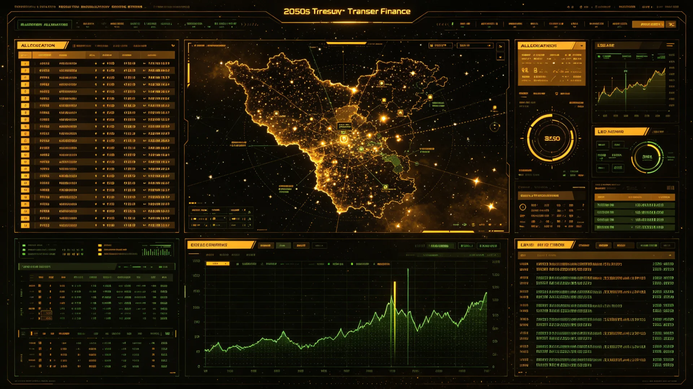

# 联合体地方财政转移支付与欠发达星系补偿机制确立公报

**发布机构**：三恒星系文明联合体财政与审计署
**发布日期**：3225年7月13日
**文件等级**：跨星系公开

## 一、机制背景

联合体成立二百二十余年，三系及第四恒星系发展并不均衡：新海市与比邻星b滨海富庶，主带部分矿站随矿枯而衰，第四恒星系拓荒前哨长期靠补贴维持。财政年度与预算程序（见GS-3007-01）、税收协定（见GS-2976-01）已立，然"富者自富、贫者自贫"之格局未改。代际正义（见GS-3172-01）讨论中，学者提出：拓荒者为全文明探路，不应因拓荒而长期贫困。财政署遂确立地方财政转移支付与欠发达星系补偿机制。

## 二、机制要点

1. **转移支付**：联合体每年从财政收入中划出固定比例，向欠发达星系与矿枯衰退区拨付，用于公共服务与基础设施；
2. **拓荒补偿**：对第四恒星系等艰苦方向服役者，其退休金（见GS-3212-01）与医疗（见GS-2938-01）予倾斜；
3. **矿枯转型**：对随矿枯而衰之主带矿站，专项支持其转型为加工、旅游或居住；
4. **透明**：每笔转移支付去向经审计署（见GS-3017-01）公开，接受议会旁听（见GS-3020-01）；
5. **不养懒**：受补星系须提交年度自我发展计划，连续无起色者调整拨付。

## 三、首年拨付（3225）

| 受补方向 | 拨付重点 | 用途 |
|---|---|---|
| 第四恒星系新拓前哨 | 拓荒补偿 | 退役安置、医疗 |
| 主带衰退矿站 | 矿枯转型 | 转型就业培训 |
| 下都老旧区 | 公共服务 | 生保（见GS-3167-01）更新 |

首年拨付总额经议会预算表决（见GS-3066-01）通过，未发生预算僵局（参见GS-3016-01类往事）。

## 四、反响

公示期间，富庶星系部分纳税人质疑"为何补贴他处"。财政署回应：跨星系社会之所以为社会，正因为富者不独富；拓荒者与矿枯者之困境，是全文明共同成本。此机制与代际正义学派（见GS-3172-01）主张一致。

## 五、施行

自3225年起逐年施行，每三年评估一次。

## 六、审计与公开

转移支付每笔去向经审计署（见GS-3017-01）核签，议会可旁听（见GS-3020-01）。受补星系之年度自我发展计划，连续两年无起色者，下一年度拨付比例下调。财政署强调：转移支付不是施舍，也不是懒人之饷，是全文明对拓荒者与矿枯者之共同责任。

## 七、审计与公开

转移支付每笔去向经审计署（见GS-3017-01）核签，议会可旁听（见GS-3020-01）。受补星系之年度自我发展计划，连续两年无起色者下一年度拨付比例下调。财政署强调：转移支付不是施舍，也不是懒人之饷，是全文明对拓荒者与矿枯者之共同责任。

## 八、回应富庶星系质疑

公示期间，富庶星系部分纳税人质疑"为何补贴他处"。财政署回应：跨星系社会之所以为社会，正因富者不独富；拓荒者与矿枯者之困境，是全文明共同成本。此机制与代际正义学派（见GS-3172-01）主张一致。

## 九、富者不独富

财政署回应富庶星系质疑：跨星系社会之所以为社会，正因富者不独富。拓荒者为全文明探路，不应因拓荒而长期贫困。此机制与代际正义学派（见GS-3172-01）主张一致，每笔拨付经审计公开。

## 十、立卷说明

公示期间富庶星系部分纳税人质疑"为何补贴他处"，财政署回应：跨星系社会之所以为社会，正因富者不独富；拓荒者为全文明探路，不应因拓荒而长期贫困。转移支付每笔去向经审计署（见GS-3017-01）核签，议会可旁听（见GS-3020-01）；受补星系之年度自我发展计划连续两年无起色者，下一年度拨付比例下调。财政署在卷末附言：转移支付不是施舍，也不是懒人之饷，是全文明对拓荒者与矿枯者之共同责任，与代际正义学派（见GS-3172-01）主张一致。

## 十一、附记

本卷由联合体教育总署档案股立卷，于次年三月底前完成编目并接入文枢（见GS-3015-01）总目，供跨系调阅。卷内所涉数据、名册、签名、考勤、体检、处分均为世界内公文物证，不作文学渲染。后续同类事件、同类制度修订，均应参照本卷交叉引注，保持时间线互锁。

## 十二、年度复核

次年同季，立卷单位对本卷所述制度、数据、人员作年度复核，确认无重大变更后方行归档定卷。复核中发现之偏差另立更正卷，不涂改原卷。文枢中心（见GS-3015-01）说明：档案之可信，正在于可更正而不伪造；本卷此后如有续事，另立后卷，与本卷互锁。

## 十三、立卷单位说明

本卷立卷单位在次年同季复核中，对卷内数据、名册、签名、考勤、体检、处分逐项核对，确认与实际办理一致，无篡改、无补造。复核中另见三系与第四恒星系方向在本卷所述事项上尚有细则差异，已于本卷附"待并条"二件，留待下一轮制度统一时处理。文枢中心（见GS-3015-01）说明：跨星系社会之事，往往一系已办、他系未办，差异本属常态；本卷既存其异，亦记其同，供后来者据以并轨。本卷自此定卷，后续如有续事，另立后卷与本卷互锁，不改一字。

## 十四、定卷

经上述各节所载数据、名册与立卷单位复核，本卷事实清楚、引证互锁，准予定卷归档。此后任何引用本卷者，应连同所引后卷一并查考，不得孤证立论。

---

**签发**：财政与审计署署长 计安贫
**日期**：3225年7月13日
**归档编号**：FISC-TRF-3225-015
