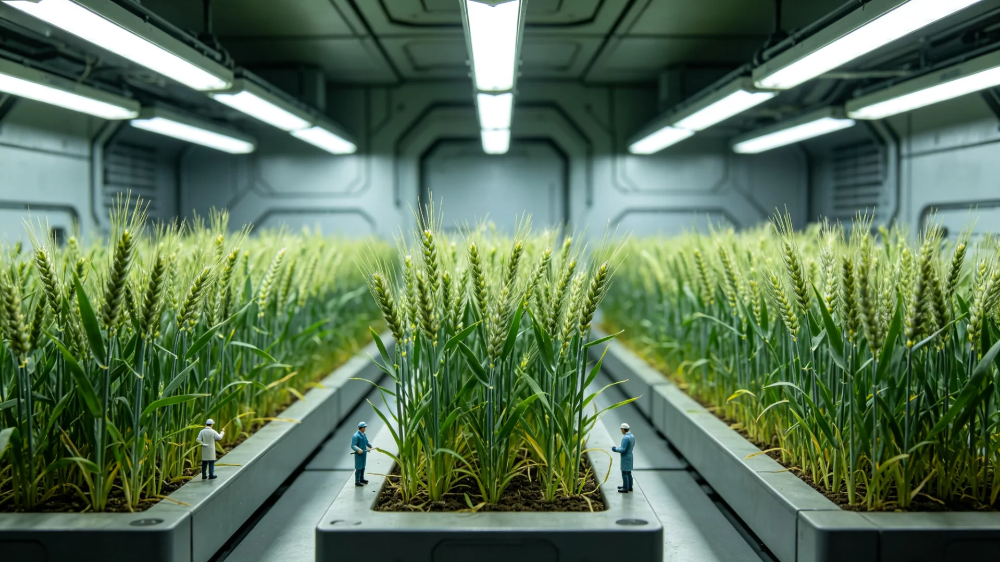

# 第四恒星系本土土壤改良后引入地球麦类作物两年监测公报

**发布机构**：第四恒星系拓荒委农业组
**监测区间**：3224—3226两年
**发布日期**：3226年10月28日
**密级**：跨星系公开

## 一、监测背景

第四恒星系本土土壤经地球菌根接种（见GS-3143-01）十年，已具备初步成土条件。3123年光敏改良育种（见GS-3123-01）已使弱光作物可种。3224年起，农业组在新拓前哨改良土壤上小规模引入地球麦类作物，考察其在红矮星弱光、本土微生物环境下之生长、产量与食品安全，为大规模本地粮食自给（见GS-3115-01作物驯化后续）探路。

## 二、两年监测数据

| 项目 | 第一年(3224-25) | 第二年(3225-26) | 地球大田参照 |
|---|---|---|---|
| 亩产(相对) | 0.62 | 0.78 | 1.0 |
| 株高(相对) | 0.85 | 0.92 | 1.0 |
| 蛋白含量(%) | 11.2 | 12.5 | 13-14 |
| 本土微生物互作 | 弱 | 趋稳 | — |
| 食品安全检测 | 合格 | 合格 | 合格 |

## 三、分析

两年间，麦类在改良本土土壤上长势逐年向好，产量已达地球大田的近八成。本土微生物与根系之互作由"弱"趋"稳"，未见有害入侵。食品安全检测合格，未检出本土异常代谢物。弱光虽使蛋白略低，然经光敏育种（见GS-3123-01）逐年选育，可望再提。

## 四、与既有农业之关系

本监测与新拓作物驯化（见GS-3115-01）、第四恒星系光敏育种（见GS-3123-01）一脉相承。农业组强调：小规模试验不等于大规模推广，在本土生态安全（见GS-3107-01原生生物隔离）未确认前，麦类只在温室试验田种植，不入本土大田。

## 五、后续

3227年起扩大试验至三处温室，重点考察土壤长期改良与麦类连作之影响。

## 六、本土生物安全边界

麦类只在温室试验田种植，不入本土大田。农业组定期检测本土微生物群落，未因麦类引入而异常。与原生生物四级隔离（见GS-3107-01）一样，地球麦类亦不与本土生态自由接触。农业组说明：弱光种麦是为自给，不是为改造本土；边界须守住。

## 七、本土生物安全边界

## 八、食品安论

两年监测麦类食品安全检测合格，未检出本土异常代谢物。亩产经光敏育种（见GS-3123-01）逐年选育可望再提。农业组强调：小规模试验不等于大规模推广，本土生态安全未确认前不入大田。

## 九、为自给非改造本土

农业组说明：弱光种麦是为自给，不是为改造本土；边界须守住。麦类只在温室试验田，不入本土大田。3227年起扩大试验至三处温室，重点考察土壤长期改良与麦类连作影响。

## 十、立卷说明

两年监测麦类食品安全检测合格，未检出本土异常代谢物；亩产经光敏育种（见GS-3123-01）逐年选育可望再提。麦类只在温室试验田种植，不入本土大田；农业组定期检测本土微生物群落，未因麦类引入而异常。农业组在卷末附言：弱光种麦是为自给，不是为改造本土；与原生生物四级隔离（见GS-3107-01）一样，地球麦类亦不与本土生态自由接触，边界须守住。3227年起扩大试验至三处温室，重点考察土壤长期改良与麦类连作影响。

## 十一、附记

本卷由联合体社会保障署档案股立卷，于次年三月底前完成编目并接入文枢（见GS-3015-01）总目，供跨系调阅。卷内所涉数据、名册、签名、考勤、体检、处分均为世界内公文物证，不作文学渲染。后续同类事件、同类制度修订，均应参照本卷交叉引注，保持时间线互锁。

## 十二、年度复核

次年同季，立卷单位对本卷所述制度、数据、人员作年度复核，确认无重大变更后方行归档定卷。复核中发现之偏差另立更正卷，不涂改原卷。文枢中心（见GS-3015-01）说明：档案之可信，正在于可更正而不伪造；本卷此后如有续事，另立后卷，与本卷互锁。

## 十三、立卷单位说明

本卷立卷单位在次年同季复核中，对卷内数据、名册、签名、考勤、体检、处分逐项核对，确认与实际办理一致，无篡改、无补造。复核中另见三系与第四恒星系方向在本卷所述事项上尚有细则差异，已于本卷附"待并条"二件，留待下一轮制度统一时处理。文枢中心（见GS-3015-01）说明：跨星系社会之事，往往一系已办、他系未办，差异本属常态；本卷既存其异，亦记其同，供后来者据以并轨。本卷自此定卷，后续如有续事，另立后卷与本卷互锁，不改一字。

## 十四、定卷

经上述各节所载数据、名册与立卷单位复核，本卷事实清楚、引证互锁，准予定卷归档。此后任何引用本卷者，应连同所引后卷一并查考，不得孤证立论。

## 十五、存档备查

本卷自定卷之日起，原件存于立卷单位库房，副本存文枢中心（见GS-3015-01）跨星系档案总目。跨系调阅须经申请，涉密与涉个人隐私部分依知情权制度（见GS-3181-01）解密后公开。

---

**签发**：拓荒委农业组 麦有光
**日期**：3226年10月28日
**归档编号**：FRT-AGRI-3226-019
