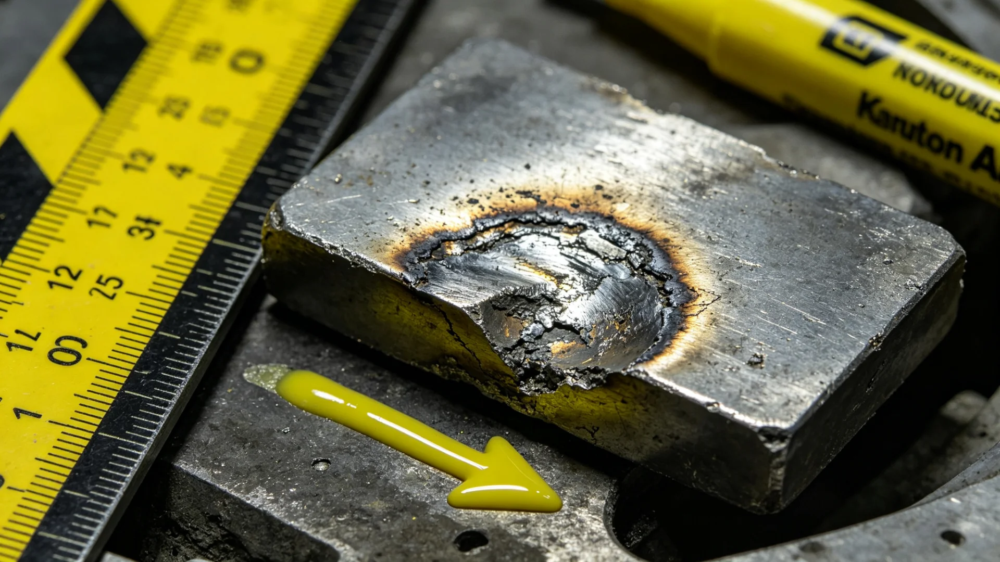

# 第六代聚变堆芯长寿命钨偏滤器辐照损伤累计评估报告

**报告单位**：三恒星系文明联合体推进工程署
**报告日期**：3229年4月18日
**密级**：工程公开

## 一、评估背景

第六代聚变推进系统经长程巡航十万小时无故障鉴定（见GS-3174-01）与长航程试运行（见GS-3053-01），已成为跨系主推进。其堆芯钨偏滤器直面高温等离子体，承受中子辐照与热冲击。长航程累计运行后，偏滤器钨块之辐照肿胀与热疲劳直接决定堆芯检修周期。推进署遂对外缘试车台一台累计运行十八万小时之第六代堆芯作偏滤器辐照损伤累计评估。

## 二、评估方法

1. **取样**：停堆后，自堆芯不同位置取钨偏滤器试样十二块；
2. **显微观察**：在电子显微镜下观察辐照空洞、晶粒变化与热疲劳裂纹；
3. **力学测试**：测试样硬度、冲击韧性之衰减；
4. **对照**：与出厂基线、与十万小时（见GS-3174-01）试样对比。

## 三、评估数据

| 项目 | 出厂 | 十万小时 | 十八万小时 | 限值 |
|---|---|---|---|---|
| 辐照空洞密度(相对) | 0 | 0.4 | 0.7 | ≤0.9 |
| 热疲劳裂纹最长(毫米) | 0 | 0.2 | 0.6 | ≤1.0 |
| 硬度变化(%) | 0 | +6 | +11 | ≤+15 |
| 冲击韧性残留(%) | 100 | 92 | 84 | ≥80 |

## 四、结论与建议

十八万小时后，偏滤器各项指标仍在限值内，然韧性已降至84%，接近预警。评估组建议：第六代堆芯偏滤器检修周期由原定二十万小时提前至十八万小时，届时即更换偏滤器模块，不必等到极限。长寿命钨配方经十八万小时考验，证明可靠，可用于后续远航船。

## 五、与推进安全之关系

本评估配合跨系客运船安全标准（见GS-2986-01）执行。推进署强调：偏滤器虽非乘客可见，然为堆芯安全之关键，十八万小时即换，不靠运气。

## 六、对远航船寿命之影响

十八万小时偏滤器评估，使第六代聚变推进（见GS-3174-01）堆芯检修周期提前。推进署说明：偏滤器是堆芯内最易损件，提前换不是保守，是对远航船乘客负责。长寿命钨配方经十八万小时考验，将用于后续跨四恒星系远航船（见GS-3111-01微型生保类配套）。

## 七、对远航船寿命之影响

## 八、不拖到极限

评估组建议：检修周期由原定二十万小时提前至十八万小时，届时即换偏滤器模块，不等到极限。推进署说明：提前换不是保守，是对远航船乘客负责。钨配方经十八万小时考验可用于后续远航船。

## 九、十八万小时即换

评估组建议检修周期由二十万小时提前至十八万小时，届时即换偏滤器模块，不等到极限。长寿命钨配方经十八万小时考验，将用于后续跨四恒星系远航船，与微型生保（见GS-3111-01）配套。

## 十、立卷说明

评估组建议检修周期由原定二十万小时提前至十八万小时，届时即换偏滤器模块，不等到极限。十八万小时偏滤器评估使第六代聚变推进（见GS-3174-01）堆芯检修周期提前；长寿命钨配方经十八万小时考验，将用于后续跨四恒星系远航船，与微型生保（见GS-3111-01）配套。推进署在卷末附言：偏滤器是堆芯内最易损件，提前换不是保守，是对远航船乘客负责；不拖到极限，是工程成熟之处。

## 十一、附记

本卷由主带自律城市群档案处立卷，于次年三月底前完成编目并接入文枢（见GS-3015-01）总目，供跨系调阅。卷内所涉数据、名册、签名、考勤、体检、处分均为世界内公文物证，不作文学渲染。后续同类事件、同类制度修订，均应参照本卷交叉引注，保持时间线互锁。

## 十二、年度复核

次年同季，立卷单位对本卷所述制度、数据、人员作年度复核，确认无重大变更后方行归档定卷。复核中发现之偏差另立更正卷，不涂改原卷。文枢中心（见GS-3015-01）说明：档案之可信，正在于可更正而不伪造；本卷此后如有续事，另立后卷，与本卷互锁。

## 十三、立卷单位说明

本卷立卷单位在次年同季复核中，对卷内数据、名册、签名、考勤、体检、处分逐项核对，确认与实际办理一致，无篡改、无补造。复核中另见三系与第四恒星系方向在本卷所述事项上尚有细则差异，已于本卷附"待并条"二件，留待下一轮制度统一时处理。文枢中心（见GS-3015-01）说明：跨星系社会之事，往往一系已办、他系未办，差异本属常态；本卷既存其异，亦记其同，供后来者据以并轨。本卷自此定卷，后续如有续事，另立后卷与本卷互锁，不改一字。

## 十四、定卷

经上述各节所载数据、名册与立卷单位复核，本卷事实清楚、引证互锁，准予定卷归档。此后任何引用本卷者，应连同所引后卷一并查考，不得孤证立论。

## 十五、存档备查

本卷自定卷之日起，原件存于立卷单位库房，副本存文枢中心（见GS-3015-01）跨星系档案总目。跨系调阅须经申请，涉密与涉个人隐私部分依知情权制度（见GS-3181-01）解密后公开。

---

**评估负责**：推进工程署堆芯组 钨守恒
**日期**：3229年4月18日
**编号**：PROP-DIV-3229-006
