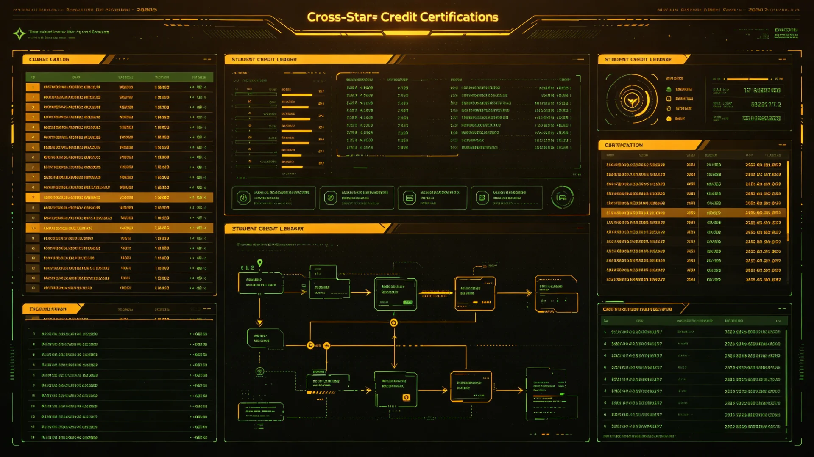

# 联合体跨星系教育服务与学分认证产业年度产值决算报告

**编制单位**：联合体经济署产业统计组
**决算年度**：3230
**报告日期**：3230年12月1日
**密级**：跨星系公开

## 一、产业背景

星际教育学分互认与跨系学位体系（见GS-2923-01）、统一基础教育课程标准（见GS-3173-01）建立后，跨系教育服务逐渐从公益事业中分出可结算之部分：跨系课程进修、学分认证、师资培训、成人再教育。随跨系学籍迁移统一规则（见GS-3219-01）落地，跨系求学日益便利，教育服务产业遂成独立统计项。

## 二、年度产值决算

| 产业项 | 3228产值 | 3230产值 | 同比 |
|---|---|---|---|
| 跨系课程进修 | 基准 | +34% | 增 |
| 学分认证服务 | 基准 | +21% | 增 |
| 师资跨系培训 | 基准 | +18% | 增 |
| 成人再教育 | 基准 | +27% | 增 |
| 合计(跨星系口径) | 基准 | +26% | 增 |

## 三、结构分析

跨系课程进修增长最快，多为主带、新拓前哨居民赴新海市、下都进修，亦有新海市居民赴谷神星学矿业、赴新拓学拓荒技术。学分认证服务随学籍迁移（见GS-3219-01）需求而增。成人再教育主要面向矿枯转型工人（见GS-3225-01转移支付）。

## 四、公益性与产业之界

经济署强调：义务教育与统一课程（见GS-3173-01）仍为公益，不在本产业统计内；本产业仅统计可结算之进修、认证、培训服务，不得以"教育产业"之名行义务教育商业化之实。

## 五、后续

3231年起将跨系教育服务纳入年度常规统计。

## 五、教育产业边界重申

经济署再次强调：义务教育与统一课程（见GS-3173-01）为公益，不入本产业统计。本产业仅统计可结算之进修、认证、培训。成人再教育主要服务矿枯转型工人（见GS-3225-01），与转移支付衔接。不得以"教育产业"之名行义务教育商业化。

## 六、教育产业边界重申

## 六、结构分析

跨系课程进修增长最快，多为主带、新拓居民赴新海、下都进修，亦有新海市居民赴谷神学矿业、赴新拓学拓荒技术。成人再教育主要服务矿枯转型工人（见GS-3225-01）。义务教育不入本产业。

## 七、义务教育不入产业

经济署强调：义务教育与统一课程（见GS-3173-01）为公益，不入本产业统计。本产业仅统计可结算之进修、认证、培训。成人再教育主要服务矿枯转型工人（见GS-3225-01），不得以教育产业之名行义务教育商业化。

## 八、立卷说明

跨系课程进修增长最快，多为主带、新拓居民赴新海、下都进修，亦有新海市居民赴谷神学矿业、赴新拓学拓荒技术。经济署在卷末附言：义务教育与统一课程（见GS-3173-01）为公益，不入本产业统计；本产业仅统计可结算之进修、认证、培训。成人再教育主要服务矿枯转型工人（见GS-3225-01），与转移支付衔接。不得以"教育产业"之名行义务教育商业化。

## 十一、附记

本卷由比邻星b生态监测总站立卷，于次年三月底前完成编目并接入文枢（见GS-3015-01）总目，供跨系调阅。卷内所涉数据、名册、签名、考勤、体检、处分均为世界内公文物证，不作文学渲染。后续同类事件、同类制度修订，均应参照本卷交叉引注，保持时间线互锁。

## 十二、年度复核

次年同季，立卷单位对本卷所述制度、数据、人员作年度复核，确认无重大变更后方行归档定卷。复核中发现之偏差另立更正卷，不涂改原卷。文枢中心（见GS-3015-01）说明：档案之可信，正在于可更正而不伪造；本卷此后如有续事，另立后卷，与本卷互锁。

## 十三、立卷单位说明

本卷立卷单位在次年同季复核中，对卷内数据、名册、签名、考勤、体检、处分逐项核对，确认与实际办理一致，无篡改、无补造。复核中另见三系与第四恒星系方向在本卷所述事项上尚有细则差异，已于本卷附"待并条"二件，留待下一轮制度统一时处理。文枢中心（见GS-3015-01）说明：跨星系社会之事，往往一系已办、他系未办，差异本属常态；本卷既存其异，亦记其同，供后来者据以并轨。本卷自此定卷，后续如有续事，另立后卷与本卷互锁，不改一字。

## 十四、定卷

经上述各节所载数据、名册与立卷单位复核，本卷事实清楚、引证互锁，准予定卷归档。此后任何引用本卷者，应连同所引后卷一并查考，不得孤证立论。

## 十五、存档备查

本卷自定卷之日起，原件存于立卷单位库房，副本存文枢中心（见GS-3015-01）跨星系档案总目。跨系调阅须经申请，涉密与涉个人隐私部分依知情权制度（见GS-3181-01）解密后公开。

## 十六、说明

本卷所列各项数据经立卷单位核实，与所附名册、签名、考勤、体检、处分等物证一一对应，无孤证。跨系引用本卷，应连同后卷并查。

## 十七、余论

立卷单位重申：本卷所述为世界内公文物证，不作文学渲染；所涉跨系比较，以并轨与互认为归，不以一系之长短论优劣。

---

**编制**：经济署产业统计组 学有产
**日期**：3230年12月1日
**编号**：ECON-EDU-3230-021
