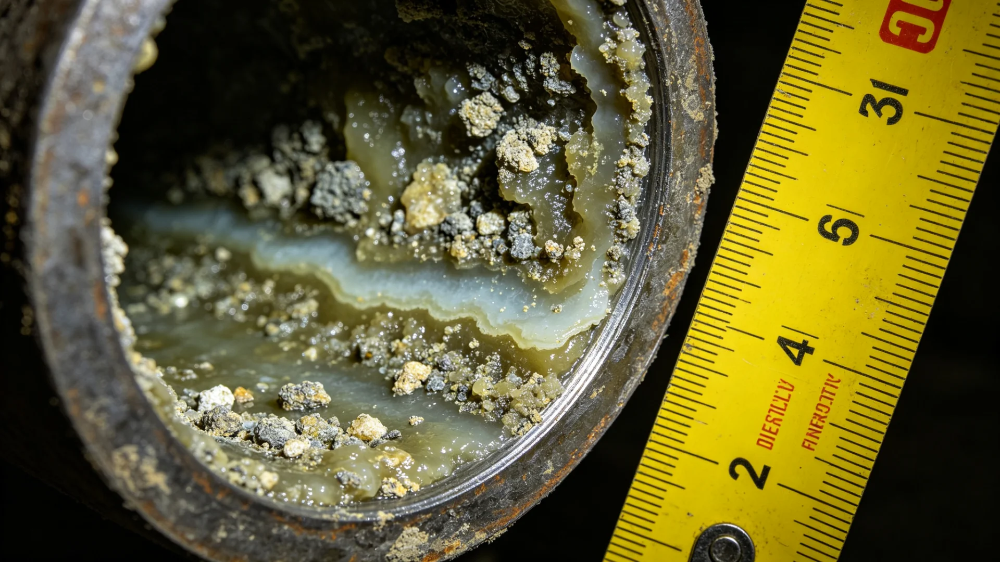

# 主带各矿站密闭饮水舱生物膜污染治理与百年监测总结公报

**发布机构**：主小行星带自律城市群卫生与生态署
**监测区间**：百年
**发布日期**：3232年9月15日
**密级**：跨星系公开

## 一、监测背景

主带各矿站密闭饮水舱为封闭水循环系统，百年运行后，管壁与舱底易生生物膜——一层细菌与胞外聚合物之黏附物，虽经消毒，仍易复发。谷神星地下暗湖人工生态（见GS-3094-01）百年演替中，饮水生物膜亦为长期监测项。卫生署遂对主带各矿站密闭饮水舱生物膜污染作百年总结。

## 二、百年治理数据

| 年代 | 生物膜重度污染站比例(%) | 治理方式 |
|---|---|---|
| 3130 | 22 | 化学冲洗 |
| 3160 | 11 | 化学+紫外 |
| 3190 | 5 | 定期清洗+监测 |
| 3232 | 2 | 模块化换壁 |

百年间，重度污染比例由两成二降至百分之二。

## 三、治理经验

初时只靠化学冲洗，生物膜复发快；后改"定期物理清洗+紫外抑制+模块换壁"组合，复发大减。关键在"防"不在"治"——每季度打开检查，早发现早刮除，不必等到堵塞。

## 四、与既有生态监测之关系

本总结与谷神星暗湖生态（见GS-3094-01）、主带矿站辐射疏散（见GS-3077-01）配套。卫生署强调：密闭饮水为矿站生存之本，生物膜虽小，关系全站饮水安全。

## 五、后续

3233年起将饮水生物膜监测纳入矿站季度巡检常规项，与火星地下城市农业舱（见GS-3248-01类）同口径。

## 五、与矿站卫生常规化

饮水生物膜百年治理经验，3233年起纳入矿站季度巡检。主带卫生署说明：密闭饮水为矿站生存之本，生物膜虽小，关系全站。治理经验与火星地下农业舱（见GS-3248-01）同口径——设备不硬套年限，监测数据说了算。

## 六、矿站卫生常规化

## 六、防重于治

卫生署说明：生物膜治理关键在"防"不在"治"——每季度打开检查，早发现早刮除，不必等到堵塞。初时只靠化学冲洗复发快，后改物理清洗加紫外加换壁组合，复发大减。

## 七、百年降九成

百年间饮水生物膜重度污染站比例由两成二降至百分之二。关键在"防"不在"治"——每季度打开检查，早发现早刮除。治理经验与火星地下农业舱（见GS-3248-01）同口径，设备不硬套年限。

## 八、立卷说明

百年间饮水生物膜重度污染站比例由两成二降至百分之二。初时只靠化学冲洗复发快，后改物理清洗加紫外加换壁组合，复发大减。饮水生物膜百年治理经验，3233年起纳入矿站季度巡检。主带卫生署在卷末附言：密闭饮水为矿站生存之本，生物膜虽小，关系全站；治理关键在"防"不在"治"——每季度打开检查，早发现早刮除，不必等到堵塞。与火星地下农业舱（见GS-3248-01）同口径，设备不硬套年限，监测数据说了算。

## 十一、附记

本卷由下都市档案处立卷，于次年三月底前完成编目并接入文枢（见GS-3015-01）总目，供跨系调阅。卷内所涉数据、名册、签名、考勤、体检、处分均为世界内公文物证，不作文学渲染。后续同类事件、同类制度修订，均应参照本卷交叉引注，保持时间线互锁。

## 十二、年度复核

次年同季，立卷单位对本卷所述制度、数据、人员作年度复核，确认无重大变更后方行归档定卷。复核中发现之偏差另立更正卷，不涂改原卷。文枢中心（见GS-3015-01）说明：档案之可信，正在于可更正而不伪造；本卷此后如有续事，另立后卷，与本卷互锁。

## 十三、立卷单位说明

本卷立卷单位在次年同季复核中，对卷内数据、名册、签名、考勤、体检、处分逐项核对，确认与实际办理一致，无篡改、无补造。复核中另见三系与第四恒星系方向在本卷所述事项上尚有细则差异，已于本卷附"待并条"二件，留待下一轮制度统一时处理。文枢中心（见GS-3015-01）说明：跨星系社会之事，往往一系已办、他系未办，差异本属常态；本卷既存其异，亦记其同，供后来者据以并轨。本卷自此定卷，后续如有续事，另立后卷与本卷互锁，不改一字。

## 十四、定卷

经上述各节所载数据、名册与立卷单位复核，本卷事实清楚、引证互锁，准予定卷归档。此后任何引用本卷者，应连同所引后卷一并查考，不得孤证立论。

## 十五、存档备查

本卷自定卷之日起，原件存于立卷单位库房，副本存文枢中心（见GS-3015-01）跨星系档案总目。跨系调阅须经申请，涉密与涉个人隐私部分依知情权制度（见GS-3181-01）解密后公开。

## 十六、说明

本卷所列各项数据经立卷单位核实，与所附名册、签名、考勤、体检、处分等物证一一对应，无孤证。跨系引用本卷，应连同后卷并查。

## 十七、余论

立卷单位重申：本卷所述为世界内公文物证，不作文学渲染；所涉跨系比较，以并轨与互认为归，不以一系之长短论优劣。

---

**签发**：主带卫生与生态署 水长清
**日期**：3232年9月15日
**归档编号**：BELT-WATER-3232-008
