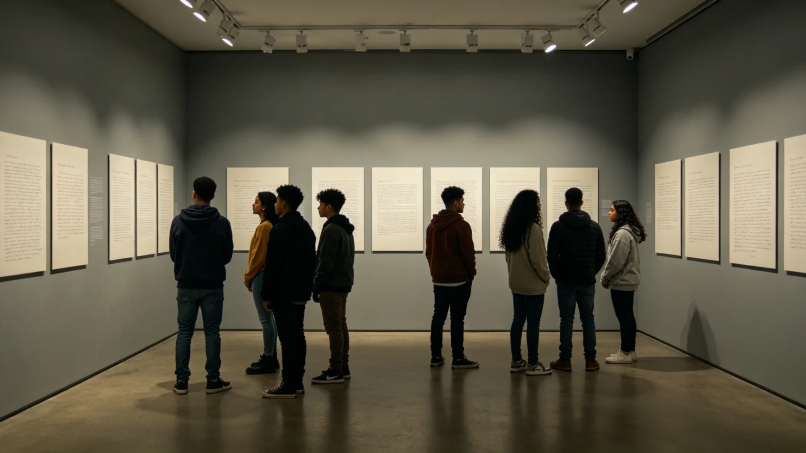

# 跨星系"混血一代"身份认同主题征文与展评获奖名录公报

**发布机构**：三恒星系文明联合体文化与公共礼仪署
**发布日期**：3234年12月19日
**文件等级**：跨星系公开

## 一、征文缘起

跨星系通婚家庭已历三四代（参见GS-3216-01通婚二代外交官）。这一代年轻人，一人身上兼有两个乃至三个星系之来历，却常被问"你到底算哪里人"。文化署遂以"混血一代"身份认同为主题征文，请他们自己说："我是谁、我从哪里来、我算哪里人。"征文不设标准答案，只求真实。

## 二、征文规程

1. **对象**：跨星系通婚家庭之第二代、第三代公民；
2. **体裁**：散文、家书、短论皆可，限五千字；
3. **评审**：由三位不同星系出身之评委盲评，不设主题导向；
4. **公开**：获奖作品公开展评，文集存档文枢（见GS-3015-01）。

## 三、获奖名录（节选）

| 奖项 | 题目 | 作者背景 |
|---|---|---|
| 首奖 | 《我是两个天空的孩子》 | 父比邻星b、母谷神星 |
| 次奖 | 《籍贯一栏我填了三个星》 | 父新海市、母新拓 |
| 次奖 | 《爷爷问我是哪里人》 | 祖父母分别来自地球与下都 |
| 入围 | 《不说方言的人》 | 通婚家庭第三代 |

首奖作品《我是两个天空的孩子》写："小时候在新海市看海，在谷神星看矿。同学问我是哪里人，我说不出一个地名。后来我懂了，我就是那些航线本身。"

## 四、反响

展评期间，参观者留言中最多的一句是："原来不只我一个人这样。"文化署说明：本征文不塑造"混血一代"为新标签，只让这一代自己发声。与代际对话周（见GS-3220-01）不同，彼为老一代讲，此为年轻一代自己讲。

## 五、后续

获奖文集编入《寻源记》年刊（见GS-3213-01）。3235年起此类征文每三年一届。

## 六、展评后续

获奖文集编入《寻源记》年刊（见GS-3213-01），公开于文枢（见GS-3015-01）。文化署说明：混血一代不是被命名的标签，是自己说出的人。此类征文每三年一届，不预设答案。

## 七、展评后续

## 七、参观者留言

展评期间参观者留言最多一句："原来不只我一个人这样。"文化署说明：本征文不塑造"混血一代"为新标签，只让这一代自己发声。此类征文每三年一届，不预设答案。

## 八、自己说出的人

文化署说明：混血一代不是被命名的标签，是自己说出的人。获奖作品《我是两个天空的孩子》写"我就是那些航线本身"。此类征文每三年一届，不预设答案，与代际对话周互补。

## 九、立卷说明

展评期间参观者留言最多一句："原来不只我一个人这样。"获奖作品《我是两个天空的孩子》写"我就是那些航线本身"。获奖文集编入《寻源记》年刊（见GS-3213-01），公开于文枢（见GS-3015-01）。文化署在卷末附言：混血一代不是被命名的标签，是自己说出的人；此类征文每三年一届，不预设答案，与代际对话周互补——彼为老一代讲，此为年轻一代自己讲。

## 十一、附记

本卷由联合体经济署档案股立卷，于次年三月底前完成编目并接入文枢（见GS-3015-01）总目，供跨系调阅。卷内所涉数据、名册、签名、考勤、体检、处分均为世界内公文物证，不作文学渲染。后续同类事件、同类制度修订，均应参照本卷交叉引注，保持时间线互锁。

## 十二、年度复核

次年同季，立卷单位对本卷所述制度、数据、人员作年度复核，确认无重大变更后方行归档定卷。复核中发现之偏差另立更正卷，不涂改原卷。文枢中心（见GS-3015-01）说明：档案之可信，正在于可更正而不伪造；本卷此后如有续事，另立后卷，与本卷互锁。

## 十三、立卷单位说明

本卷立卷单位在次年同季复核中，对卷内数据、名册、签名、考勤、体检、处分逐项核对，确认与实际办理一致，无篡改、无补造。复核中另见三系与第四恒星系方向在本卷所述事项上尚有细则差异，已于本卷附"待并条"二件，留待下一轮制度统一时处理。文枢中心（见GS-3015-01）说明：跨星系社会之事，往往一系已办、他系未办，差异本属常态；本卷既存其异，亦记其同，供后来者据以并轨。本卷自此定卷，后续如有续事，另立后卷与本卷互锁，不改一字。

## 十四、定卷

经上述各节所载数据、名册与立卷单位复核，本卷事实清楚、引证互锁，准予定卷归档。此后任何引用本卷者，应连同所引后卷一并查考，不得孤证立论。

## 十五、存档备查

本卷自定卷之日起，原件存于立卷单位库房，副本存文枢中心（见GS-3015-01）跨星系档案总目。跨系调阅须经申请，涉密与涉个人隐私部分依知情权制度（见GS-3181-01）解密后公开。

## 十六、说明

本卷所列各项数据经立卷单位核实，与所附名册、签名、考勤、体检、处分等物证一一对应，无孤证。跨系引用本卷，应连同后卷并查。

---

**签发**：文化与公共礼仪署署长 方同尘
**日期**：3234年12月19日
**归档编号**：CUL-MIX-3234-009
