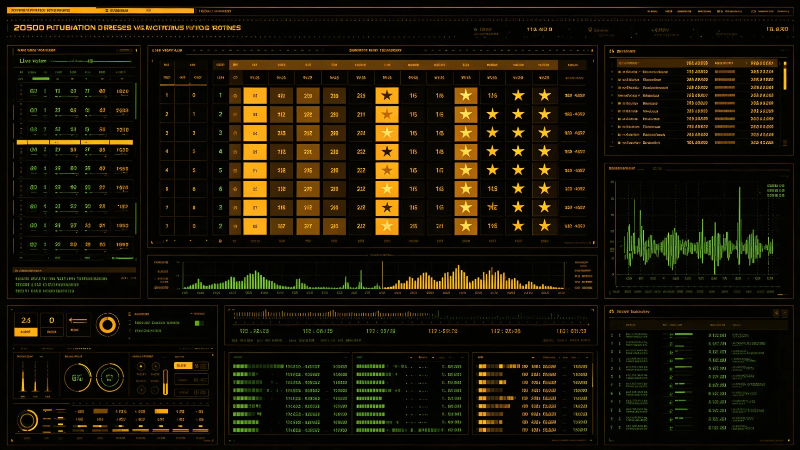

# 联合体议会跨系连线表决系统字幕延迟误读与投票更正整改公报

**发布机构**：联合体议会秘书处
**事件日期**：3239年初
**发布日期**：3239年3月30日
**密级**：跨星系公开

## 一、事件经过

联合体议会跨系连线表决（见GS-3066-01时差投票规则）依赖同步字幕与协时网授时（见GS-3209-01）。3239年2月一次例行表决中，因跨系连线字幕延迟约二秒，一名远在下都连线之议员将一项修正案之表决误读为另一项，投错票。表决结果当场察觉票数异常，议长宣布休会，核对记录后更正投票，重新计票通过。事件未影响立法实质，然暴露字幕延迟之隐患。

## 二、时间线

| 时刻 | 事件 |
|---|---|
| 2月 表决中 | 下都议员因字幕延迟误读修正案 |
| 表决当场 | 票数异常，议长宣布休会核对 |
| 当日 | 核对连线记录，更正投票 |
| 次日 | 重新计票，案通过 |
| 3月30日 | 公布整改公报 |

## 三、原因与整改

字幕延迟主因系连线字幕生成与显示之间未严格对齐协时网（见GS-3209-01）。整改：1. 跨系连线表决字幕与授时严格对齐，延迟不得超过零点三秒；2. 表决前各连线方须以同步提示音确认已看清；3. 票数异常自动报警；4. 对误读议员不予追究，其当场更正之举获肯定。

## 四、与既有制度之关系

本整改与跨系表决程序修订（见GS-3066-01）、协时网光频标（见GS-3209-01）配套。秘书处强调：跨系立法之"准"，系于授时与字幕之准。

## 五、误读议员之说明

误读议员当场承认并请求更正，议长未追究其责。议会秘书处说明：跨系立法之准，系于授时（见GS-3209-01）与字幕之准；人会错读，机器应可纠正。本案未影响立法实质。

## 六、误读议员之说明

## 七、人会错读机器应纠正

秘书处说明：跨系立法之"准"系于授时（见GS-3209-01）与字幕之准。人会错读，机器应可纠正。票数异常自动报警、表决前同步提示音，此二项为本次整改关键。

## 八、当场更正不追究

误读议员当场承认并请求更正，议长未追究其责。秘书处说明：人会错读，机器应可纠正。票数异常自动报警、表决前同步提示音，为本次整改关键。本案未影响立法实质。

## 九、立卷说明

误读议员当场承认并请求更正，议长未追究其责；重新计票后案通过，未影响立法实质。秘书处整改二项：其一，表决屏票数异常自动报警；其二，跨系表决同步提示音。议会秘书处在卷末附言：跨系立法之"准"系于授时（见GS-3209-01）与字幕之准；人会错读，机器应可纠正。人会错读机器应纠正，这是跨系立法机器辅助之底线。

## 十一、附记

本卷由联合体医疗总署档案股立卷，于次年三月底前完成编目并接入文枢（见GS-3015-01）总目，供跨系调阅。卷内所涉数据、名册、签名、考勤、体检、处分均为世界内公文物证，不作文学渲染。后续同类事件、同类制度修订，均应参照本卷交叉引注，保持时间线互锁。

## 十二、年度复核

次年同季，立卷单位对本卷所述制度、数据、人员作年度复核，确认无重大变更后方行归档定卷。复核中发现之偏差另立更正卷，不涂改原卷。文枢中心（见GS-3015-01）说明：档案之可信，正在于可更正而不伪造；本卷此后如有续事，另立后卷，与本卷互锁。

## 十三、立卷单位说明

本卷立卷单位在次年同季复核中，对卷内数据、名册、签名、考勤、体检、处分逐项核对，确认与实际办理一致，无篡改、无补造。复核中另见三系与第四恒星系方向在本卷所述事项上尚有细则差异，已于本卷附"待并条"二件，留待下一轮制度统一时处理。文枢中心（见GS-3015-01）说明：跨星系社会之事，往往一系已办、他系未办，差异本属常态；本卷既存其异，亦记其同，供后来者据以并轨。本卷自此定卷，后续如有续事，另立后卷与本卷互锁，不改一字。

## 十四、定卷

经上述各节所载数据、名册与立卷单位复核，本卷事实清楚、引证互锁，准予定卷归档。此后任何引用本卷者，应连同所引后卷一并查考，不得孤证立论。

## 十五、存档备查

本卷自定卷之日起，原件存于立卷单位库房，副本存文枢中心（见GS-3015-01）跨星系档案总目。跨系调阅须经申请，涉密与涉个人隐私部分依知情权制度（见GS-3181-01）解密后公开。

## 十六、说明

本卷所列各项数据经立卷单位核实，与所附名册、签名、考勤、体检、处分等物证一一对应，无孤证。跨系引用本卷，应连同后卷并查。

## 十七、余论

立卷单位重申：本卷所述为世界内公文物证，不作文学渲染；所涉跨系比较，以并轨与互认为归，不以一系之长短论优劣。

## 十八、结语

本卷至此定卷，存备查考。

---

**签发**：议会秘书处 议有信
**日期**：3239年3月30日
**事件编号**：PARL-VOTE-3239-001
