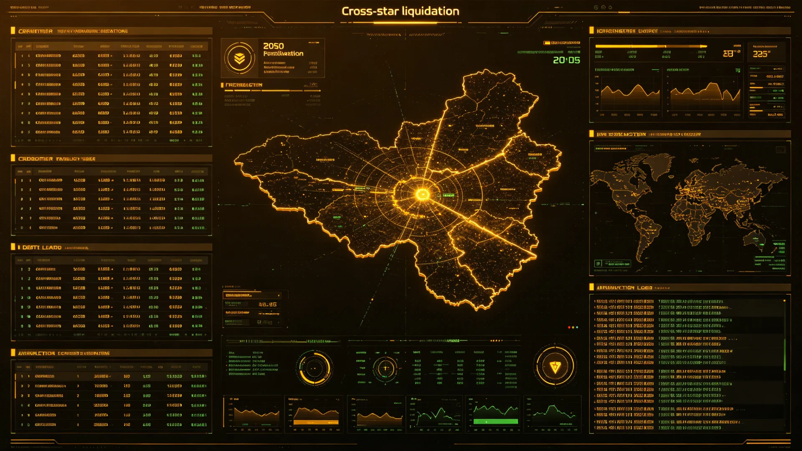

# 联合体跨星系破产清算与债务连带承担规则统一公报

**发布机构**：三恒星系文明联合体法律事务署
**发布日期**：3241年7月10日
**文件等级**：跨星系公开

## 一、规则背景

跨星系贸易（见GS-3056-01自贸区）与产业（见GS-3223-01一体化产业带）百年后，跨系企业破产、债务连带之纠纷渐多。然各星系破产清算规则不一，一企业在新海市破产、在谷神星仍可欠债，债权人难追。法律署遂统一跨系破产清算与债务连带承担规则，使跨系企业"一处破产、全域清算"。

## 二、统一规则要点

1. **一处受理**：跨系企业破产，债权人可向任一系破产庭申请，全域债权一并申报；
2. **债务连带**：跨系关联企业债务连带，不因星系不同而逃脱；
3. **清算财产跨系查控**：债务人在各星系之财产，经破产庭裁定可跨系查控；
4. **职工优先**：破产企业职工之工资、补偿优先于普通债权，与跨系工伤互认（见GS-3133-01）衔接；
5. **程序透明**：破产清算文书接入文枢（见GS-3015-01），债权人可跨系查阅。

## 三、试行数据

规则于3240年试行一年：受理跨系破产案件四十二件，较上年增加三成（与跨系产业活跃一致）；跨系债权平均追讨率由旧制的四成提至七成；未发生债务人借星系差异逃债。

## 四、与既有法律之关系

本规则与跨系仲裁（见GS-3201-01类）、跨系复议（见GS-3202-01）、判例援引（见GS-3080-01）配套。法律署强调：统一破产清算，是跨系市场真正统一之标志。

## 五、施行

自3241年8月1日起三恒星系及第四恒星系前哨同步施行。

## 六、职工优先之落实

破产企业职工工资与补偿优先于普通债权，与跨系工伤互认（见GS-3133-01）衔接。法律署说明：统一破产清算，是跨系市场真正统一之标志；职工饭碗，比债权人钱袋先算。

## 七、职工优先之落实

## 七、试行效果

试行一年受理跨系破产四十二件，跨系债权平均追讨率由旧制四成提至七成，未发生债务人借星系差异逃债。法律署说明：统一破产清算，是跨系市场真正统一之标志。

## 八、职工饭碗先算

法律署说明：统一破产清算，是跨系市场真正统一之标志。破产企业职工工资与补偿优先于普通债权——职工饭碗，比债权人钱袋先算。与跨系工伤互认（见GS-3133-01）衔接。

## 九、立卷说明

试行一年受理跨系破产四十二件，跨系债权平均追讨率由旧制四成提至七成，未发生债务人借星系差异逃债。破产企业职工工资与补偿优先于普通债权，与跨系工伤互认（见GS-3133-01）衔接。法律署在卷末附言：统一破产清算，是跨系市场真正统一之标志；职工饭碗，比债权人钱袋先算。破产文书接入文枢（见GS-3015-01），债权人可跨系查阅。

## 十一、附记

本卷由主带自律城市群档案处立卷，于次年三月底前完成编目并接入文枢（见GS-3015-01）总目，供跨系调阅。卷内所涉数据、名册、签名、考勤、体检、处分均为世界内公文物证，不作文学渲染。后续同类事件、同类制度修订，均应参照本卷交叉引注，保持时间线互锁。

## 十二、年度复核

次年同季，立卷单位对本卷所述制度、数据、人员作年度复核，确认无重大变更后方行归档定卷。复核中发现之偏差另立更正卷，不涂改原卷。文枢中心（见GS-3015-01）说明：档案之可信，正在于可更正而不伪造；本卷此后如有续事，另立后卷，与本卷互锁。

## 十三、立卷单位说明

本卷立卷单位在次年同季复核中，对卷内数据、名册、签名、考勤、体检、处分逐项核对，确认与实际办理一致，无篡改、无补造。复核中另见三系与第四恒星系方向在本卷所述事项上尚有细则差异，已于本卷附"待并条"二件，留待下一轮制度统一时处理。文枢中心（见GS-3015-01）说明：跨星系社会之事，往往一系已办、他系未办，差异本属常态；本卷既存其异，亦记其同，供后来者据以并轨。本卷自此定卷，后续如有续事，另立后卷与本卷互锁，不改一字。

## 十四、定卷

经上述各节所载数据、名册与立卷单位复核，本卷事实清楚、引证互锁，准予定卷归档。此后任何引用本卷者，应连同所引后卷一并查考，不得孤证立论。

## 十五、存档备查

本卷自定卷之日起，原件存于立卷单位库房，副本存文枢中心（见GS-3015-01）跨星系档案总目。跨系调阅须经申请，涉密与涉个人隐私部分依知情权制度（见GS-3181-01）解密后公开。

## 十六、说明

本卷所列各项数据经立卷单位核实，与所附名册、签名、考勤、体检、处分等物证一一对应，无孤证。跨系引用本卷，应连同后卷并查。

## 十七、余论

立卷单位重申：本卷所述为世界内公文物证，不作文学渲染；所涉跨系比较，以并轨与互认为归，不以一系之长短论优劣。

---

**签发**：法律事务署署长 法有凭
**日期**：3241年7月10日
**归档编号**：LAW-BANKR-3241-006
