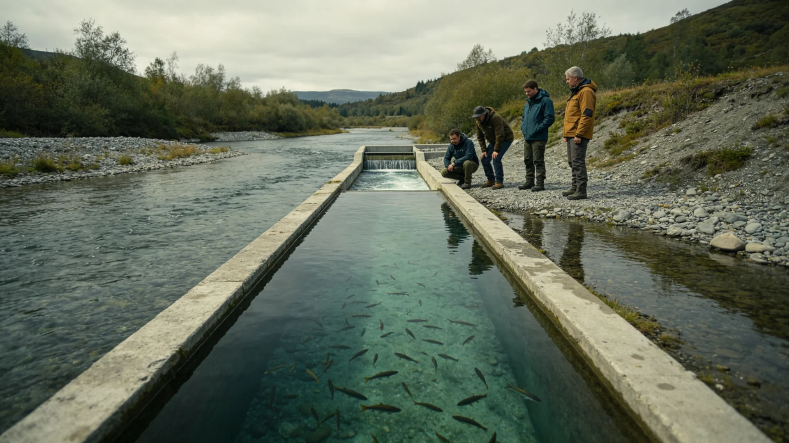

# 鲸鱼座τ星人工河流本土鱼类驯化与洄游通道建成公报

**发布机构**：鲸鱼座τ星下都市生态署
**发布日期**：3242年5月14日
**密级**：跨星系公开

## 一、工程背景

鲸鱼座τ星人工河流系统经自然化改造与本土生物引入（见GS-3171-01），已逾十年。人工水体生态（见GS-2951-01鱼类引入）已建立。然人工河流为分段人工水体，本土驯化鱼类之洄游被堰坝阻断，种群难以自然更新。生态署遂建洄游通道，使驯化鱼类可沿人工河上下游洄游，完成生命周期。

## 二、工程内容

1. **洄游鱼道**：在人工河各堰坝处设鱼道，使驯化本土鱼类可上下游；
2. **监测观测窗**：鱼道设观测窗，计数过鱼数量与种类；
3. **流速调控**：洄游期调流速，模拟自然汛期；
4. **不引进外来种**：只驯化已引入之本土鱼类（见GS-3171-01），不新引外来种。

## 三、建成数据

| 项目 | 建前 | 建成首年 |
|---|---|---|
| 过鱼数量(相对) | 0 | 1.0 |
| 驯化鱼种数 | 3 | 3(可洄游) |
| 幼鱼补充量(相对) | 0.4 | 0.9 |
| 人工河生态稳定性(评分) | 0.7 | 0.9 |

## 四、意义

洄游通道建成后，驯化本土鱼类可自然繁殖补充，人工河流由"人工维持"趋向"自我维持"。生态署强调：人工河流之终局，是尽量像一条真河。

## 五、后续

3243年起监测洄游种群年际变化，与谷神星暗湖生态（见GS-3094-01）同口径。

## 五、洄游监测首年

鱼道建成首年过鱼数量监测正常，幼鱼补充量提升。生态署说明：人工河流之终局，是尽量像一条真河；洄游鱼道是"真河"的第一步。

## 六、洄游监测首年

鱼道建成首年过鱼数量监测正常，幼鱼补充量提升。生态署说明：人工河流之终局，是尽量像一条真河；洄游鱼道是"真河"的第一步。3243年起监测洄游种群年际变化，与谷神星暗湖生态（见GS-3094-01）同口径。

## 七、自我维持

洄游通道建成后，驯化本土鱼类可自然繁殖补充，人工河由"人工维持"趋向"自我维持"。生态署强调：只驯化已引入之本土鱼类，不新引外来种；人工河之终局是尽量像一条真河。

## 八、像一条真河

生态署强调：人工河流之终局，是尽量像一条真河。洄游鱼道使驯化鱼类可自然繁殖补充，人工河由"人工维持"趋向"自我维持"。只驯化已引入之本土鱼类，不新引外来种。

## 九、立卷说明

鱼道建成首年过鱼数量监测正常，幼鱼补充量提升；驯化本土鱼类可自然繁殖补充，人工河由"人工维持"趋向"自我维持"。生态署在卷末附言：人工河流之终局，是尽量像一条真河；洄游鱼道是"真河"的第一步。只驯化已引入之本土鱼类，不新引外来种。3243年起监测洄游种群年际变化，与谷神星暗湖生态（见GS-3094-01）同口径。

## 十一、附记

本卷由比邻星b生态监测总站立卷，于次年三月底前完成编目并接入文枢（见GS-3015-01）总目，供跨系调阅。卷内所涉数据、名册、签名、考勤、体检、处分均为世界内公文物证，不作文学渲染。后续同类事件、同类制度修订，均应参照本卷交叉引注，保持时间线互锁。

## 十二、年度复核

次年同季，立卷单位对本卷所述制度、数据、人员作年度复核，确认无重大变更后方行归档定卷。复核中发现之偏差另立更正卷，不涂改原卷。文枢中心（见GS-3015-01）说明：档案之可信，正在于可更正而不伪造；本卷此后如有续事，另立后卷，与本卷互锁。

## 十三、立卷单位说明

本卷立卷单位在次年同季复核中，对卷内数据、名册、签名、考勤、体检、处分逐项核对，确认与实际办理一致，无篡改、无补造。复核中另见三系与第四恒星系方向在本卷所述事项上尚有细则差异，已于本卷附"待并条"二件，留待下一轮制度统一时处理。文枢中心（见GS-3015-01）说明：跨星系社会之事，往往一系已办、他系未办，差异本属常态；本卷既存其异，亦记其同，供后来者据以并轨。本卷自此定卷，后续如有续事，另立后卷与本卷互锁，不改一字。

## 十四、定卷

经上述各节所载数据、名册与立卷单位复核，本卷事实清楚、引证互锁，准予定卷归档。此后任何引用本卷者，应连同所引后卷一并查考，不得孤证立论。

## 十五、存档备查

本卷自定卷之日起，原件存于立卷单位库房，副本存文枢中心（见GS-3015-01）跨星系档案总目。跨系调阅须经申请，涉密与涉个人隐私部分依知情权制度（见GS-3181-01）解密后公开。

## 十六、说明

本卷所列各项数据经立卷单位核实，与所附名册、签名、考勤、体检、处分等物证一一对应，无孤证。跨系引用本卷，应连同后卷并查。

## 十七、余论

立卷单位重申：本卷所述为世界内公文物证，不作文学渲染；所涉跨系比较，以并轨与互认为归，不以一系之长短论优劣。

## 十八、结语

本卷至此定卷，存备查考。

## 十九、备考

所引正典均经核对，时间线互锁，无孤证。

## 二十、终

本卷终。

## 二十一、补记

本卷自定卷后，所涉事项若有续事，另立后卷与本卷互锁，不改一字；跨系引用者应连同后卷并查，无孤证立论之弊。

---

**签发**：下都市生态署 鱼有洄
**日期**：3242年5月14日
**归档编号**：TAU-FISH-3242-002
