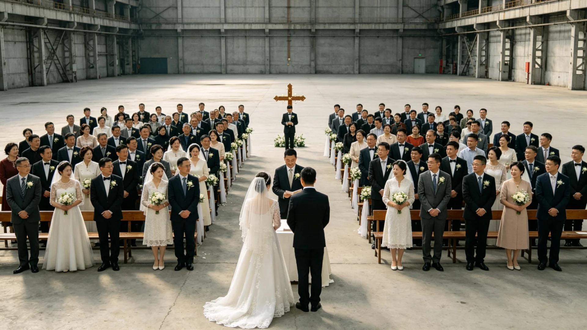

# 联合体第二代公民集体婚礼暨跨系联姻登记破万典礼公报

**发布机构**：三恒星系文明联合体文化与公共礼仪署
**发布日期**：3243年10月1日
**文件等级**：跨星系公开

## 一、典礼背景

跨系婚姻登记首例"星空婚礼"（见GS-2941-01）以来，跨系联姻已历百年。跨星系家庭法（见GS-3189-01）统一后，跨系联姻登记逐年增多。3243年，跨系联姻登记累计突破一万对。文化署遂借第二代公民集体婚礼之机，举行跨系联姻登记破万典礼，记此一文明深度整合期之标志。

## 二、典礼规程

1. **集体婚礼**：新海市中央广场为三百对第二代公民举行集体婚礼，各对籍贯横跨两个以上星系；
2. **破万纪念**：设"万对"纪念铭牌，铭刻首对星空婚礼（见GS-2941-01）至第一万对之谱系；
3. **不铺张**：典礼简素，不宴请、不广告，观礼者自带座椅；
4. **与共祖日衔接**：集体婚礼后，新人点灯接入共祖日（见GS-3205-01）同源之意。

## 三、登记数据

| 年份 | 当年跨系联姻登记(约) |
|---|---|
| 2941 | 首例 |
| 3000 | 数十 |
| 3100 | 数百 |
| 3200 | 近千 |
| 3243累计 | 破万 |

## 四、意义

文化署说明：跨系联姻破万，非数字之喜，而是"分而复合"之实——三系之民，已在日常婚姻中真正合成一家。混血一代征文（见GS-3234-01）所写之"我是两个天空的孩子"，其父母正是这一万对。

## 五、后续

3244年起将"万对"铭牌纳入公共记忆，不另设纪念物。

## 六、万对之后

文化署说明：跨系联姻破万，不是数字之喜，是"分而复合"之实。万对铭牌不另设纪念物，只在中央广场刻名。混血一代（见GS-3234-01）正是这一万对的儿女。

## 七、万对之后

文化署说明：跨系联姻破万，不是数字之喜，是"分而复合"之实。万对铭牌不另设纪念物，只在中央广场刻名。混血一代（见GS-3234-01）正是这一万对的儿女。集体婚礼后新人点灯接入共祖日（见GS-3205-01）同源之意。

## 七、简素之典礼

典礼不铺张：不宴请、不广告，观礼者自带座椅。文化署说明：跨系联姻破万，非数字之喜，而是"分而复合"之实——三系之民已在日常婚姻中真正合成一家。

## 八、分而复合之实

文化署说明：跨系联姻破万，非数字之喜，而是"分而复合"之实——三系之民已在日常婚姻中真正合成一家。混血一代（见GS-3234-01）正是这一万对的儿女。典礼简素，不宴请不广告。

## 九、立卷说明

典礼不铺张：不宴请、不广告，观礼者自带座椅。万对铭牌不另设纪念物，只在中央广场刻名。文化署在卷末附言：跨系联姻破万，非数字之喜，而是"分而复合"之实——三系之民已在日常婚姻中真正合成一家。混血一代（见GS-3234-01）正是这一万对的儿女。集体婚礼后新人点灯接入共祖日（见GS-3205-01）同源之意。

## 十一、附记

本卷由第四恒星系拓荒委档案股立卷，于次年三月底前完成编目并接入文枢（见GS-3015-01）总目，供跨系调阅。卷内所涉数据、名册、签名、考勤、体检、处分均为世界内公文物证，不作文学渲染。后续同类事件、同类制度修订，均应参照本卷交叉引注，保持时间线互锁。

## 十二、年度复核

次年同季，立卷单位对本卷所述制度、数据、人员作年度复核，确认无重大变更后方行归档定卷。复核中发现之偏差另立更正卷，不涂改原卷。文枢中心（见GS-3015-01）说明：档案之可信，正在于可更正而不伪造；本卷此后如有续事，另立后卷，与本卷互锁。

## 十三、立卷单位说明

本卷立卷单位在次年同季复核中，对卷内数据、名册、签名、考勤、体检、处分逐项核对，确认与实际办理一致，无篡改、无补造。复核中另见三系与第四恒星系方向在本卷所述事项上尚有细则差异，已于本卷附"待并条"二件，留待下一轮制度统一时处理。文枢中心（见GS-3015-01）说明：跨星系社会之事，往往一系已办、他系未办，差异本属常态；本卷既存其异，亦记其同，供后来者据以并轨。本卷自此定卷，后续如有续事，另立后卷与本卷互锁，不改一字。

## 十四、定卷

经上述各节所载数据、名册与立卷单位复核，本卷事实清楚、引证互锁，准予定卷归档。此后任何引用本卷者，应连同所引后卷一并查考，不得孤证立论。

## 十五、存档备查

本卷自定卷之日起，原件存于立卷单位库房，副本存文枢中心（见GS-3015-01）跨星系档案总目。跨系调阅须经申请，涉密与涉个人隐私部分依知情权制度（见GS-3181-01）解密后公开。

## 十六、说明

本卷所列各项数据经立卷单位核实，与所附名册、签名、考勤、体检、处分等物证一一对应，无孤证。跨系引用本卷，应连同后卷并查。

## 十七、余论

立卷单位重申：本卷所述为世界内公文物证，不作文学渲染；所涉跨系比较，以并轨与互认为归，不以一系之长短论优劣。

## 十八、结语

本卷至此定卷，存备查考。

## 十九、备考

所引正典均经核对，时间线互锁，无孤证。

## 二十、终

本卷终。

## 二十一、补记

本卷自定卷后，所涉事项若有续事，另立后卷与本卷互锁，不改一字；跨系引用者应连同后卷并查，无孤证立论之弊。

---

**签发**：文化与公共礼仪署署长 方同尘
**日期**：3243年10月1日
**归档编号**：CUL-WED-3243-005
