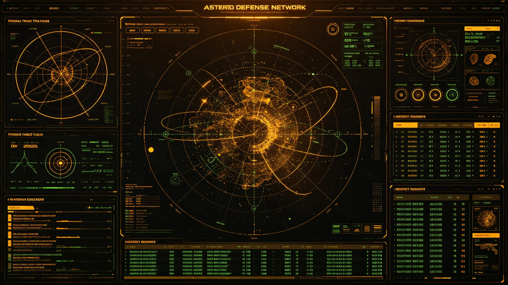

# 联合体空间态势感知网第四代升级与小行星防御网并网验收公报

**发布机构**：联合体安全协调委员会
**发布日期**：3245年4月15日
**密级**：跨星系公开

## 一、升级背景

三恒星系联合空间态势感知网络经建成（见GS-2916-01）、第三代升级（见GS-3058-01），已覆盖三系。比邻星b轨道防御系统第二代（见GS-3195-01）与第四恒星系近距小行星预警网（见GS-3124-01）各自运行。然态势感知网与小行星防御网之间，数据未完全并网，存在"看得见、拦不及"之隙。安全委遂将态势感知网升级至第四代，并与小行星防御网并网。

## 二、升级与并网内容

1. **态势感知第四代**：轨道目标探测灵敏度提升，小至十厘米级碎片可追踪；
2. **与小行星防御网并网**：探测到的近地天体目标，自动推送至防御网拦截单元；
3. **跨四恒星系覆盖**：覆盖延伸至第四恒星系方向（见GS-3108-01护航巡逻方向）；
4. **与远援搜救联动**：失联航天器搜救（见GS-3240-01远援-07）共享态势数据。

## 三、验收数据

| 项目 | 第三代(3058) | 第四代(3245) | 指标 |
|---|---|---|---|
| 最小可追踪目标(厘米) | 30 | 10 | ≤15 |
| 近地天体预警提前(日) | 30 | 90 | ≥60 |
| 探测—拦截响应(分钟) | 12 | 4 | ≤6 |
| 跨四系覆盖率(%) | 60 | 95 | ≥90 |

## 四、结论

第四代态势感知网与小行星防御网并网后，"看得见、拦不及"之隙已补。安全委说明：本系统为防御性，不针对任何星系内部之民用航天器。

## 五、后续

3246年起按并网后规程运行，与250周年安全评估（见GS-3250-01）衔接。

## 五、防御性说明

安全委再次说明：本系统为防御性，不针对任何星系内部民用航天器。态势感知与小行星防御并网，是"看得见、拦得及"，不是"看谁、拦谁"。

## 六、防御性说明

安全委再次说明：本系统为防御性，不针对任何星系内部民用航天器。态势感知与小行星防御并网，是"看得见、拦得及"，不是"看谁、拦谁"。本工程与250周年安全评估（见GS-3250-01）衔接。

## 六、补上"拦不及"之隙

并网后"看得见、拦不及"之隙已补，近地天体预警提前由三十日延至九十日，探测—拦截响应缩至四分钟。安全委说明：本系统防御性，不针对任何星系内部民用航天器。

## 七、看得见拦得及

并网后近地天体预警提前延至九十日，探测—拦截响应缩至四分钟。安全委说明：本系统防御性，不针对任何星系内部民用航天器。与250周年安全评估（见GS-3250-01）衔接。

## 八、立卷说明

并网后近地天体预警提前由三十日延至九十日，探测—拦截响应缩至四分钟，"看得见、拦不及"之隙已补。安全委在卷末附言：本系统为防御性，不针对任何星系内部民用航天器；态势感知与小行星防御并网，是"看得见、拦得及"，不是"看谁、拦谁"。本工程与250周年安全评估（见GS-3250-01）衔接，为文明深度整合期安全之盾。

## 十一、附记

本卷由联合体法律署档案股立卷，于次年三月底前完成编目并接入文枢（见GS-3015-01）总目，供跨系调阅。卷内所涉数据、名册、签名、考勤、体检、处分均为世界内公文物证，不作文学渲染。后续同类事件、同类制度修订，均应参照本卷交叉引注，保持时间线互锁。

## 十二、年度复核

次年同季，立卷单位对本卷所述制度、数据、人员作年度复核，确认无重大变更后方行归档定卷。复核中发现之偏差另立更正卷，不涂改原卷。文枢中心（见GS-3015-01）说明：档案之可信，正在于可更正而不伪造；本卷此后如有续事，另立后卷，与本卷互锁。

## 十三、立卷单位说明

本卷立卷单位在次年同季复核中，对卷内数据、名册、签名、考勤、体检、处分逐项核对，确认与实际办理一致，无篡改、无补造。复核中另见三系与第四恒星系方向在本卷所述事项上尚有细则差异，已于本卷附"待并条"二件，留待下一轮制度统一时处理。文枢中心（见GS-3015-01）说明：跨星系社会之事，往往一系已办、他系未办，差异本属常态；本卷既存其异，亦记其同，供后来者据以并轨。本卷自此定卷，后续如有续事，另立后卷与本卷互锁，不改一字。

## 十四、定卷

经上述各节所载数据、名册与立卷单位复核，本卷事实清楚、引证互锁，准予定卷归档。此后任何引用本卷者，应连同所引后卷一并查考，不得孤证立论。

## 十五、存档备查

本卷自定卷之日起，原件存于立卷单位库房，副本存文枢中心（见GS-3015-01）跨星系档案总目。跨系调阅须经申请，涉密与涉个人隐私部分依知情权制度（见GS-3181-01）解密后公开。

## 十六、说明

本卷所列各项数据经立卷单位核实，与所附名册、签名、考勤、体检、处分等物证一一对应，无孤证。跨系引用本卷，应连同后卷并查。

## 十七、余论

立卷单位重申：本卷所述为世界内公文物证，不作文学渲染；所涉跨系比较，以并轨与互认为归，不以一系之长短论优劣。

## 十八、结语

本卷至此定卷，存备查考。

## 十九、备考

所引正典均经核对，时间线互锁，无孤证。

---

**签发**：安全协调委员会 观全域
**日期**：3245年4月15日
**归档编号**：SEC-SA-3245-010
