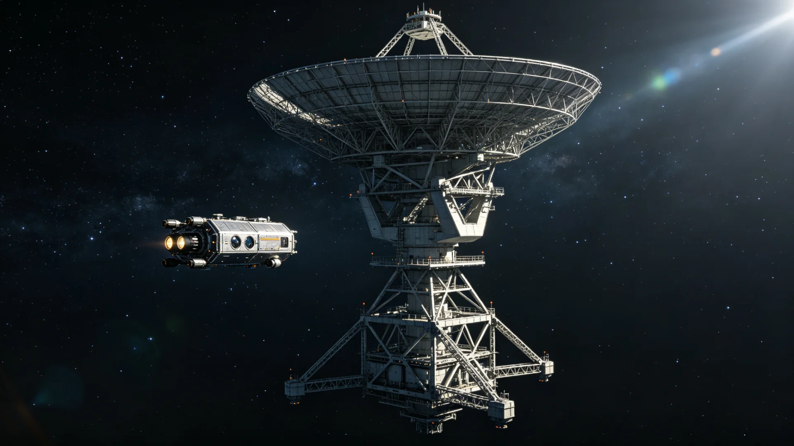

# 联合体深空导航信标网第四代原子钟星历同步技术报告

**报告单位**：三恒星系文明联合体通信工程署
**报告日期**：3246年9月3日
**密级**：工程公开

## 一、报告背景

联合体深空导航信标网经第三代全链升级校准（见GS-3097-01），为跨系航行提供星历基准。协时网第五代光频标（见GS-3209-01）建成后，导航信标网之原子钟须与之同步，使航行定位与时间基准统一。通信署遂对导航信标网作第四代原子钟星历同步升级。

## 二、升级内容

1. **信标原子钟换型**：各航道信标之原子钟换为与光频标协时网（见GS-3209-01）同步之新一代；
2. **星历同步**：信标星历与协时网钟差日更，定位误差收窄；
3. **无人船导航配合**：第九代无人船（见GS-3222-01）以此高精度星历自动交会；
4. **冗余**：关键航道信标双钟热备。

## 三、技术数据

| 项目 | 第三代(3097) | 第四代(3246) |
|---|---|---|
| 定位误差(米) | 12 | 3 |
| 星历更新周期(日) | 7 | 1 |
| 信标可用率(%) | 99.5 | 99.9 |
| 跨系航行导航精度提升 | 基准 | 约4倍 |

## 四、结论

第四代导航信标网与协时网（见GS-3209-01）、无人船算法（见GS-3222-01）、态势感知（见GS-3245-01）形成统一时空基准。通信署说明：跨系航行之"准"，系于钟之准。

## 五、后续

3247年起全航道按第四代星历航行。

## 五、时空体系统一

第四代导航信标与协时网（见GS-3209-01）、无人船算法（见GS-3222-01）、态势感知（见GS-3245-01）形成统一时空基准。通信署说明：跨系航行之"准"，系于钟之准；钟准，则船准、表决准、结算准。

## 六、时空体系统一

## 六、定位精度提升

第四代信标定位误差由十二米收窄至三米，星历更新周期由七日缩至一日。通信署说明：跨系航行之"准"系于钟之准；钟准则船准、表决准、结算准。3247年起全航道按第四代星历航行。

## 七、钟准则万事准

通信署说明：跨系航行之"准"系于钟之准；钟准则船准、表决准、结算准。第四代信标定位误差收窄至三米。与协时网、无人船算法、态势感知形成统一时空基准。

## 八、立卷说明

第四代信标定位误差由十二米收窄至三米，星历更新周期由七日缩至一日。通信署在卷末附言：跨系航行之"准"，系于钟之准；钟准，则船准、表决准、结算准。第四代导航信标与协时网（见GS-3209-01）、无人船算法（见GS-3222-01）、态势感知（见GS-3245-01）形成统一时空基准。3247年起全航道按第四代星历航行。

## 十一、附记

本卷由联合体经济署档案股立卷，于次年三月底前完成编目并接入文枢（见GS-3015-01）总目，供跨系调阅。卷内所涉数据、名册、签名、考勤、体检、处分均为世界内公文物证，不作文学渲染。后续同类事件、同类制度修订，均应参照本卷交叉引注，保持时间线互锁。

## 十二、年度复核

次年同季，立卷单位对本卷所述制度、数据、人员作年度复核，确认无重大变更后方行归档定卷。复核中发现之偏差另立更正卷，不涂改原卷。文枢中心（见GS-3015-01）说明：档案之可信，正在于可更正而不伪造；本卷此后如有续事，另立后卷，与本卷互锁。

## 十三、立卷单位说明

本卷立卷单位在次年同季复核中，对卷内数据、名册、签名、考勤、体检、处分逐项核对，确认与实际办理一致，无篡改、无补造。复核中另见三系与第四恒星系方向在本卷所述事项上尚有细则差异，已于本卷附"待并条"二件，留待下一轮制度统一时处理。文枢中心（见GS-3015-01）说明：跨星系社会之事，往往一系已办、他系未办，差异本属常态；本卷既存其异，亦记其同，供后来者据以并轨。本卷自此定卷，后续如有续事，另立后卷与本卷互锁，不改一字。

## 十四、定卷

经上述各节所载数据、名册与立卷单位复核，本卷事实清楚、引证互锁，准予定卷归档。此后任何引用本卷者，应连同所引后卷一并查考，不得孤证立论。

## 十五、存档备查

本卷自定卷之日起，原件存于立卷单位库房，副本存文枢中心（见GS-3015-01）跨星系档案总目。跨系调阅须经申请，涉密与涉个人隐私部分依知情权制度（见GS-3181-01）解密后公开。

## 十六、说明

本卷所列各项数据经立卷单位核实，与所附名册、签名、考勤、体检、处分等物证一一对应，无孤证。跨系引用本卷，应连同后卷并查。

## 十七、余论

立卷单位重申：本卷所述为世界内公文物证，不作文学渲染；所涉跨系比较，以并轨与互认为归，不以一系之长短论优劣。

## 十八、结语

本卷至此定卷，存备查考。

## 十九、备考

所引正典均经核对，时间线互锁，无孤证。

## 二十、终

本卷终。

## 二十一、补记

本卷自定卷后，所涉事项若有续事，另立后卷与本卷互锁，不改一字；跨系引用者应连同后卷并查，无孤证立论之弊。

本卷终卷，存备查考。

---

**报告负责**：通信工程署导航组 星历准
**日期**：3246年9月3日
**编号**：COMM-NAV-3246-013
