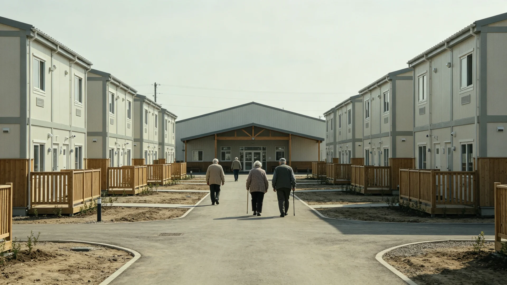

# 联合体跨星系养老服务与低温宜居度假地产产业规划公报

**发布机构**：三恒星系文明联合体经济署
**发布日期**：3247年8月28日
**文件等级**：跨星系公开

## 一、规划背景

跨星系养老统筹三系并轨（见GS-3212-01）后，退休人口跨系迁居养老渐多。比邻星b滨海露天（见GS-3238-01淡季度假）气候温和，成为跨系养老首选；下都、新拓则为老弱供暖代价高。经济署遂规划跨星系养老服务与宜居度假地产，使老弱有可去之处、产业有可为之地。

## 二、规划要点

1. **宜居养老舱区**：在新海市近郊、比邻星b滨海气候温和处建养老舱区，配远程诊疗（见GS-2938-01、GS-3235-01）；
2. **低温宜居**：对下都、新拓等寒冷方向，建低温宜居养老舱，与供暖驰援（见GS-3231-01）配套；
3. **养老服务**：养老护理、康复、临终关怀成产业，与代际对话周（见GS-3220-01）衔接；
4. **不炒作**：养老地产以居住为本，不得炒作、不得哄抬。

## 三、规划数据

| 方向 | 床位规划 | 定位 |
|---|---|---|
| 新海市近郊 | 两万 | 跨系迁居养老 |
| 比邻星b滨海 | 一万五千 | 露天度假养老 |
| 下都低温舱 | 八千 | 本地老弱养老 |
| 新拓低温舱 | 五千 | 拓荒者退役养老 |

## 四、与既有产业之关系

本规划与滨海度假淡季调度（见GS-3238-01）、退休养老金（见GS-2969-01）、养老并轨（见GS-3212-01）配套。经济署强调：养老产业以"老人安"为本，不以营利为先。

## 五、后续

3248年起分期建设，与转移支付补偿（见GS-3225-01）衔接。

## 六、不炒作风

经济署强调：养老地产以居住为本，不炒作、不哄抬。养老服务为产业，亦为民生；老弱有可去之处，是文明深度整合期之题中应有义。

## 七、不炒作风

经济署强调：养老地产以居住为本，不炒作、不哄抬。养老服务为产业，亦为民生；老弱有可去之处，是文明深度整合期之题中应有义。与滨海度假淡季调度（见GS-3238-01）、退休养老金（见GS-2969-01）衔接。

## 七、老弱有可去之处

规划在新海市近郊、比邻星b滨海、下都低温舱、新拓低温舱分设养老床位。经济署强调：养老服务为产业亦为民生；老弱有可去之处，是文明深度整合期之题中应有义，不以营利为先。

## 八、不以营利为先

经济署强调：养老服务为产业亦为民生；老弱有可去之处，是文明深度整合期之题中应有义。养老地产不炒作、不哄抬。与滨海淡季度假（见GS-3238-01）、退休养老金（见GS-2969-01）衔接。

## 九、立卷说明

规划在新海市近郊、比邻星b滨海、下都低温舱、新拓低温舱分设养老床位。经济署在卷末附言：养老服务为产业亦为民生；老弱有可去之处，是文明深度整合期之题中应有义。养老地产不炒作、不哄抬，以居住为本。与滨海淡季度假（见GS-3238-01）、退休养老金（见GS-2969-01）、养老并轨（见GS-3212-01）配套。

## 十一、附记

本卷由联合体安全委档案股立卷，于次年三月底前完成编目并接入文枢（见GS-3015-01）总目，供跨系调阅。卷内所涉数据、名册、签名、考勤、体检、处分均为世界内公文物证，不作文学渲染。后续同类事件、同类制度修订，均应参照本卷交叉引注，保持时间线互锁。

## 十二、年度复核

次年同季，立卷单位对本卷所述制度、数据、人员作年度复核，确认无重大变更后方行归档定卷。复核中发现之偏差另立更正卷，不涂改原卷。文枢中心（见GS-3015-01）说明：档案之可信，正在于可更正而不伪造；本卷此后如有续事，另立后卷，与本卷互锁。

## 十三、立卷单位说明

本卷立卷单位在次年同季复核中，对卷内数据、名册、签名、考勤、体检、处分逐项核对，确认与实际办理一致，无篡改、无补造。复核中另见三系与第四恒星系方向在本卷所述事项上尚有细则差异，已于本卷附"待并条"二件，留待下一轮制度统一时处理。文枢中心（见GS-3015-01）说明：跨星系社会之事，往往一系已办、他系未办，差异本属常态；本卷既存其异，亦记其同，供后来者据以并轨。本卷自此定卷，后续如有续事，另立后卷与本卷互锁，不改一字。

## 十四、定卷

经上述各节所载数据、名册与立卷单位复核，本卷事实清楚、引证互锁，准予定卷归档。此后任何引用本卷者，应连同所引后卷一并查考，不得孤证立论。

## 十五、存档备查

本卷自定卷之日起，原件存于立卷单位库房，副本存文枢中心（见GS-3015-01）跨星系档案总目。跨系调阅须经申请，涉密与涉个人隐私部分依知情权制度（见GS-3181-01）解密后公开。

## 十六、说明

本卷所列各项数据经立卷单位核实，与所附名册、签名、考勤、体检、处分等物证一一对应，无孤证。跨系引用本卷，应连同后卷并查。

## 十七、余论

立卷单位重申：本卷所述为世界内公文物证，不作文学渲染；所涉跨系比较，以并轨与互认为归，不以一系之长短论优劣。

## 十八、结语

本卷至此定卷，存备查考。

## 十九、备考

所引正典均经核对，时间线互锁，无孤证。

## 二十、终

本卷终。

## 二十一、补记

本卷自定卷后，所涉事项若有续事，另立后卷与本卷互锁，不改一字；跨系引用者应连同后卷并查，无孤证立论之弊。

---

**签发**：经济署署长 老有所养
**日期**：3247年8月28日
**归档编号**：ECON-ELDER-3247-014
