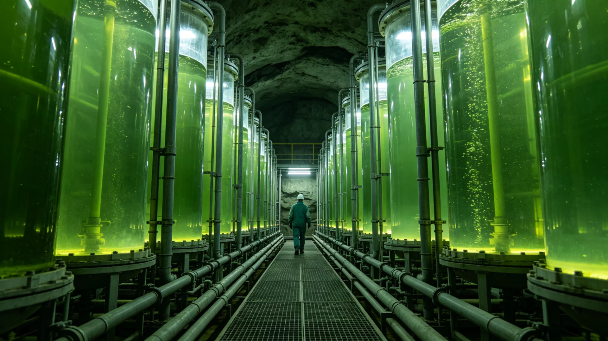

# 火星地下城市第三代水培藻类蛋白产量两百年提升评估公报

**发布机构**：火星地下城市农业管理处
**评估区间**：两百年
**发布日期**：3249年11月12日
**密级**：跨星系公开

## 一、评估背景

火星地下城市第二代生态闭环（见GS-3163-01百年监测）中，水培藻类蛋白为居民重要蛋白来源。自第二代到第三代，水培藻培养历经品种选育、LED补光优化与采收自动化。农业处遂对第三代水培藻蛋白产量作两百年提升评估，为火星地下城市粮食自给提供依据。

## 二、两百年产量提升数据

| 指标 | 第二代(约3050) | 第三代(3249) | 提升 |
|---|---|---|---|
| 单位藻液蛋白产量(相对) | 1.0 | 2.8 | 近3倍 |
| 采收周期(日) | 12 | 7 | 缩短 |
| 能源消耗(相对产量) | 1.0 | 0.55 | 降近半 |
| 蛋白含量(%) | 45 | 62 | 升 |

## 三、分析

两百年间，水培藻蛋白产量提升近三倍，能源消耗反降近半，得益于品种选育（参见深空育种，GS-2943-01类）与LED补光优化。藻蛋白已占火星地下城市居民蛋白摄入之四成以上，为主粮之外重要补充，亦为农业舱温控失效（见GS-3248-01）时之缓冲。

## 四、与既有农业之关系

本评估与火星地下城市生态闭环（见GS-3163-01）、苔藓地衣自然扩散（见GS-3194-01）配套。农业处强调：藻蛋白虽为辅助，然其稳定高产，是地下城市生存之底。

## 五、后续

3250年起将藻蛋白产量纳入火星地下城市年度农业统计。

## 六、粮食安全意义

藻蛋白占火星地下居民蛋白摄入四成以上，稳定高产，是地下城市生存之底。农业处说明：藻不起眼，然它是火星地下餐桌上最稳的一道。

## 七、粮食安全意义

藻蛋白占火星地下居民蛋白摄入四成以上，稳定高产，是地下城市生存之底。农业处说明：藻不起眼，然它是火星地下餐桌上最稳的一道。3250年起将藻蛋白产量纳入火星地下城市年度农业统计。

## 七、最稳的一道菜

百年间藻蛋白产量提升近三倍、能耗反降近半，得益于品种选育与LED补光优化。农业处说明：藻不起眼，然它是火星地下餐桌上最稳的一道；农业舱温控失效（见GS-3248-01）时，藻蛋白即缓冲。

## 八、最稳的一道

农业处说明：藻不起眼，然它是火星地下餐桌上最稳的一道。农业舱温控失效（见GS-3248-01）时，藻蛋白即缓冲。3250年起将藻蛋白产量纳入火星地下城市年度农业统计。

## 九、立卷说明

百年间藻蛋白产量提升近三倍、能耗反降近半，得益于品种选育（参见深空育种，GS-2943-01类）与LED补光优化。藻蛋白已占火星地下城市居民蛋白摄入四成以上，为主粮之外重要补充。农业处说明：藻不起眼，然它是火星地下餐桌上最稳的一道；农业舱温控失效（见GS-3248-01）时，藻蛋白即缓冲。3250年起将藻蛋白产量纳入火星地下城市年度农业统计。

## 十一、附记

本卷由联合体教育总署档案股立卷，于次年三月底前完成编目并接入文枢（见GS-3015-01）总目，供跨系调阅。卷内所涉数据、名册、签名、考勤、体检、处分均为世界内公文物证，不作文学渲染。后续同类事件、同类制度修订，均应参照本卷交叉引注，保持时间线互锁。

## 十二、年度复核

次年同季，立卷单位对本卷所述制度、数据、人员作年度复核，确认无重大变更后方行归档定卷。复核中发现之偏差另立更正卷，不涂改原卷。文枢中心（见GS-3015-01）说明：档案之可信，正在于可更正而不伪造；本卷此后如有续事，另立后卷，与本卷互锁。

## 十三、立卷单位说明

本卷立卷单位在次年同季复核中，对卷内数据、名册、签名、考勤、体检、处分逐项核对，确认与实际办理一致，无篡改、无补造。复核中另见三系与第四恒星系方向在本卷所述事项上尚有细则差异，已于本卷附"待并条"二件，留待下一轮制度统一时处理。文枢中心（见GS-3015-01）说明：跨星系社会之事，往往一系已办、他系未办，差异本属常态；本卷既存其异，亦记其同，供后来者据以并轨。本卷自此定卷，后续如有续事，另立后卷与本卷互锁，不改一字。

## 十四、定卷

经上述各节所载数据、名册与立卷单位复核，本卷事实清楚、引证互锁，准予定卷归档。此后任何引用本卷者，应连同所引后卷一并查考，不得孤证立论。

## 十五、存档备查

本卷自定卷之日起，原件存于立卷单位库房，副本存文枢中心（见GS-3015-01）跨星系档案总目。跨系调阅须经申请，涉密与涉个人隐私部分依知情权制度（见GS-3181-01）解密后公开。

## 十六、说明

本卷所列各项数据经立卷单位核实，与所附名册、签名、考勤、体检、处分等物证一一对应，无孤证。跨系引用本卷，应连同后卷并查。

## 十七、余论

立卷单位重申：本卷所述为世界内公文物证，不作文学渲染；所涉跨系比较，以并轨与互认为归，不以一系之长短论优劣。

## 十八、结语

本卷至此定卷，存备查考。

## 十九、备考

所引正典均经核对，时间线互锁，无孤证。

---

**签发**：火星地下城市农业管理处 藻稳产
**日期**：3249年11月12日
**归档编号**：MARS-ALG-3249-007
