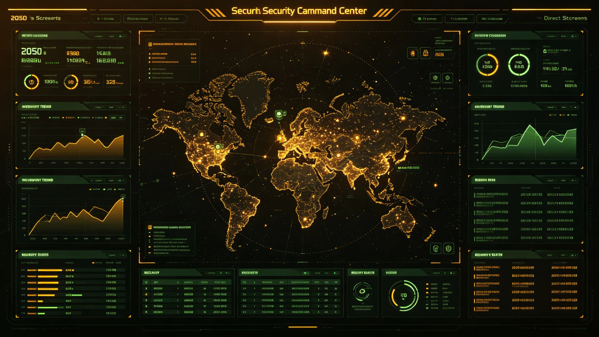

# 联合体成立二百五十周年全域安全态势总评估与维和力量优化公报

**发布机构**：三恒星系文明联合体安全协调委员会
**发布日期**：3250年12月31日
**密级**：跨星系公开

## 一、评估背景

3250年为联合体成立二百五十周年（3000-3250年）。继两百周年安全态势总评估（见GS-3200-01）之后，安全委对二百五十年来三恒星系与第四恒星系方向之全域安全态势再作总评估，并据以优化维和力量。

## 二、二百五十周年安全数据

| 指标 | 3000年 | 3200年 | 3250年 |
|---|---|---|---|
| 跨星系海盗发生率 | 0.32% | 0.003% | ≈0 |
| 重大安全事件 | 年均3起 | 年均0.5起 | 年均0.3起 |
| 航道巡逻覆盖率 | 60% | 99% | 99.9% |
| 近地天体拦截成功率 | 70% | 99.5% | 99.9% |
| 跨四系搜救响应(日) | — | — | ≤9 |

## 三、安全态势总评

二百五十年来，全域安全总体良好：跨星系海盗已基本绝迹（见GS-3179-01、GS-3116-01）；近地天体威胁经态势感知第四代与小行星防御网并网（见GS-3245-01）有效应对；跨四恒星系搜救（见GS-3240-01远援-07）验证可用；网络安全（见GS-3187-01）与反恐预防教育（见GS-3199-01）持续。

## 四、维和力量优化

鉴于全域安全态势平稳，安全委建议优化维和力量：其一，常规巡逻减员一成，省出人力转应急搜救；其二，维持跨四系护航编队（见GS-3108-01）不减；其三，与250周年文明整合同步，安全工作重心由"防外"转向"护内民生"。

## 五、展望

3251年起，安全工作重点为：跨四恒星系方向持续布局、新一代通信安全、人工智能伦理安全。二百五十周年节点，安全委寄语：和平非天赐，是百年制度与巡逻之累积。

## 六、二百五十年寄语

安全委寄语：和平非天赐，是百年制度与巡逻之累积。二百五十周年，非庆功，而是自警——安全一旦松懈，百年之功可毁于一旦。3251年起，安全重心由"防外"转向"护内民生"，与文明深度整合期相应。

## 七、二百五十年寄语

安全委寄语：和平非天赐，是百年制度与巡逻之累积。二百五十周年非庆功，而是自警——安全一旦松懈，百年之功可毁于一旦。3251年起安全重心由"防外"转向"护内民生"，与文明深度整合期相应。

## 八、250年数据回顾

二百五十年来跨星系海盗发生率由0.32%降至近零，重大安全事件由年均3起降至0.3起，航道巡逻覆盖率达99.9%，近地天体拦截成功率99.9%。安全委寄语：和平非天赐，是百年制度与巡逻之累积。

## 九、自警非庆功

安全委说明：二百五十周年非庆功，而是自警——安全一旦松懈，百年之功可毁于一旦。3251年起安全重心由"防外"转向"护内民生"，与文明深度整合期相应。和平非天赐，是百年累积。

## 十、立卷说明

二百五十年来跨星系海盗发生率由0.32%降至近零，重大安全事件由年均3起降至0.3起，航道巡逻覆盖率达99.9%，近地天体拦截成功率99.9%。安全委在卷末附言：和平非天赐，是百年制度与巡逻之累积；二百五十周年非庆功，而是自警——安全一旦松懈，百年之功可毁于一旦。3251年起安全重心由"防外"转向"护内民生"，与文明深度整合期相应。常规巡逻减员一成，省出人力转应急搜救。

## 十一、附记

本卷由联合体社会保障署档案股立卷，于次年三月底前完成编目并接入文枢（见GS-3015-01）总目，供跨系调阅。卷内所涉数据、名册、签名、考勤、体检、处分均为世界内公文物证，不作文学渲染。后续同类事件、同类制度修订，均应参照本卷交叉引注，保持时间线互锁。

## 十二、年度复核

次年同季，立卷单位对本卷所述制度、数据、人员作年度复核，确认无重大变更后方行归档定卷。复核中发现之偏差另立更正卷，不涂改原卷。文枢中心（见GS-3015-01）说明：档案之可信，正在于可更正而不伪造；本卷此后如有续事，另立后卷，与本卷互锁。

## 十三、立卷单位说明

本卷立卷单位在次年同季复核中，对卷内数据、名册、签名、考勤、体检、处分逐项核对，确认与实际办理一致，无篡改、无补造。复核中另见三系与第四恒星系方向在本卷所述事项上尚有细则差异，已于本卷附"待并条"二件，留待下一轮制度统一时处理。文枢中心（见GS-3015-01）说明：跨星系社会之事，往往一系已办、他系未办，差异本属常态；本卷既存其异，亦记其同，供后来者据以并轨。本卷自此定卷，后续如有续事，另立后卷与本卷互锁，不改一字。

## 十四、定卷

经上述各节所载数据、名册与立卷单位复核，本卷事实清楚、引证互锁，准予定卷归档。此后任何引用本卷者，应连同所引后卷一并查考，不得孤证立论。

## 十五、存档备查

本卷自定卷之日起，原件存于立卷单位库房，副本存文枢中心（见GS-3015-01）跨星系档案总目。跨系调阅须经申请，涉密与涉个人隐私部分依知情权制度（见GS-3181-01）解密后公开。

## 十六、说明

本卷所列各项数据经立卷单位核实，与所附名册、签名、考勤、体检、处分等物证一一对应，无孤证。跨系引用本卷，应连同后卷并查。

---

**签发**：安全协调委员会 衡久远
**日期**：3250年12月31日
**归档编号**：SEC-250Y-3250-001
