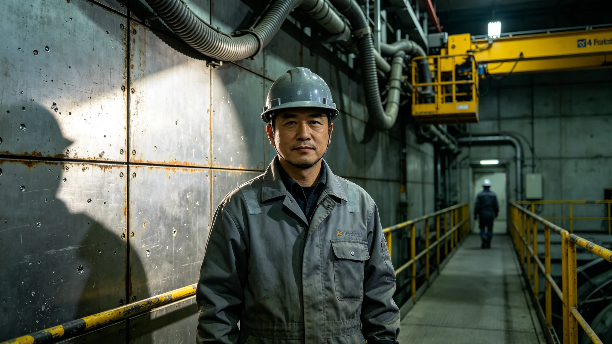

# 第七代聚变点火总工艺师祁灼年考勤与辐射体检档案

**档案所属**：三恒星系文明联合体能源署 · 第七代聚变工程人事处
**案卷编号**：HR-FUS7-QZY-0317
**立卷日期**：3252年8月14日
**密级**：人事内部

## 一、基本登记

| 项目 | 登记内容 |
|---|---|
| 姓名 | 祁灼年 |
| 性别 | 男 |
| 出生 | 3209年4月，比邻星b三号穹顶出生 |
| 入册 | 3231年，能源署第七代聚变工程处见习工艺员 |
| 现任 | 第七代聚变点火总工艺师（基址同步轨道二号） |
| 专业 | 第一壁材料与等离子体控制 |
| 学派 | 工程学派 |

登记照附卷。拍摄于3252年8月12日，中性平光，着深灰工装，左胸绣基址编号"SC-ORB-02"。面部无美颜修饰，眼下有长期夜班所致色素沉着，右眉骨有一道旧擦伤瘢痕（3246年第一壁检修事故所致，见下文处分记录）。

## 二、考勤记录摘要（3248—3252）

本卷摘录近五年考勤卡关键条目，不录全貌。

| 年度 | 应出勤 | 实出勤 | 旷工 | 迟到 | 夜班次数 | 备注 |
|---|---|---|---|---|---|---|
| 3248 | 248 | 247 | 0 | 3 | 162 | 第一壁应力试验期 |
| 3249 | 248 | 248 | 0 | 1 | 171 | 满载试运行 |
| 3250 | 248 | 246 | 0 | 5 | 188 | 并网冲刺，加班未调休31日 |
| 3251 | 248 | 248 | 0 | 0 | 149 | 并网后稳态值守 |
| 3252 | 164 | 164 | 0 | 2 | 91 | 截至立卷日 |

考勤系统注记：3250年12月并网窗口期间，祁灼年连续在岗四十六日，其间仅离岗三次（每次不超过两小时，用于体检与换洗衣物）。人事处依《地月低重力劳动安全与补偿公约》精神，于3251年1月强制安排其撤离休假十四日，休假期间考勤显示其于第三日即自行返岗，被基址医疗站劝回。

## 三、辐射与职业健康体检记录

以下摘录基址医疗站历次体检结论。

| 体检日 | 累计中子当量 | 结论 | 干预 |
|---|---|---|---|
| 3248-03 | 412 毫西弗 | 在岗许可 | 常规 |
| 3249-09 | 587 毫西弗 | 在岗许可，建议轮换 | 调离第一壁三月 |
| 3250-11 | 803 毫西弗 | 逼近年限预警线 | 强制体检加项 |
| 3251-06 | 851 毫西弗 | 在岗许可，骨髓造血功能轻度下降 | 铁剂与促红素疗程 |
| 3252-08 | 879 毫西弗 | **禁止进入第一壁热室** | 调离热室岗位 |

末次体检（3252年8月12日）由基址医疗站主治医方鹿鸣签署，结论原文摘引："受检者累计中子当量已达本岗位年限管控阈值。骨髓造血干细胞活性较基线下降百分之十一，外周血淋巴细胞染色体畸变率升高。依规程，自即日起不得进入第一壁热室作业区，改任非辐照工艺评审岗。"

祁灼年于体检结论后两日（8月14日）签署《岗位调整知情同意书》，未申请复核。

## 四、处分与事故记录

本卷收录与其相关的两起事故及一次处分，均不做道德评价。

**事故一（3246年3月）**：第一壁模拟段真空室漏氚。事故原因为密封圈批次老化，非其操作失误。其在复压过程中眉骨擦伤，记工伤，未处分。

**事故二（3250年11月）**：并网前满功率试验，等离子体破裂导致一段限制器烧蚀。事后调查认定其在破裂前十四秒未按规程触发急停，理由是"再等两秒可取得一组有效数据"。该次试验数据事后被证明对并网调试有价值，但规程即为规程。

**处分（3250年12月）**：工程处纪律处分决定，原文摘引："祁灼年于3250年11月19日满功率试验中，延迟急停指令约十四秒，违反《等离子体破裂操作规程》第七款。鉴于其延迟所获数据对后续调试确有贡献，且未造成人员伤害，记警告一次，扣减当季贡献工时折算额度三成，责令书面检讨。"检讨附卷，共六百一十七字，字迹由潦草趋于工整。

## 五、签名与涂改痕迹

档案末页为其历次岗位确认书签名。3231年见习期签名工整拘谨；3248年起签名中"灼"字火字旁渐潦草；3252年8月14日《岗位调整知情同意书》签名平稳，无涂改。

## 六、处分记录详情

3250年12月处分：

- 事故：3250年11月19日满功率试验，延迟急停约14秒；
- 处分类型：警告一次；
- 扣减贡献工时折算额度：三成；
- 书面检讨：617字；
- 申诉：祁灼年未申诉；
- 执行：已执行。

## 七、岗位调整执行

| 项目 | 内容 |
|---|---|
| 调整前 | 第一壁热室工艺师 |
| 调整后 | 非辐照工艺评审岗 |
| 生效日期 | 3252年8月14日 |
| 知情同意 | 已签署 |
| 申请复核 | 未申请 |

## 八、附则

本卷归档。祁灼年后续工艺评审工作另立，不并入本卷。

## 附录：祁灼年历年体检影像索引

| 体检日 | 影像编号 | 结论摘要 |
|---|---|---|
| 3248-03 | IMG-3248-QZY-01 | 在岗许可 |
| 3249-09 | IMG-3249-QZY-02 | 建议轮换 |
| 3250-11 | IMG-3250-QZY-03 | 逼近预警线 |
| 3251-06 | IMG-3251-QZY-04 | 造血轻度下降 |
| 3252-08 | IMG-3252-QZY-05 | 禁止热室 |

影像胶片存档于基址医疗站透光读片墙，伪彩骨密度梯度图见随附图片。祁灼年历次体检均亲自到场，未缺席。末次体检后，其个人工服按规程移交后续工艺师岑望洋，工服内口袋留存其本人折叠的一张班组合影，合影不录于档案。

## 补充说明

本档案不试图塑造一个为聚变事业燃尽自身的形象。祁灼年在二十二年热室岗位上的考勤几乎没有污点，这种近乎刻板的守时，在一个自动化率已达九成以上的工程体系里，本身就是一种普通的坚持。他之所以被记入档案，并非因为他做了什么超凡的事，而是因为他是这一代工艺师中，第一个在万小时测试前夕被辐射体检判定必须离开热室的人。他的离开，比他的坚守更值得记录——它说明即便在技术奇点时代，肉身对中子辐照的耐受仍有一条不会因为制度善意而后退的硬线。祁灼年未就岗位调整申请复核，这一沉默被人事处原样收入档案，不作褒贬。
## 档案补录
祁灼年离岗后，其在第七代聚变工程中主持的工艺评审共一百二十七项，均已移交后续工程师。人事处按规程将其工服、安全帽、辐射剂量计三件实物封存于基址档案馆不开放展区，仅可应学术研究调阅。祁灼年本人未出席任何交接仪式，其最后一次进入热室为八月十二日，此后仅在评审会议室出席非辐照工艺讨论。档案不录其家属信息，不录其业余生活，仅录考勤、体检、处分三类公文物证。这一处理方式本身，即为本批次传记类文书的统一原则：去英雄化，以物证人，不以叙事神化。
## 离岗附注
祁灼年离岗后的非辐照工艺评审岗，设在主带三号基址的三楼会议室。他每日到岗时间为八时整，五时半离岗，与在岗时一致。会议室窗外为一片反射镜阵列，他在评审间隙偶尔望向窗外，但从未在记录中提及。其同事在人事调查中表示，祁灼年离岗后话更少，但评审意见仍一如既往地具体。他未就离岗申请任何形式的补偿或荣誉。人事处按规程在其离岗满三年后，将其档案从"在岗"转入"在册"，不再续录考勤。

## 归档附记

本卷自发布之日起，按三恒星系文明联合体档案管理条例归档。凡引用本卷者，须同时引用其交叉关联卷，不得割裂单卷单独引用。本卷所涉数据以发布日为准，后续修订另立新卷，不改本卷原文。各定居点委员会可应公民合理请求，公开本卷中非保密的执行数据。本卷解释权归编制机构，跨卷争议由法学派议事会仲裁。

---

**归档编号**：HR-FUS7-QZY-0317
**立卷**：能源署第七代聚变工程人事处
**日期**：3252年8月14日
