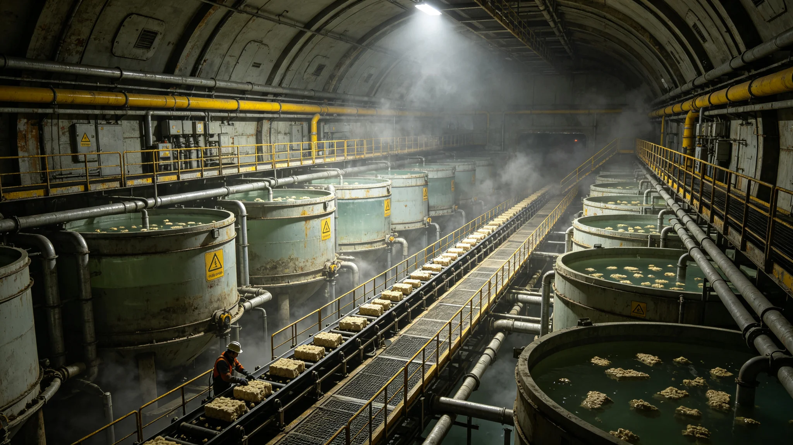

# 能源无偿化后合成蛋白与海水淡化全成本归零产业决算公报

**编制机构**：三恒星系文明联合体经济与产业协调署
**文号**：经产署公字〔3253〕第〇四二一号
**编制日期**：3253年4月20日
**文件等级**：跨星系公开
**会签**：生态学派议事会 · 农业学派议事会

## 一、决算背景

3251年1月1日能源定额核拨制生效后（见GS-3251-01），居民生活用能与基础工业用能不再以星元计价。合成蛋白工业与海水淡化工业是受此影响最直接的两个基础产业：其成本结构中，能源历来占最大头。本决算核算3251—3252两个完整年度，该两产业在能源成本归零后的全成本变动。

## 二、成本结构对照

| 成本项（每单位产出） | 合成蛋白(3250) | 合成蛋白(3252) | 海水淡化(3250) | 海水淡化(3252) |
|---|---|---|---|---|
| 能源 | 0.412 星元当量 | 0.000 | 0.688 星元当量 | 0.000 |
| 原料(碳源/盐水) | 0.098 | 0.096 | 0.041 | 0.040 |
| 人工与折旧 | 0.156 | 0.071 | 0.102 | 0.038 |
| 维护与环控 | 0.077 | 0.074 | 0.055 | 0.053 |
| **全单位成本** | **0.743** | **0.241** | **0.886** | **0.131** |

注：3252年人工与折旧项的下降，源于自动化率提升（见GS-3262-01意义工时市场决算所记之转岗潮），非能源直接所致。原料项因自动化无人种植体系成熟而微降。

## 三、产量与供给

| 指标 | 3250年 | 3252年 |
|---|---|---|
| 合成蛋白年产量(干重) | 3,812 万吨 | 5,447 万吨 |
| 海水淡化年产量 | 20,771 万立方米 | 31,206 万立方米 |
| 居民日均蛋白摄入供给覆盖率 | 88% | 100% |
| 比邻星b淡水自给率 | 92% | 100% |
| 第四恒星系淡水自给率 | 61% | 97% |

## 四、价格废止与核销

能源成本归零后，合成蛋白与淡化水的零售价格已于3252年7月1日废止，改为各定居点按人头定额配给。本决算统计两年度内注销的旧价格账单：

- 合成蛋白旧价注销：3,901,552,884 笔；
- 淡化水旧价注销：5,772,091,330 笔；
- 跨星际运水旧费注销：1,206 万笔。

旧有"跨星系运水"这一自落地纪元延续百年的产业，于3252年底正式归零：第四恒星系淡水自给率达标后，无需再从比邻星b或太阳系水运。原运水船队（见GS-3149-01所记本地化造船产能）转作他用。

## 五、残余成本去向

能源归零后，合成蛋白与淡化水仍存约三成残余成本（原料、维护、环控），该部分不再向居民收取，而由各定居点公共维护基金承担。本决算核算该公共负担：

| 定居点 | 3252年公共维护基金承担残余成本(万星元当量) |
|---|---|
| 太阳系轨道城市群 | 1,206,771 |
| 比邻星b各定居点 | 874,330 |
| 第四恒星系晨昏带城 | 1,402,885 |
| **合计** | **3,483,986** |

## 六、风险提示

经济署提示：成本归零不等于资源无限。合成蛋白受碳源与水培空间约束，淡化水受集水与环控约束。若以"成本为零"为由无限扩大消耗，将冲击生物圈承载（见GS-3186-01基因库、GS-3150-01水体稳态）。建议各定居点维持配给定额，不以价格为唯一调节。

## 七、分定居点公共维护基金负担

| 定居点 | 合成蛋白负担(万星元) | 淡化水负担(万星元) | 合计 |
|---|---|---|---|
| 太阳系轨道城市群 | 712,091 | 494,680 | 1,206,771 |
| 比邻星b各定居点 | 512,091 | 362,239 | 874,330 |
| 第四恒星系晨昏带城 | 812,091 | 590,794 | 1,402,885 |
| **合计** | **2,036,273** | **1,447,713** | **3,483,986** |

## 八、旧运水船队转用途

跨星系运水船队(比邻星b→第四恒星系、太阳系→比邻星b)于3252年底转作他用；本地运水船队保留。跨星系运水产业归零。

## 九、附则

本决算自发布之日起作为各定居点公共维护基金拨付依据。涉及居民配给定额的具体标准，由经济署会同各定居点委员会另行核定。

## 附录：配给定额试行方案

| 定居点 | 人均年蛋白定额(千克) | 人均年淡水定额(立方米) |
|---|---|---|
| 太阳系轨道城市群 | 412 | 212 |
| 比邻星b各定居点 | 387 | 186 |
| 第四恒星系晨昏带城 | 341 | 154 |

定额内不结算。超定额部分按贡献工时指数加价，加价所得转入公共维护基金。试行首季度，各定居点超定额率均低于3%，未出现滥用。经济署提示：配给定额为最低保障，不限制公民自愿节约。

## 补充说明

成本归零并不意味着物质可以无限取用。本决算反复强调，合成蛋白的碳源与淡化水的集水空间，是比能源更紧的约束。旧跨星系运水产业的归零，在经济账上是一笔节省，但在生态账上，它把第四恒星系淡水自给的全部压力压在了本地集水环控上。经济署不愿看到"成本为零"被误读为"可以浪费"，因此在决算中宁可把残余公共负担逐项列清，也要让每个定居点明白：公共维护基金替你承担的那三成，不是凭空而来，而是来自另一群公民在意义工时中创造的贡献。这种透明，本身就是对浪费最温和也最持久的约束。
## 产业延伸
合成蛋白与海水淡化的全成本归零，并非意味着相关产业消失。恰恰相反，产业以”公共维护基金承担运营成本、公民按配给定额领取”的新形态继续存在。各定居点原有的合成蛋白工厂并未关闭，其产品从”商品”转为”公共配给品”，其工人从”产业工人”转为”公共维护工时贡献者”。海水淡化设施同样保留，但不再以”卖水”为收支逻辑。经济署提示：成本归零改变的是计价方式，不是生产本身。任何定居点不得借”成本归零”之名拆除必要的生产设施，否则将在配给不足时陷入被动。
## 决算附注
本决算经联合体审计厅复核。审计厅在复核意见中确认：合成蛋白与淡化水的全成本归零，在技术上成立，但在会计上须将"全成本"与"边际成本"严格区分。全成本归零指能源与淡水等可变成本归零，合成蛋白的碳源成本、淡化设施的折旧与人工仍由公共维护基金承担，并非一切费用归零。审计厅特别提示各定居点：在向公民说明配给免费时，不得使用"一切免费"的笼统表述，以免造成预期落差。这一提示被写入各定居点的居民说明手册。

## 归档附记

本卷自发布之日起，按三恒星系文明联合体档案管理条例归档。凡引用本卷者，须同时引用其交叉关联卷，不得割裂单卷单独引用。本卷所涉数据以发布日为准，后续修订另立新卷，不改本卷原文。各定居点委员会可应公民合理请求，公开本卷中非保密的执行数据。本卷解释权归编制机构，跨卷争议由法学派议事会仲裁。

---

**归档编号**：ECO-PROTEIN-3253-0421
**编制**：经济与产业协调署 · 基础产业处
**日期**：3253年4月20日
