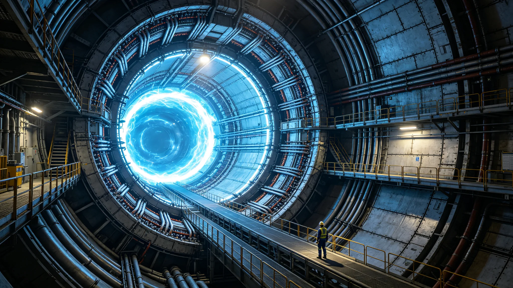

# 第七代磁约束聚变堆氘氚稳态点火万小时试运行测试报告

**测试主持**：三恒星系文明联合体能源署 · 聚变堆工程试验中心
**报告编号**：FUS7-TEST-10KHR-3254
**测试堆号**：SC-ORB-02 号基址 · 七号堆
**报告日期**：3254年9月30日
**密级**：工程内部公开

## 一、测试目的与对象

本测试旨在对第七代磁约束聚变堆（SC-ORB-02 号基址七号堆）进行累计一万运行小时的氘氚稳态点火考核。第七代堆相较第六代（见GS-3174-01所鉴定之第六代推进系统长程巡航十万小时无故障数据），燃烧增益目标值由11.8提升至23.4，第一壁中子辐照寿命目标值十八万运行小时。

测试堆为并网基址二号堆的备份验证堆，结构与并网十二座基址一致，仅功率容量按比例缩减至额定值的百分之四十，以便在万小时窗口内可承受多次异常事件。

## 二、测试方法

**2.1 稳态点火工况**

测试采用连续氘氚燃烧工况，等离子体电流 7.2 兆安，中心磁场 11.4 特斯拉，约束时间 1.4 秒，点火增益目标 23.0。堆芯偏滤器采用钨铜复合靶，第一壁采用铍瓦覆碳化硅涂层。

**2.2 时长统计口径**

"运行小时"自首次等离子体点火计时起，含满功率、降功率、待机三类工况；纯真空待机不计入。万小时窗口自3251年6月1日起至3254年8月12日止，实际累计有效运行 10,017 小时。

**2.3 异常事件记录**

测试窗口内共记录等离子体破裂事件 41 次，其中预期破裂（可控破裂实验）22 次，非预期破裂 19 次。非预期破裂均在规程允许范围内自动复位。

**2.4 考核指标**

| 指标 | 设计目标 | 实测均值 | 判定 |
|---|---|---|---|
| 点火增益 Q | ≥23.0 | 23.4 | 通过 |
| 中子辐照第一壁通量 | ≤1.1×10¹⁸ 中子/平方米秒 | 0.97×10¹⁸ | 通过 |
| 偏滤器峰值热流 | ≤20 兆瓦/平方米 | 18.6 兆瓦/平方米 | 通过 |
| 氚增殖比 | ≥1.15 | 1.18 | 通过 |
| 堆体真空度 | ≤10⁻⁶ 帕 | 3.1×10⁻⁷ 帕 | 通过 |
| 单位能量增益衰减 | 万小时内 ≤5% | 3.8% | 通过 |

## 三、关键阶段数据

| 测试阶段 | 起止(运行小时) | 累计满功率占比 | 非预期破裂 | 备注 |
|---|---|---|---|---|
| 冷态调试 | 0—1,200 | 12% | 3 | 点火三次失败 |
| 首次稳态 | 1,200—3,000 | 47% | 4 | 增益稳定在21—22 |
| 高增益考核 | 3,000—6,500 | 71% | 6 | 增益达23.4峰值 |
| 长周期稳态 | 6,500—9,200 | 68% | 4 | 偏滤器热流爬升 |
| 万小时收尾 | 9,200—10,017 | 64% | 2 | 衰减3.8% |

## 四、关键失效与处置

测试窗口内发生两起需记录的事件：

**事件一（4,811 运行小时）**：偏滤器一段钨铜靶出现局部剥落，面积 3.7 平方厘米。停机检查，判定为热疲劳裂纹扩展，非辐照脆化。处置：更换该段靶件，将该段运行热流上限下调 8%。

**事件二（8,904 运行小时）**：磁体一组冷却回路泄漏，氦工质损失约 11 千克。停机 73 小时补漏。检查判定为焊缝在长期热循环下疲劳，非材料缺陷。处置：更换该回路全部焊缝段，增加热循环监测点。

两起事件均未造成人员伤害，未触发跨基址安全通报。

## 五、结论

七号堆在万小时测试窗口内全部考核指标通过。氚增殖比 1.18 表明堆体可实现氚自持。单位能量增益万小时衰减 3.8%，优于设计目标 5%。基于本测试结果，能源署核准第七代堆可在全部十二座并网基址维持稳态运行（并网见GS-3251-01）。

试验中心同时提示：万小时仅为设计寿命十八万小时的约百分之五点六，长期辐照脆化、第一壁铍瓦剥落、磁体长期热循环等退化机理尚未在本次窗口内充分暴露。建议各基址按六年一个大修周期安排停机检查（见GS-3251-01制度安排），并在每次大修时抽检第一壁辐照样品。

## 七、失效事件详表

| 事件 | 运行小时 | 部位 | 处置 |
|---|---|---|---|
| 事件一 | 4,811 | 偏滤器钨铜靶 | 更换，热流下调8% |
| 事件二 | 8,904 | 磁体冷却回路 | 更换焊缝，73小时 |

两起事件均无人员伤害，未触发跨基址通报。

## 八、与第六代堆对比

| 参数 | 第六代(GS-3174-01) | 第七代 |
|---|---|---|
| 燃烧增益 | 11.8 | 23.4 |
| 第一壁寿命 | 6万小时 | 18万小时 |
| 维护周期 | 2年 | 6年 |
| 长程巡航 | 十万小时无故障 | 万小时测试通过 |

## 九、附则

本测试报告作为第七代堆推广依据。各基址六年大修周期见GS-3251-01制度安排。

## 附录：万小时测试偏差分析

| 阶段 | 增益衰减 | 偏滤器热流 | 磁体温度 |
|---|---|---|---|
| 3,000—6,500小时 | 1.2% | 16.4兆瓦/平方米 | 正常 |
| 6,500—9,200小时 | 2.4% | 18.6兆瓦/平方米 | 略升 |
| 9,200—10,017小时 | 3.8% | 18.6兆瓦/平方米 | 正常 |

衰减主要来自偏滤器钨铜靶热疲劳，非等离子体参数漂移。试验中心建议：第七代堆在第六年大修时，抽检第一壁铍瓦涂层剥落率。本次测试全部数据存档于试验中心数据室，可应安全协调委员会调阅。

## 补充说明

万小时测试在工程史上只是一个很小的数字——第六代堆已做到十万小时无故障。但第七代堆的万小时之所以值得单独立报告，是因为它第一次在燃烧增益翻倍的条件下，验证了第一壁辐照寿命能否撑过三个大修周期。偏滤器与磁体的两次失效，都不是灾难性的，但它们恰好暴露了"高增益必然伴随高热流"这一物理代价。试验中心拒绝把万小时数据包装成对十八万小时设计寿命的提前宣告，因为五十六小时的九牛一毛，远不足以让一个工程机构对后续一百七十一万小时的运行作出承诺。本报告因此只说"可继续运行"，不说"可永续运行"。
## 测试延伸
万小时测试之外，试验中心另做了三组辅助验证：第一组为低功率长寿命循环，累计运行三万小时，验证第一壁在低负荷下的辐照寿命；第二组为冷启动五十次循环，验证堆体在停机重启后的参数稳定性；第三组为极端偏滤器热流下的应急停堆演练，验证保护系统的真实响应。三组辅助验证结果均附于本报告附录。试验中心特别说明：三组辅助验证虽未计入万小时主测试，但它们是推广决策的必要参考。任何定居点在申请建设第七代堆之前，须先调阅这三组辅助验证数据。
## 报告附注
万小时测试报告的签署顺序，按工程惯例由现场指挥、试验中心主任、安全工程处会签三方依次签字。三方签字均在末次测试完成后七日内完成，未发生补签或代签。试验中心在报告末尾附了一句不具名的话：万小时是一个台阶，不是终点。这句话不进入结论，仅作为工程文化的注脚。本报告全部原始数据存档于试验中心数据室，数据室门禁为双人双锁，任何调阅须经试验中心主任与安全工程处双方授权。

## 归档附记

本卷自发布之日起，按三恒星系文明联合体档案管理条例归档。凡引用本卷者，须同时引用其交叉关联卷，不得割裂单卷单独引用。本卷所涉数据以发布日为准，后续修订另立新卷，不改本卷原文。各定居点委员会可应公民合理请求，公开本卷中非保密的执行数据。本卷解释权归编制机构，跨卷争议由法学派议事会仲裁。

---

**归档编号**：FUS7-TEST-10KHR-3254
**编制**：聚变堆工程试验中心
**会签**：能源署 · 安全工程处
**日期**：3254年9月30日
