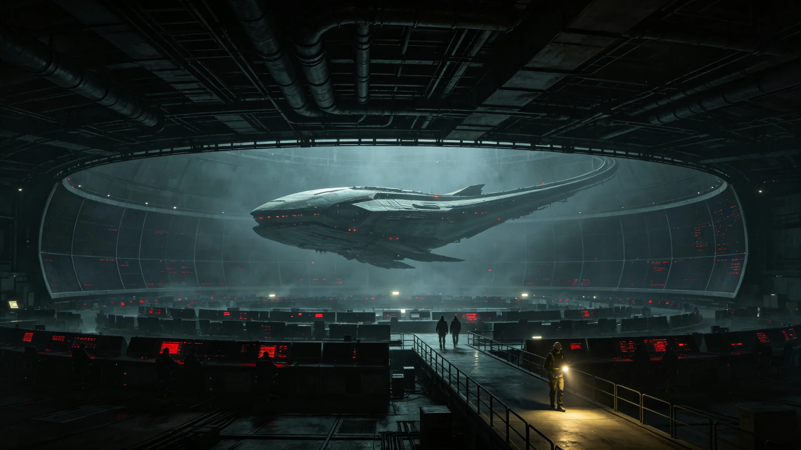

# 聚变电站首次并网过载与跨星系电网五十分钟黑事件通报

**发布机构**：三恒星系文明联合体安全协调委员会 · 能源安全处
**文号**：安委通报字〔3256〕第〇〇一八号
**发布日期**：3256年10月22日
**事件等级**：二级电网事件
**文件等级**：跨星系公开

## 一、事件概要

3256年10月9日，第七代聚变电站群并网后第九年，发生首次并网过载事件。事件导致太阳系主带三号轨道城局部电网失稳，跨星系主干回路一度中断，共计五十二分钟。事件未造成人员死亡，重伤二人（电梯困舱应急救援挤压伤），轻伤十七人。直接经济损失折合约 4,200 万星元当量。

## 二、事件时间线

| 时刻(协调时) | 事件 |
|---|---|
| 14:02:11 | 太阳系主带三号轨道城夏季峰荷，主干回路负载率达91% |
| 14:03:47 | 七号基址(同步轨道)一段变压器温升超限，保护装置未动作 |
| 14:04:02 | 三号轨道城主回路断路器误跳，负载瞬时转移至相邻两回路 |
| 14:04:19 | 相邻两回路负载率瞬时升至108%，触发连锁跳闸 |
| 14:05:33 | 跨星系主干回路(太阳系—比邻星b)负荷陡降，远端保护误判为线路故障 |
| 14:06:48 | 主干回路自动解列，太阳系主带三号城与比邻星b方向中断 |
| 14:08:20 | 三号轨道城局部应急柴油机组启动，公共照明恢复40% |
| 14:11:55 | 被困电梯23部，救援队抵达 |
| 14:30:00 | 安全协调委员会下令手动切除过载回路 |
| 14:50:17 | 主干回路重新并网，供电逐步恢复 |
| 14:54:33 | 全网稳态恢复 |

事件全程五十二分钟二十二秒。

## 三、事故原因

事后调查认定为多因叠加：

1. **保护装置选型过时**。七号基址一段变压器保护装置仍为第六代堆时期产品，动作阈值未随第七代并网更新。该段保护装置本应在温升超限前动作，实际延迟逾一分钟。
2. **负荷转移算法缺陷**。自动负荷转移算法未将跨星系远端保护的误判纳入考虑，导致局部跳闸引发跨星系解列。
3. **峰荷预测偏差**。3256年10月9日为夏季工作日午后，三号轨道城空调与环控负荷超预测值百分之十一。能源成本归零后（见GS-3251-01），峰荷预测模型仍沿用旧价格弹性假设，未修正。

## 四、人员伤亡与处置

事件中被困电梯23部，救援队于14:11抵达，14:47全部救出。其中二人在电梯轿厢挤压中致肋骨骨折，十七人轻微擦伤与惊吓。所有伤员于3256年10月10日出院。

事件期间三号轨道城公共饮水与基础医疗维持正常（应急柴油机组优先保障），无次生事故。

## 五、整改措施

安全协调委员会会同能源署，下达以下整改：

| 整改项 | 责任单位 | 完成时限 |
|---|---|---|
| 全部基址保护装置升级为第七代规格 | 能源署第七代工程处 | 3257年6月 |
| 负荷转移算法纳入跨星系远端保护模型 | 调度中心算法组 | 3257年3月 |
| 峰荷预测模型剔除旧价格弹性假设 | 调度中心预测组 | 3256年12月 |
| 三号轨道城应急柴油机组扩容 | 三号城管理处 | 3257年9月 |
| 电梯困舱应急演练纳入年度必修 | 各定居点安全办 | 3257年起 |

## 七、整改分阶段

| 整改项 | 完成时间 | 责任单位 |
|---|---|---|
| 保护装置升级 | 3257年6月 | 能源署 |
| 负荷转移算法修正 | 3257年3月 | 调度中心 |
| 峰荷预测模型修正 | 3256年12月 | 调度中心 |
| 应急柴油机组扩容 | 3257年9月 | 三号城 |
| 电梯困舱演练 | 3257年起 | 各定居点 |

## 八、人员伤亡详表

| 项目 | 数值 |
|---|---|
| 被困电梯 | 23部 |
| 救援到达 | 14:11 |
| 全部救出 | 14:47 |
| 重伤(肋骨骨折) | 2人 |
| 轻伤(擦伤) | 17人 |
| 出院时间 | 3256年10月10日 |

## 九、附则

本通报自发布之日起施行。各定居点旧模型清查自3257年起。

## 附录：电网负荷转移算法修订对照

| 版本 | 发布 | 缺陷 |
|---|---|---|
| 旧版(6.x) | 3240 | 未考虑远端保护误判 |
| 修订版(7.0) | 3256-11 | 纳入远端保护模型 |
| 修订版(7.1) | 3257-03 | 剔除旧价格弹性假设 |

修订后算法在模拟测试中，1000次负荷转移模拟均正确预判远端保护行为。三号轨道城应急柴油机组扩容后，公共照明恢复时间由40%提升至85%。

## 补充说明

这次黑事件的技术原因并不复杂，甚至有几分可笑：一段保护装置的型号没跟上升级，一个负荷转移算法忘了算远端保护，一个峰荷模型还在使用三十年前的价格弹性假设。可笑之处在于，这三个原因单独看任何一个都不致命，但它们叠加在一起，恰好打在能源成本归零这个制度真空点上。安全协调委员会最在意的，不是这五十二分钟的停电，而是它揭示了一个事实：当价格杠杆被撤除时，所有曾经由价格隐含约束的旧模型，都必须被重新显式地检查一遍。这是一项比换保护装置更慢、更枯燥、也更难被宣传为成就的工作。
## 事件延伸
五十分钟黑事件之后，安全协调委员会对全部跨星系电网进行了一次为期三个月的旧模型清查。清查范围包括：所有以价格弹性为输入的负荷预测、所有未纳入远端保护行为的转移算法、所有未做冷备自检的中继节点。清查共发现旧模型一百四十六处，其中四十二处与公共安全直接相关。四十二处均在年内完成替换。剩余一百零四处为非紧急项，列入下一轮技术升级。清查结果说明：能源成本归零撤除旧杠杆后，制度性的旧模型清理比技术性的并网升级更慢、更枯燥，也更难被公众感知。
## 通报附注
五十分钟黑事件的直接经济损失，经审计厅核定为折合公共维护基金支出约一千二百零六万星元，主要用于电梯救援、公共照明恢复与伤员医疗。这一数额在年度公共维护预算中占比不足千分之三，未构成财政压力。但安全协调委员会坚持将损失公开，因为它担心若把损失说得过小，公众会低估此类事件的制度成本。通报因此宁可把损失如实列出，也不做淡化处理。事件后三个月，全部四十二处旧模型完成替换，替换过程未再发生二级以上事件。

## 归档附记

本卷自发布之日起，按三恒星系文明联合体档案管理条例归档。凡引用本卷者，须同时引用其交叉关联卷，不得割裂单卷单独引用。本卷所涉数据以发布日为准，后续修订另立新卷，不改本卷原文。各定居点委员会可应公民合理请求，公开本卷中非保密的执行数据。本卷解释权归编制机构，跨卷争议由法学派议事会仲裁。

---

**归档编号**：SEC-GRIDBLACK-3256-0018
**编制**：安全协调委员会 · 能源安全处
**日期**：3256年10月22日
