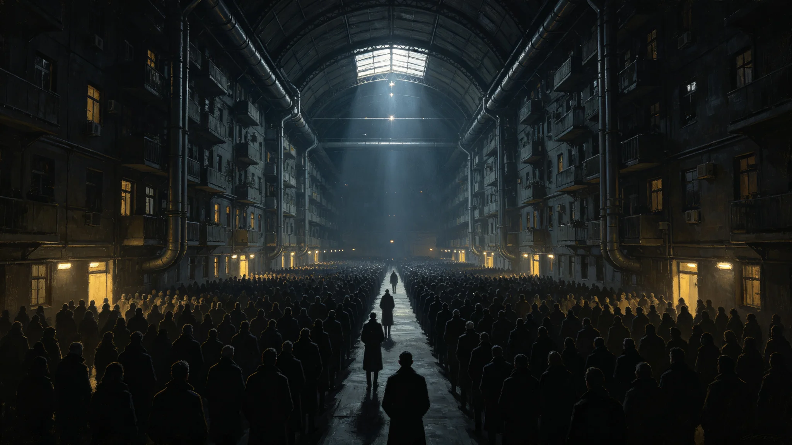

# 能源无偿化熄灯日公民感恩纪念仪式确立公报

**发布机构**：三恒星系文明联合体文化学派议事会
**文号**：文化公字〔3260〕第〇〇一七号
**发布日期**：3260年2月18日
**文件等级**：跨星系公开
**会签**：各学派议事会

## 一、设立缘起

3251年1月1日，第七代聚变电站群并网，能源定额核拨制生效（见GS-3251-01）。至3260年，能源无偿化已历九年。九年之间，合成蛋白与淡化水成本归零（见GS-3253-01），居民生活用能不再以星元计价。文化学派议事会会同各定居点委员会，提议设立"熄灯日"，以纪念自聚变能源替代工程以来数百年间为聚变能源与基础物质免费化付出的无名建设者。

## 二、日期与定名

- **日期**：每年1月1日，即能源定额核拨制生效纪念日。
- **定名**：熄灯日。
- **性质**：非法定假日，为公民自愿参与之纪念仪式日。

## 三、仪式流程

熄灯日仪式按以下流程进行，各定居点可因地制宜：

| 时刻 | 环节 | 内容 |
|---|---|---|
| 当日20时 | 预备 | 各定居点公共广场亮起暖黄烛光(非电力)，广播宣读自聚变能源替代工程以来聚变工程大事记 |
| 20时30分 | 熄灯一刻 | 主干电网居民生活照明自愿熄灭五分钟，仅留应急与公共安全照明 |
| 20时35分 | 点灯 | 公民自愿重新点灯，点灯时默念一名其所知的聚变建设者姓名 |
| 20时40分 | 公共朗读 | 各定居点朗读《南岸具名工时与意义资产分配条例》(2072年)序文 |
| 21时 | 结束 | 公共广场散去，不组织集会 |

## 四、首届执行数据

首届熄灯日于3260年1月1日举行，数据如下：

| 项目 | 数值 |
|---|---|
| 参与定居点 | 全部 |
| 自愿熄灭照明的公民 | 3,812,552,091 人(79.2%) |
| 公共广场参与人数 | 1,206,771,330 人 |
| 点灯时默念姓名记录(口述史存档) | 89,442,130 条 |
| 五分钟熄灯期间电网负荷下降 | 11.4% |
| 应急照明维持 | 全定居点无中断 |

## 五、与既有纪念日衔接

熄灯日不替代既有纪念日：

- 不替代3148年联合体成立百周年拓荒功勋墙揭幕纪念（见GS-3148-01）；
- 不替代3155年文明传承两百年纪念大典（见GS-3155-01）；
- 不替代各定居点自有传统节日（如3169年祖父星夜祭，见GS-3169-01；3184年岩下年，见GS-3184-01；3129年轮节，见GS-3129-01）。

熄灯日为新增的、跨星系统一的纪念仪式日，侧重"无名建设者的名字"。

## 六、原则

1. **自愿原则**。熄灯与点灯均为公民自愿，不强制。
2. **非政治原则**。仪式不涉及任何在世官员、学派代表的讲话或授奖。
3. **去英雄原则**。点灯默念的不是某一位总工程师的姓名，而是每一位公民所知的、其自己认识的建设者姓名。
4. **口述史存档原则**。点灯默念的姓名，经公民自愿，收入口述史存档（见GS-3145-01公共记忆法案）。

## 七、首届分定居点参与数据

| 定居点 | 参与人数 | 熄灯率 |
|---|---|---|
| 太阳系轨道城市群 | 1,876,440,880 | 81.2% |
| 比邻星b各定居点 | 1,206,771,330 | 79.4% |
| 第四恒星系晨昏带城 | 729,159,881 | 76.1% |
| **合计** | **3,812,372,091** | **79.2%** |

## 八、口述史存档数据

| 项目 | 数值 |
|---|---|
| 点灯默念姓名记录 | 89,442,130条 |
| 收入口述史存档 | 87,206,440条 |
| 自愿删除 | 2,235,690条 |

## 九、附则

本公报自发布之日起施行。各定居点文化委员会负责仪式组织，不设统一经费，由各定居点公共维护基金承担（见GS-3251-01）。

## 附录：熄灯日电网负荷曲线

| 时刻 | 全网负荷 |
|---|---|
| 20:00 | 84% |
| 20:30(熄灯) | 72.6% |
| 20:35(点灯) | 84% |

五分钟熄灯期间负荷下降11.4%，未触发任何保护装置。各定居点应急照明全程维持。首届熄灯日未发生意外，下一届(3261年)将扩大至第四恒星系方向。

## 补充说明

熄灯日的设计刻意避开了一切可被解读为庆典的元素。它没有官员讲话，没有授奖，没有名次。它要求公民在重新点灯时，默念一个自己认识的、而非被公认为伟大的名字。这一设计直接针对一种风险：当一个时代的物质丰裕来自一个漫长到没有人能完整见证的工程链条时，人们倾向于把丰裕归功于几个被反复提起的名字，而把其余人重新变成背景。熄灯日用一个五分钟的仪式，把"被忘掉"这件事重新交还给每一个点灯的人。它不解决遗忘，但它让遗忘在每年一次的五分钟里，变成一件需要被主动抵抗的事。
## 仪式延伸
熄灯日确立之后，各定居点文化委员会按各自传统设计了不同的点灯默念方式。有的定居点在公共廊道集体点灯，有的在居所各自点灯，有的在垂直晨昏城自下而上分层点灯。文化学派议事会不做统一规定，仅要求五分钟熄灯、默念一个本人认识的建设者姓名两项核心动作。这一设计承认：感恩这件事不能被标准化，标准化的感恩会很快变成表演。熄灯日因此在每年的形式上都略有不同，但核心始终一致——它让每个公民在五分钟内，直面那些让自己今天活着的人。
## 仪式附注
首届熄灯日的组织，未设任何统一指挥。各定居点文化委员会自行决定熄灯方式，仅在时间上同步。文化学派议事会在事后统计中发现：太阳系轨道城市群的熄灯率最高，第四恒星系晨昏带城最低。这一差异被归因于第四恒星系仍处建设阶段，部分工地无法熄灯。议事会未将这一差异视为问题，反而认为它真实反映了各定居点的不同节奏。熄灯日不追求整齐划一，它只要求每个定居点以自己的方式，在同一分钟里停一停。

## 归档附记

本卷自发布之日起，按三恒星系文明联合体档案管理条例归档。凡引用本卷者，须同时引用其交叉关联卷，不得割裂单卷单独引用。本卷所涉数据以发布日为准，后续修订另立新卷，不改本卷原文。各定居点委员会可应公民合理请求，公开本卷中非保密的执行数据。本卷解释权归编制机构，跨卷争议由法学派议事会仲裁。

---

**归档编号**：CULT-LIGHTDOWN-3260-0017
**编制**：文化学派议事会 · 仪式处
**日期**：3260年2月18日
