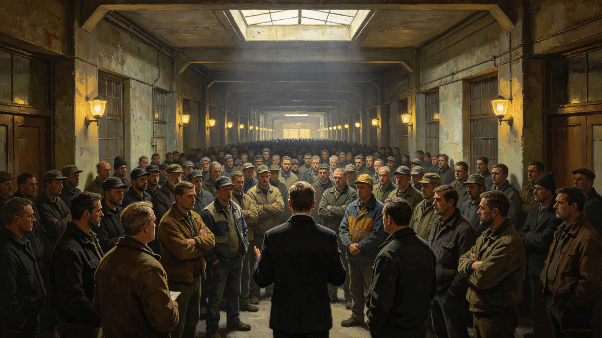

# 自动化转岗潮中某居住区意义工时争议集会与处置事件公报

**发布机构**：三恒星系文明联合体安全协调委员会 · 居住区秩序处
**文号**：安委通报字〔3263〕第〇〇三一三号
**发布日期**：3263年8月27日
**事件等级**：三级公共秩序事件
**文件等级**：跨星系公开

## 一、事件概要

3263年7月14日，太阳系主带三号轨道城B-12居住区发生意义工时争议集会。集会由该居住区某自动化产线转岗工人发起，约 312 人参与，持续四小时十七分钟。事件未造成人员伤亡，未发生财物破坏，最终经居住区委员会调解散去。

## 二、事件时间线

| 时刻(本地) | 事件 |
|---|---|
| 09:12 | 发起人于B-12居住区公共廊道张贴手写告示，称"意义工时定价不公" |
| 09:40 | 陆续有转岗工人聚集，至10:30约210人 |
| 10:47 | 居住区委员会值班员到场，开始现场对话 |
| 11:15 | 人数增至312人，廊道交通受阻，但未堵塞应急通道 |
| 11:30 | 安全协调委员会居住区秩序处到场，未启动驱散 |
| 12:02 | 发起人提出三项诉求(见下文) |
| 12:40 | 委员会承诺三日内答复 |
| 13:19 | 集会散去，无人滞留 |

## 三、诉求与答复

发起人提出三项诉求：

1. **诉求一**：意义工时服务市场教学类定价虚高（见GS-3262-01市场问题一），要求公共抽审。
   **答复**：经济署已于3263年3月启动工时定价年度抽审，教学类为首批抽审对象。
2. **诉求二**：自动化转岗工人既往贡献未获充分承认（参照钟渡案件二，见GS-3259-01）。
   **答复**：依GS-3145-01公共记忆法案，既往贡献一律收入口述史存档，不因其转岗而抹除。
3. **诉求三**：反对"不参与具名工时亦享生存权"被解读为"可以不工作"。
   **答复**：依GS-3258-01第二条，不参与具名工事关涉公民自由选择，非义务豁免。本居住区委员会不组织劝工。

## 四、处置与整改

安全协调委员会会同居住区委员会，下达以下整改：

| 整改项 | 责任单位 | 完成时限 |
|---|---|---|
| B-12居住区公共廊道增设意义工时咨询岗 | 居住区委员会 | 3263年9月 |
| 教学类工时定价抽审结果公开 | 经济署 | 3263年10月 |
| 转岗工人既往贡献口述史录制专场 | 居住区委员会 | 3263年12月 |
| 居住区集会疏导预案修订 | 居住区秩序处 | 3263年9月 |

## 五、定性

本事件为自动化转岗潮中的合法公共表达，非暴力、无破坏、有诉求、有答复。安全协调委员会未启动驱散，亦未对参与人作任何记录。本事件记入居住区公共秩序档案，不记入任何个人档案。

## 七、集会参与人构成

| 构成 | 人数 |
|---|---|
| 自动化产线转岗工人 | 186 |
| 自动化产线在职工人 | 47 |
| 居住区居民(围观) | 79 |
| 其他 | 0 |
| **合计** | **312** |

## 八、整改分阶段

| 整改项 | 完成时间 |
|---|---|
| B-12意义工时咨询岗 | 3263年9月 |
| 教学类工时定价抽审结果公开 | 3263年10月 |
| 转岗工人口述史录制专场 | 3263年12月 |
| 居住区集会疏导预案修订 | 3263年9月 |

## 九、附则

本通报自发布之日起施行。本事件为合法公共表达，不记入任何个人档案。各定居点意义工时法公民说明会自3264年起开展。

## 附录：B-12居住区背景

B-12居住区为太阳系主带三号轨道城老居住区，常住居民41,206人，其中自动化转岗工人占21%。居住区公共廊道宽4.2米，日常通行顺畅，集会未堵塞应急通道。集会后三日，居住区委员会增设意义工时咨询岗，配钟渡(见GS-3259-01)一名。

## 补充说明

B-12的集会在安全档案里被定性为"合法公共表达"，这个定性本身就是这次事件的核心。它不是一场暴乱，没有破坏，没有受伤，有诉求，有答复。安全协调委员会没有驱散，甚至没有把参与人记入任何个人档案。这在旧时代的许多社会里是不可想象的——一个关于"我们怕被忘掉"的集会，被当作一件正常的公共事务处理。事件暴露的真正问题，不是这些工人太激动，而是意义工时法刚试行，连执法者自己都还没完全想清楚"不工作权"到底意味着什么。一场集会，成了一次全民说明书。
## 事件延伸
B-12居住区集会事件之后，安全协调委员会对全部老居住区做了一次”意义工时理解度”抽样调查。调查显示：约百分之十一的转岗工人仍把”不参与具名工时”理解为”被社会抛弃”，而非”权利”。这一比例在老居住区高于新居住区。委员会据此建议各定居点在次年开展一轮说明会，重点放在老居住区。事件本身没有引发制度变更，它只是暴露了新法律落地的社会时差。一场集会的价值，有时不在于它改变了什么，而在于它让被忽略的那部分人被看见。
## 事件附注
B-12居住区集会事件，在安全档案中被归入"合法公共表达"类别。这一类别在旧时代的安全档案中并不存在，它是意义工时法试行后新增的。安全协调委员会在事件总结中指出：一个关于"怕被忘掉"的集会，被当作正常公共事务处理，这本身就是制度成熟的标志。事件后，B-12居住区增设了意义工时咨询岗，由钟渡（见GS-3259-01）兼任。集会参与人未被记入任何个人档案，事件本身不构成任何处分。

## 归档附记

本卷自发布之日起，按三恒星系文明联合体档案管理条例归档。凡引用本卷者，须同时引用其交叉关联卷，不得割裂单卷单独引用。本卷所涉数据以发布日为准，后续修订另立新卷，不改本卷原文。各定居点委员会可应公民合理请求，公开本卷中非保密的执行数据。本卷解释权归编制机构，跨卷争议由法学派议事会仲裁。

---

**归档编号**：RES-ASSEMBLY-3263-00313
**编制**：安全协调委员会 · 居住区秩序处
**日期**：3263年8月27日
