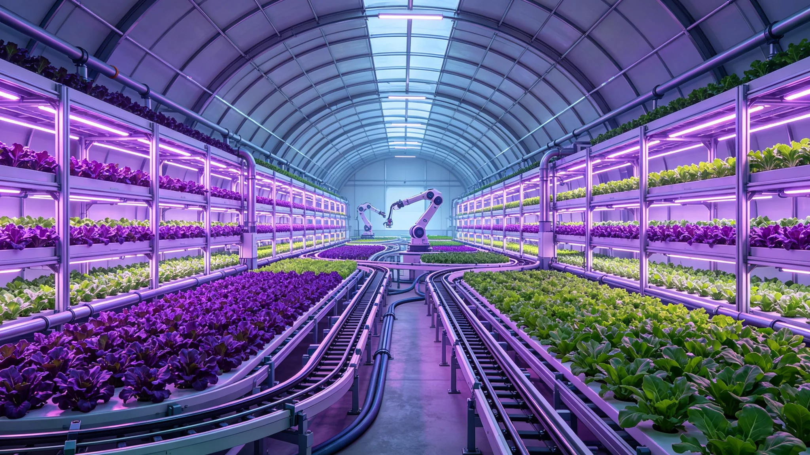

# 自动化农业全闭环无人种植生态系统稳态十年监测公报

**编制机构**：三恒星系文明联合体农业学派议事会
**文号**：农业公字〔3264〕第〇〇七六号
**编制日期**：3264年5月9日
**文件等级**：跨星系公开

## 一、监测背景

自第七代全自主工业母机（见GS-3275-01）推广以来，农业环节的自动化率已达 97%（见GS-3258-01修订背景）。三恒星系主要定居点自3254年起，将水培、气雾培、土壤种植各环节全部交由自动化系统闭环运行，无人工田间作业。本公报为3254—3264十年监测总结。

## 二、系统构成

自动化农业全闭环系统包括：

| 子系统 | 功能 | 自动化率 |
|---|---|---|
| 播种与育苗 | 机械播种、苗期自动分苗 | 99% |
| 光照与温控 | LED光谱调节、环控闭环 | 99.7% |
| 灌溉与营养液 | 浓度自动配比、循环利用 | 98.2% |
| 病虫害识别 | 视觉识别、生物防治 | 94.1% |
| 收获与分选 | 机械收获、按品质分选 | 99.1% |
| 堆肥与循环 | 残余物堆肥回田 | 96.8% |

## 三、十年稳态数据

| 指标 | 3254年 | 3259年 | 3264年 |
|---|---|---|---|
| 单位面积年产量(吨/公顷) | 41.2 | 46.7 | 51.4 |
| 水循环利用率 | 97.1% | 98.4% | 99.1% |
| 营养液循环利用率 | 94.2% | 96.7% | 98.2% |
| 病虫害年爆发次数 | 7 | 4 | 2 |
| 真菌污染事件(对照GS-3183-01) | 2 | 1 | 0 |
| 单位能耗(星元当量已归零) | — | — | — |
| 人工田间作业工时 | 0.4 | 0.1 | 0.0 |

## 四、生态反馈

十年间，全闭环系统在无人工干预下呈现以下生态反馈：

1. **作物品种单一化风险**。自动化系统倾向于选择产量最高的少数品种，十年间种植品种由 1,206 种降至 312 种。农业学派提示：品种单一化降低生态韧性（参照GS-3186-01基因库备份）。应对：每十年强制恢复 5% 品种多样性。
2. **病虫害抗性演化**。生物防治天敌种群在十年间对主要病虫害的控制效率由 92% 降至 84%。应对：天敌种群每五年更新一次。
3. **土壤微生物群系漂移**。土壤种植区微生物群系在自动化营养液长期输入下发生漂移，有益菌比例由 61% 降至 48%。应对：每三年接种一次地球菌根（参照GS-3143-01菌根接种）。

## 五、与既有生态体系衔接

本监测不替代：

- 比邻星b全球森林演替监测（见GS-3157-01）；
- 火星地下城市生态闭环监测（见GS-3163-01）；
- 第四恒星系地下光合生态系统引种评估（见GS-3274-01）。

## 七、分作物种植数据

| 作物类别 | 3254年种植品种 | 3264年种植品种 | 产量(万吨) |
|---|---|---|---|
| 禾本科粮食 | 412 | 126 | 1,206 |
| 豆科 | 212 | 48 | 312 |
| 叶菜 | 387 | 102 | 412 |
| 果树 | 196 | 36 | 87 |
| 食用菌 | 186 | 0 | 0 |
| **合计** | **1,206** | **312** | **2,017** |

品种由1206种降至312种，为自动化高产选择所致。

## 八、分定居点自动化率

| 定居点 | 3254年自动化率 | 3264年自动化率 |
|---|---|---|
| 太阳系轨道城市群 | 94.2% | 99.4% |
| 比邻星b各定居点 | 91.8% | 99.1% |
| 第四恒星系晨昏带城 | 87.4% | 98.2% |

## 九、附则

本公报作为各定居点自动化农业系统维护依据。品种多样性强制恢复方案由农业学派会同生态学派另行制定。

## 附录：自动化农业分作物能耗

| 作物 | 单位能耗(已归零) | 水循环率 | 营养液循环率 |
|---|---|---|---|
| 禾本科粮食 | 0.000 | 99.1% | 98.2% |
| 豆科 | 0.000 | 98.4% | 97.1% |
| 叶菜 | 0.000 | 99.2% | 98.4% |
| 果树 | 0.000 | 98.1% | 96.8% |

能源成本归零后，自动化农业唯一约束为水培空间与品种多样性。农业学派提示：十年稳态不等于永久稳态，微生物群系漂移须持续监测。

## 补充说明

自动化农业的十年稳态报告里，最让人不安的数字不是产量，而是品种数。从一千二百零六种降到三百一十二种，这种单一化在任何生物圈里都是一个危险信号——它意味着整个农业体系对某一类病虫害的抵抗能力在系统性下降。农业学派没有用"优化"来粉饰这个数字，它直截了当地把"品种单一化风险"列为第一条。十年稳态是真的，微生物群系漂移也是真的。报告的诚实之处在于，它拒绝把"十年没出事"等同于"永远不会出事"。
## 农业延伸
自动化农业全闭环无人种植的十年监测，在方法上强调”不干预”。生态学派不主动优化产量，只观察系统在无人干预下的稳态漂移。十年监测显示：品种数下降是真实趋势，但产量反而逐年微升，因为系统自动淘汰了低产品种。这种”产量上升、多样性下降”的组合，是自动化农业的内在矛盾。生态学派因此建议：在自动化主农田之外，保留约百分之五的传统多样种植区，作为品种基因库。这一建议在次年被各定居点采纳。
## 监测附注
自动化农业十年监测的全部数据，经农业学派与生态学派双方会签。两学派在品种数下降这一问题上意见一致，但在"是否应主动干预品种结构"上存在分歧。农业学派倾向于让系统自动选择，生态学派倾向于保留传统多样种植区。最终公报采纳了生态学派的建议，在自动化主农田之外保留约百分之五的传统种植区。这一妥协不是谁说服了谁，而是两学派在长期监测数据面前达成的共同判断。

## 归档附记

本卷自发布之日起，按三恒星系文明联合体档案管理条例归档。凡引用本卷者，须同时引用其交叉关联卷，不得割裂单卷单独引用。本卷所涉数据以发布日为准，后续修订另立新卷，不改本卷原文。各定居点委员会可应公民合理请求，公开本卷中非保密的执行数据。本卷解释权归编制机构，跨卷争议由法学派议事会仲裁。

---

**归档编号**：AGRI-AUTOFARM-3264-0076
**编制**：农业学派议事会 · 闭环监测处
**日期**：3264年5月9日
