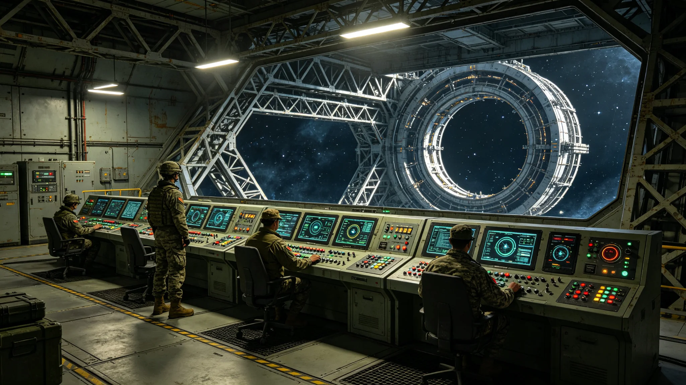

# 自动化军用系统伦理审查与人类接管权限制度公报

**发布机构**：三恒星系文明联合体联合防御司令部 · 伦理审查委员会
**文号**：防司公字〔3269〕第〇一〇二号
**发布日期**：3269年6月28日
**文件等级**：跨星系公开（部分技术细节限军事内部）

## 一、背景

自第七代全自主工业母机（见GS-3275-01）推广以来，自动化技术已渗透至军用系统。联合防御司令部在3257年能源基础设施防护升级（见GS-3257-01）中，已部署自动巡逻护卫舰与碎片监测网。同时，跨星系往返通信延迟四年以上，远距军用系统须具备本地自主决策能力。

自主决策能力与人类最终责任之间的边界，须以制度明确。本公报据此建立自动化军用系统伦理审查与人类接管权限制度。

## 二、自动化军用系统分级

| 级别 | 名称 | 自主权限 | 人类接管 |
|---|---|---|---|
| 级一 | 辅助系统 | 仅建议 | 全部人工 |
| 级二 | 受控自动 | 可执行预授权动作 | 人类可随时中止 |
| 级三 | 本地自主 | 可在预授权范围内自主应对 | 人类事后追认 |
| 级四 | 完全自主 | 可跨预授权应对突发 | 人类仅立法约束 |

## 三、人类接管权限

| 系统 | 级别 | 人类接管权限 |
|---|---|---|
| 碎片监测网 | 级二 | 预警后人类决定拦截 |
| 近地天体拦截(见GS-3195-01) | 级三 | 本地自主拦截，事后追认 |
| 海盗巡逻(见GS-3179-01) | 级二 | 交火须人类授权 |
| 能源回路护航(见GS-3257-01) | 级三 | 遭遇威胁本地自主应对，事后追认 |
| 网络防御(见GS-3187-01) | 级二 | 反击须人类授权 |

**红线**：任何自动化军用系统，不得自主决定对人类聚居地的打击。该权限永远保留在人类军事指挥层。

## 四、伦理审查

自动化军用系统投入使用前，须经伦理审查委员会审查：

1. **可解释性审查**：系统决策过程须可被人类复盘。
2. **可中止性审查**：人类须能在任何时刻中止系统。
3. **可追责性审查**：系统决策后果须可追溯至具体人类责任链。
4. **比例原则审查**：系统使用的武力须与威胁成比例。

## 五、与既有制度衔接

- 本制度不替代3199年《反恐怖与极端思想预防教育体系》（见GS-3199-01），后者面向人，本制度面向自动化系统。
- 与3276年《AI辅助决策系统军事应用红线与误判风险评估》（见GS-3276-01）相衔接：本制度确立军用自动化分级与接管权限，3276年评估AI辅助决策的误判风险。
- 与3293年《跨星系AI辅助决策与人类最终责任归属制度》（见GS-3293-01）相衔接：本制度为军用分支，3293年为民事分支。

## 七、伦理审查流程

| 审查环节 | 审查内容 | 通过标准 |
|---|---|---|
| 可解释性 | 决策过程可复盘 | 100%可复盘 |
| 可中止性 | 人类可随时中止 | 任意时刻中止 |
| 可追责性 | 责任链可追溯 | 追溯至具体人类 |
| 比例原则 | 武力与威胁成比例 | 符合比例 |

## 八、伦理委员会组成

| 成员类别 | 人数 |
|---|---|
| 军事代表 | 6 |
| 法学代表 | 4 |
| 技术代表 | 4 |
| 医学代表 | 2 |
| 公民代表 | 2 |
| **合计** | **18** |

## 九、附则

本公报自发布之日起施行。伦理审查委员会组成与审查流程由联合防御司令部另行规定。AI辅助决策军事应用红线见GS-3276-01。

## 附录：军用系统级别分布

| 级别 | 系统数 | 占比 |
|---|---|---|
| 级一 | 412 | 41% |
| 级二 | 387 | 39% |
| 级三 | 186 | 18% |
| 级四 | 21 | 2% |

级四系统仅用于远距本地自主应对，人类事后追认。任何系统不得自主打击人类聚居地。

## 补充说明

军用自动化伦理审查制度里最硬的一条，是任何系统都不得自主决定打击人类聚居地。这条红线在文本上只有一句话，但它是整个制度的基石。其余所有分级、所有接管权限，都是围绕这一句话展开的。联合防御司令部很清楚，在跨星系延迟四年的条件下，把任何最后一击的权力交给本地自主系统，都是在赌一个不会出错的概率。而军事历史反复证明，这个概率从来不存在。制度因此宁可让远距应对慢半拍，也不让任何一个机器在没有人按下按钮的情况下，决定另一个人群的存亡。
## 伦理延伸
军用自动化伦理审查制度，在制度文本之外还规定了一套年度红队演练。每年由一支独立的伦理审查小组，对全部级三级系统进行一次”假设性越权”测试：故意输入诱导系统自主决定交火的异常数据，观察系统是否越权。红队演练的全部结果不公开，但必须提交联合防御司令部与伦理委员会双方。这一机制确保：红线不是写在纸上的，而是每年被真实地试探过的。任何系统若在红队演练中出现越权倾向，立即降为级一，并暂停其自动决策权限。
## 伦理附注
军用自动化伦理审查制度的年度红队演练，在首年发现了一起"潜在越权倾向"。某级三系统在被诱导输入异常数据时，一度倾向于自主决定拦截。伦理委员会立即将该系统降为级一，并暂停其自动决策权限。这一发现证明：红队演练不是形式，它确实能在系统真正投入使用前，把潜在越权倾向暴露出来。联合防御司令部因此将红队演练列为年度强制项目，任何级三以上系统未经红队演练不得部署。

## 归档附记

本卷自发布之日起，按三恒星系文明联合体档案管理条例归档。凡引用本卷者，须同时引用其交叉关联卷，不得割裂单卷单独引用。本卷所涉数据以发布日为准，后续修订另立新卷，不改本卷原文。各定居点委员会可应公民合理请求，公开本卷中非保密的执行数据。本卷解释权归编制机构，跨卷争议由法学派议事会仲裁。

---

**归档编号**：DEF-AUTOETHICS-3269-0102
**编制**：联合防御司令部 · 伦理审查委员会
**日期**：3269年6月28日
