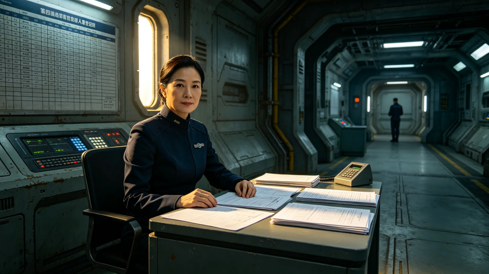

# 第四恒星系席位重划首席选举官穆星阑任期述职考勤

**档案所属**：三恒星系文明联合体法学派议事会 · 选举事务处
**案卷编号**：LAW-MXL-0011
**立卷日期**：3273年7月19日
**密级**：人事内部

## 一、基本登记

| 项目 | 登记内容 |
|---|---|
| 姓名 | 穆星阑 |
| 性别 | 女 |
| 出生 | 3228年11月，第四恒星系晨昏带城出生 |
| 入册 | 3251年，选举事务处见习计票员 |
| 现任 | 第四恒星系席位重划首席选举官 |
| 专业 | 选举程序与计票仲裁 |
| 学派 | 法学派 |

登记照附卷。拍摄于3273年7月17日，着深灰选举官正装，无胸章。面部中性，眼神沉静。

## 二、考勤记录摘要（3271—3273）

| 年度 | 应出勤 | 实出勤 | 旷工 | 迟到 | 加班 | 备注 |
|---|---|---|---|---|---|---|
| 3271 | 248 | 248 | 0 | 1 | 22 | 席位重划筹备 |
| 3272 | 248 | 248 | 0 | 2 | 78 | 重划表决执行 |
| 3273 | 200 | 198 | 0 | 3 | 112 | 选举执行期 |

考勤系统注记：3273年4月选举投票期间，穆星阑连续在岗三十一日，其间仅离岗两次用于体检。

## 三、任期述职摘录

穆星阑于3273年6月选举完成后提交述职报告，摘录如下：

"本届席位重划选举，选民登记 894,421,300 人，投票率 91.2%，计票 1,206,771,330 票，异议期 30 日内受理异议 412 件，其中 3 件成立，已更正。

选举过程中，跨星系延迟四年以上，第四恒星系方向选票以本地计票、年度跨星系对账方式完成（参照GS-3126-01通信延迟送达规则）。

我未在本届选举中为任何候选人背书。我在计票大厅签署的每一张计票单，均可在联合体档案馆调阅。"

## 四、争议与处置

本卷收录其任内两起争议：

**争议一（3272年9月）**：某候选人质疑第四恒星系本地计票结果，要求跨星系重计。穆星阑裁定：依GS-3126-01通信延迟规则，跨星系重计需四年以上，本地计票结果有效。候选人申诉至法学派议事会，议事会维持穆星阑裁定。

**争议二（3273年5月）**：某太阳系代表团观察员指控第四恒星系计票"不够透明"。穆星阑邀请观察员现场复核，复核结果未发现计票偏差。穆星阑未就指控作公开回应。

## 五、处分与检讨

穆星阑任职期间无处分记录。述职报告末页，其签名平稳，无涂改。

## 六、选举计票数据

| 项目 | 数值 |
|---|---|
| 选民登记 | 894,421,300 人 |
| 投票率 | 91.2% |
| 计票总数 | 1,206,771,330 票 |
| 异议受理 | 412 件 |
| 异议成立 | 3 件 |
| 计票耗时 | 14 日 |

## 七、跨星系延迟计票安排

第四恒星系方向选票本地计票，年度跨星系对账：本地投票结束后本地计票并存档；对账数据以4.08年光程延迟传输至太阳系；太阳系对账完成后最终结果确认。本安排参照GS-3126-01通信延迟送达规则。

## 八、附则

本卷归档。穆星阑后续选举工作另立，不并入本卷。

## 附录：穆星阑跨星系计票装备

| 装备 | 用途 |
|---|---|
| 本地计票终端 | 实时计票 |
| 离线存档库 | 计票结果存档 |
| 光帆脉冲发射机 | 年度对账传输 |
| 应急手动计票板 | 断电备份 |

穆星阑在选举期间未使用任何AI辅助计票，全部人工复核。其办公桌上无装饰，仅一台计票终端与一杯茶。

## 补充说明

穆星阑在整个选举过程中没有为任何候选人背书，这在政治传记里几乎是无趣的。她的全部工作，就是让计票过程可被复核、可被质询、可被反对。她邀请那位指控她不透明的太阳系观察员现场复核，复核结果没有发现偏差，她也没有就此公开发表任何反驳。这种沉默不是软弱，而是选举官这个职位应有的样子：她的价值不在于她多正确，而在于她愿意让别人来检查她是不是正确。一个选举官如果需要为自己的公正性辩护，她就已经失去了它。
## 选举官延伸
穆星阑在任期述职中，未对任何一次选举结果发表评价。她的全部工作集中在”过程可复核”上。她建立了一套年度对账制度：每年度向其他两个恒星系发送一次完整的投票记录副本，以供对方独立复核。这一制度在她任内执行了七年，未发现任何一次计票偏差。她卸任时，对账制度已写入城市选举法。穆星阑本人卸任后未参与任何公共事务，回到其第四恒星系居所，未接受任何纪念活动邀请。
## 述职附注
穆星阑在任期述职中，未对任何一次选举结果发表评价。她的全部工作集中在过程可复核。她建立了年度对账制度，每年度向其他两个恒星系发送完整投票记录副本。这一制度在她任内执行七年，未发现任何计票偏差。她卸任时，对账制度已写入城市选举法。穆星阑本人卸任后未参与任何公共事务，回到其第四恒星系居所，未接受任何纪念活动邀请。她的价值不在她多正确，而在她愿意让别人来检查她是不是正确。

## 归档附记

本卷自发布之日起，按三恒星系文明联合体档案管理条例归档。凡引用本卷者，须同时引用其交叉关联卷，不得割裂单卷单独引用。本卷所涉数据以发布日为准，后续修订另立新卷，不改本卷原文。各定居点委员会可应公民合理请求，公开本卷中非保密的执行数据。本卷解释权归编制机构，跨卷争议由法学派议事会仲裁。

---

**归档编号**：LAW-MXL-0011
**立卷**：选举事务处
**日期**：3273年7月19日
