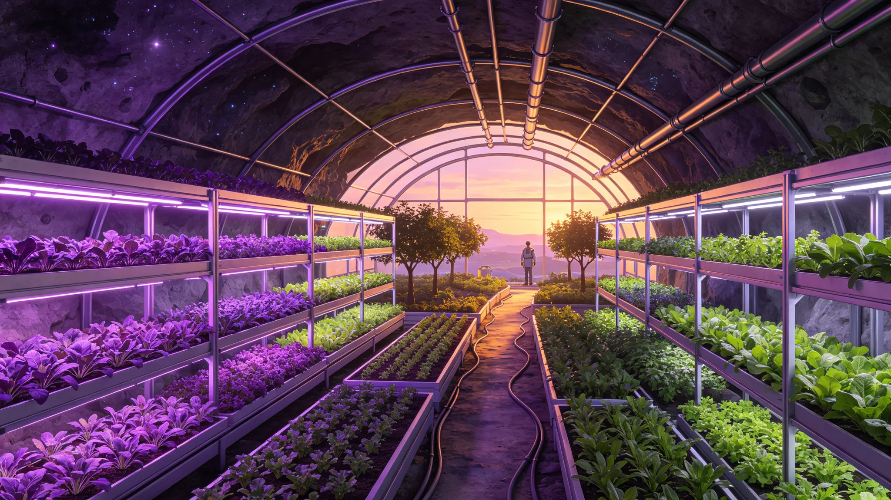

# 第四恒星系晨昏带地下光合生态系统引种十年评估公报

**编制机构**：三恒星系文明联合体生态学派议事会
**文号**：生态公字〔3274〕第〇一五九号
**编制日期**：3274年5月26日
**文件等级**：跨星系公开

## 一、评估背景

第四恒星系晨昏带城位于该恒星系的永久晨昏带，地表无稳定直射恒星光照。城市生态系统建于地下（见GS-3271-01居住权、GS-3282-01人工重力分层），以人工光源模拟光合环境。自3264年引种第一批地球植物以来，已十年。本公报为十年引种评估。

## 二、引种清单

| 类别 | 引种数 | 存活数 | 存活率 |
|---|---|---|---|
| 乔木 | 412 | 312 | 75.7% |
| 灌木 | 876 | 644 | 73.5% |
| 草本 | 2,106 | 1,844 | 87.6% |
| 蕨类 | 312 | 288 | 92.3% |
| 苔藓地衣 | 412 | 401 | 97.3% |
| 食用菌 | 186 | 171 | 91.9% |
| **合计** | **4,304** | **3,660** | **85.0%** |

## 三、十年生态演替

| 指标 | 3264年 | 3269年 | 3274年 |
|---|---|---|---|
| 地下光合区总面积 | 12 平方公里 | 18 平方公里 | 26 平方公里 |
| 年光合作用固碳量 | 0.4 万吨 | 0.8 万吨 | 1.4 万吨 |
| 氧气年释放量 | 0.6 万吨 | 1.2 万吨 | 2.1 万吨 |
| 本土昆虫引入种 | 41 种 | 87 种 | 126 种 |
| 微生物群系稳定性 | 初建 | 基本稳定 | 稳定 |

## 四、问题

生态学派监测到三类问题：

1. **乔木生长缓慢**。地下人工光源光强仅为地表的 40%，乔木生长速率为地球的 60%。应对：补光光谱向红端偏移（参照GS-3123-01光敏育种）。
2. **本土昆虫逃逸风险**。引入的地球昆虫中，3种在地下生态外发现逃逸个体。应对：逃逸个体监测网扩容。
3. **微生物群系漂移**。与GS-3264-01无人种植区类似，地下光合区微生物群系在十年间发生漂移。应对：每三年接种一次地球菌根。

## 五、与既有生态体系衔接

本评估不替代：

- 第四恒星系本地生物引入（参照GS-3171-01人工河流自然化）；
- 跨星系物种基因库备份（见GS-3186-01）；
- 比邻星b全球森林演替（见GS-3157-01）。

## 六、引种失败案例

生态学派记录三起引种失败：

| 物种 | 失败原因 | 处理 |
|---|---|---|
| 某地球高杆乔木 | 地下光照不足，三年枯死 | 改种蕨类 |
| 某地球授粉蜂 | 地下温度过低，越冬失败 | 改机械授粉(见GS-2D) |
| 某地球蔓藤 | 根系侵入管线，被清除 | 引种停止 |

## 七、分区域生态数据

| 区域 | 面积(平方公里) | 固碳(吨/年) | 释氧(吨/年) |
|---|---|---|---|
| 一号地下穹顶 | 8.4 | 412 | 612 |
| 二号地下穹顶 | 10.2 | 512 | 764 |
| 三号地下穹顶 | 7.4 | 306 | 458 |

## 八、附则

本公报作为第四恒星系地下光合生态系统维护依据。涉及逃逸昆虫监测的具体方案，由生态学派会同农业学派另行制定，不迟于3275年发布。引种失败物种档案收入跨星系基因库备份(见GS-3186-01)。

## 附录：地下光合区光照参数

| 区域 | 光强(地球%) | 光谱 | 补光 |
|---|---|---|---|
| 一号穹顶 | 40% | 全光谱 | 无 |
| 二号穹顶 | 42% | 全光谱 | 无 |
| 三号穹顶 | 38% | 红端偏移 | 有 |

三号穹顶补光后，乔木生长速率提升至地球的58%(原40%)。

## 补充说明

地下光合生态系统的引种失败清单，比成功清单更有价值。四地球高杆乔木在弱光下枯死、地球授粉蜂在低温下越冬失败、地球蔓藤入侵管线被清除——这三起失败，比三百六十四种存活植物更能说明，把一个地球生态系统移植到异星地下，从来不是一个"搬过去就行"的工程问题。生态学派把失败物种档案收入基因库备份，不是因为它们失败了就无用，而是因为每一次失败都标记了一条地球生态边界的形状。
## 引种延伸
第四恒星系晨昏带地下光合生态系统引种十年评估，在成功物种之外，还记录了一批”失败但有价值”的引种。其中地球高杆乔木虽在弱光下枯死，但它的根系结构被用于改进垂直森林的深层固定。地球蔓藤虽被清除，但其耐旱基因被保存入基因库。生态学派提示：引种失败不是资源浪费，而是异星生态知识的积累。每一次失败物种的基因都被备份，未来在其他异星定居点可能重新找到适用环境。
## 引种附注
地下光合生态系统引种十年评估，在成功物种三百六十四种之外，还记录了失败物种的档案。失败物种虽未存活，但它们的基因被保存入基因库备份。生态学派提示：引种失败不是资源浪费，而是异星生态知识的积累。地球高杆乔木的根系结构被用于改进垂直森林的深层固定，地球蔓藤的耐旱基因被保存以备未来。这份评估的价值，一半在成功清单，一半在失败清单。

## 归档附记

本卷自发布之日起，按三恒星系文明联合体档案管理条例归档。凡引用本卷者，须同时引用其交叉关联卷，不得割裂单卷单独引用。本卷所涉数据以发布日为准，后续修订另立新卷，不改本卷原文。各定居点委员会可应公民合理请求，公开本卷中非保密的执行数据。本卷解释权归编制机构，跨卷争议由法学派议事会仲裁。
## 引种十年附注
地下光合生态系统引种十年，在三百六十四种存活物种之外，还有约四百种引种处于试种阶段，尚未定性为存活或失败。生态学派提示：试种中的物种不应急于下结论，异星地下环境的适应周期可能长达数十年。引种的长期价值在于建立一个本地物种库，而非在十年内达成地球生态的复制。这份评估因此拒绝给出一个最终数字，它只说：引种仍在进行中。

---

**归档编号**：ECO-UNDERGROVE-3274-0159
**编制**：生态学派议事会 · 引种评估处
**日期**：3274年5月26日
