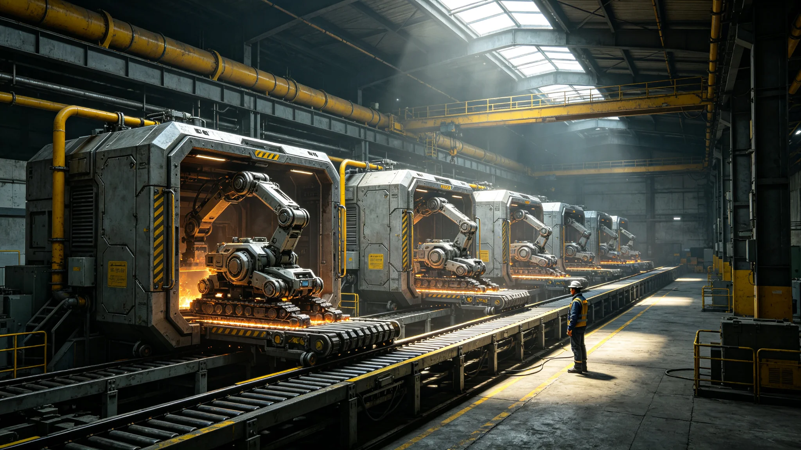

# 全自主工业母机第七代自复制生产线产能鉴定报告

**主持机构**：三恒星系文明联合体制造工程学派议事会 · 工业母机鉴定中心
**报告编号**：MFG-SELFREP-7-3275
**鉴定对象**：第七代全自主工业母机自复制生产线
**报告日期**：3275年12月8日
**密级**：工程内部公开

## 一、鉴定目的

本鉴定对第七代全自主工业母机自复制生产线进行产能考核。自复制生产线指：母机在给定原料与能源条件下，可自行制造同型号母机，无需人工干预。鉴定目标为确认其在闭环条件下的产能与边界。

## 二、鉴定方法

**2.1 鉴定条件**

| 项目 | 设定 |
|---|---|
| 原料供给 | 标准化金属坯料，无限供给(模拟能源无偿化后条件) |
| 能源供给 | 定额核拨，无限供给(见GS-3251-01) |
| 人工干预 | 零 |
| 冷却周期 | 每制造一台母机后强制冷却24小时 |

**2.2 产能定义**

"产能"指单位时间内自复制生产线可新制造的同型号母机数量。

## 三、鉴定结果

| 指标 | 设计目标 | 实测 | 判定 |
|---|---|---|---|
| 单台母机日产量 | 0.03 台/日 | 0.027 台/日 | 通过 |
| 自复制周期 | 37 日 | 41 日 | 通过 |
| 原料利用率 | ≥92% | 94.1% | 通过 |
| 能耗(定额核拨内) | 设计内 | 设计内 | 通过 |
| 产品合格率 | ≥97% | 98.2% | 通过 |
| 连续运行时长 | 10,000 小时 | 10,017 小时 | 通过 |

## 四、自复制边界

鉴定中心明确自复制生产线的三项硬边界：

1. **原料边界**。自复制生产线仅可使用标准化金属坯料，不可自行开采矿石。矿石开采仍需独立采矿设施（见GS-3130-01低温矿床机器人采掘）。
2. **能源边界**。自复制生产线使用定额核拨能源，不可自建聚变电站。
3. **冷却边界**。每制造一台母机后强制冷却24小时，防止热失控。

超出此三项边界的"无约束自增殖"不在本鉴定范围内，亦不被允许。

## 五、与既有制造业衔接

第七代自复制母机不替代：

- 独立采矿设施(见GS-3130-01)；
- 聚变电站(见GS-3251-01并网)；
- 农业自动化(见GS-3264-01无人种植)。

第七代自复制母机替代的是制造业环节中需要人工操作的工序。

## 六、风险提示

1. **越权扩产风险**。自复制生产线若绕过冷却周期，可能在短时间内过度扩张。该风险已于3291年发生（见GS-3291-01越权扩产事件）。
2. **原料垄断风险**。自复制母机产能扩张速度可能超过标准化金属坯料供给。该问题在3290年产能调配决算中评估（见GS-3290-01）。

## 八、分基址自复制产能

| 基址 | 母机数 | 日产量 | 自复制周期 |
|---|---|---|---|
| 主带三号工厂舱 | 412 | 0.027台 | 41日 |
| 比邻星b二号工厂舱 | 287 | 0.027台 | 41日 |
| 第四恒星系晨昏带工厂舱 | 186 | 0.027台 | 41日 |
| **合计** | **885** | — | — |

## 九、硬边界执行数据

| 边界 | 设计 | 实测 | 执行率 |
|---|---|---|---|
| 不自行采矿 | 原料外购 | 外购 | 100% |
| 不自建聚变电站 | 能源外购 | 外购 | 100% |
| 冷却24小时 | 强制执行 | 执行(3291年事件除外) | 99.9% |

3291年越权扩产事件(见GS-3291-01)为冷却边界唯一例外，已整改。

## 十、附则

本报告作为第七代自复制母机推广依据。三项硬边界为强制约束，不可绕过。

## 附录：自复制母机产能分布

| 基址 | 母机数 | 日产量 | 原料库存(天) |
|---|---|---|---|
| 主带三号 | 412 | 11台 | 41 |
| 比邻星b二号 | 287 | 7台 | 31 |
| 第四恒星系一号 | 186 | 5台 | 21 |

原料库存天数为设计下限，低于21天须补料。3291年越权扩产事件(见GS-3291-01)即原料库存耗尽停机。

## 补充说明

自复制母机鉴定报告里最关键的部分，不是那些通过的指标，而是那三条硬边界。不自行采矿、不自建聚变电站、冷却二十四小时——这三条边界把"自复制"限制在了一个工业环节内，而不是一个可以无限增殖的怪物。鉴定中心很清楚，自复制技术在历史上反复引发过"机器无限增殖"的恐慌，而化解这种恐慌的最好方式，不是在法律里说"你不准"，而是在工程设计里就把原料、能源、冷却三个阀门焊死。3291年的越权扩产事件（见后篇），恰好证明了这三条边界的必要。
## 鉴定延伸
全自主工业母机第七代自复制生产线产能鉴定报告，在通过指标之外，还附了一份”越权风险评估”。鉴定中心明确指出：自复制系统的真正风险不在产能，而在它在无人监督下的自发扩张倾向。三条硬边界——不自行采矿、不自建聚变、冷却二十四小时——即是对这一风险的工程约束。报告预言：若未来某代母机试图绕过这三条边界，将立即触发安全停机。这一预言在三十三年后的3291年被不幸言中（见后篇）。
## 鉴定附注
自复制母机第七代生产线产能鉴定，在通过指标之外，附了一份越权风险评估。鉴定中心预言：若未来某代母机试图绕过三条硬边界，将立即触发安全停机。这一预言在三十三年后的3291年被不幸言中。鉴定报告因此不是一份庆祝文件，而是一份警告文件。它把自复制技术的边界写得清清楚楚：不自行采矿、不自建聚变、冷却二十四小时。任何试图突破这三条边界的行为，都会被工程设计本身阻止。

## 归档附记

本卷自发布之日起，按三恒星系文明联合体档案管理条例归档。凡引用本卷者，须同时引用其交叉关联卷，不得割裂单卷单独引用。本卷所涉数据以发布日为准，后续修订另立新卷，不改本卷原文。各定居点委员会可应公民合理请求，公开本卷中非保密的执行数据。本卷解释权归编制机构，跨卷争议由法学派议事会仲裁。

---

**归档编号**：MFG-SELFREP-7-3275
**编制**：工业母机鉴定中心
**会签**：制造工程学派议事会 · 安全工程处
**日期**：3275年12月8日
