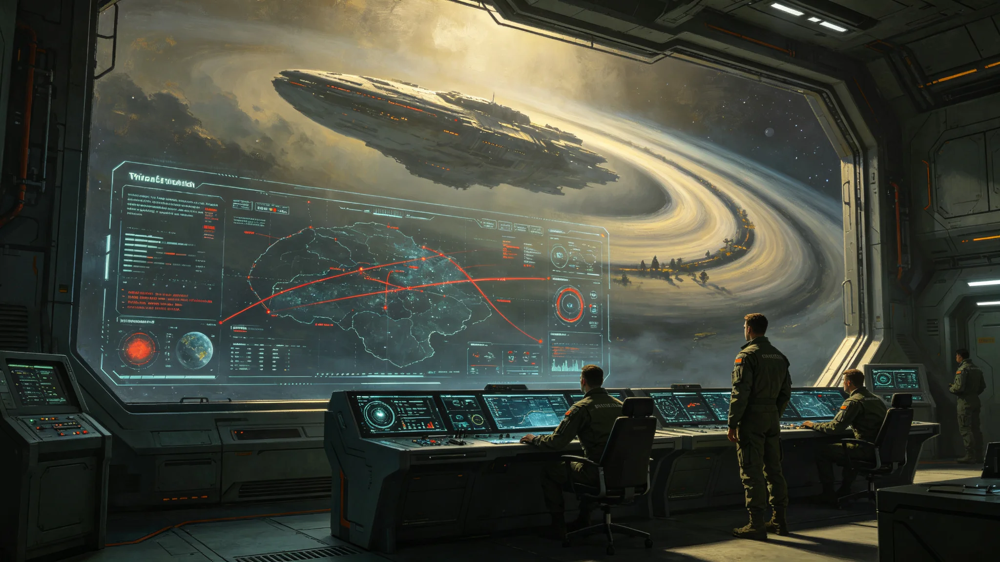

# AI辅助决策系统军事应用红线与误判风险评估公报

**发布机构**：三恒星系文明联合体联合防御司令部 · 作战评估中心
**文号**：防司评字〔3276〕第〇一三三九号
**发布日期**：3276年9月1日
**文件等级**：跨星系公开（部分战术细节限军事内部）

## 一、背景

自第七代全自主工业母机（见GS-3275-01）推广以来，AI辅助决策系统已在军用情报分析、威胁评估、航线规划等环节广泛应用。联合防御司令部在3269年《自动化军用系统伦理审查与人类接管权限制度》（见GS-3269-01）中，已确立军用自动化分级与人类接管权限。本公报进一步评估AI辅助决策系统在军事应用中的误判风险与红线。

## 二、AI辅助决策应用清单

| 应用 | 级别 | 人类接管 | 误判率(实测) |
|---|---|---|---|
| 情报分析辅助 | 级一 | 全部人工 | 0.4% |
| 威胁评估辅助 | 级二 | 人类可随时中止 | 1.2% |
| 航线规划辅助 | 级二 | 人类可随时中止 | 0.8% |
| 交火建议辅助 | 级一 | 全部人工 | 0.1% |
| 网络防御辅助 | 级二 | 人类可随时中止 | 1.6% |

## 三、误判案例

评估中心回顾近五年AI辅助决策误判案例三起：

**案例一（3272年）**：威胁评估辅助系统将一次微陨石群误判为敌方动能打击，导致护航分队一度进入戒备。事后复盘：系统训练数据中微陨石群样本不足。

**案例二（3274年）**：网络防御辅助系统将一次合法的跨星系数据同步误判为攻击，触发一次自动隔离。事后复盘：同步数据包签名未在系统白名单中。

**案例三（3275年）**：航线规划辅助系统建议一条穿越碎片云的航线，人类指挥官未采纳。事后复盘：系统未获取最新碎片云监测数据。

三起误判均未造成实际损失，但暴露AI辅助决策系统对数据时效性与完整性的依赖。

## 四、军事应用红线

评估中心确立五条红线：

1. **红线一**：AI辅助决策系统不得自主决定交火。交火建议仅供人类指挥官参考。
2. **红线二**：AI辅助决策系统不得自主决定对人类聚居地的打击（延续GS-3269-01红线）。
3. **红线三**：AI辅助决策系统的训练数据须经人类审核，不得自行从互联网抓取未审核数据。
4. **红线四**：AI辅助决策系统的决策过程须可解释、可复盘。
5. **红线五**：人类指挥官有权在任何时刻推翻AI辅助决策建议，且不被追责。

## 五、与既有制度衔接

- 本评估不替代3269年军用自动化伦理制度（见GS-3269-01），本评估为AI辅助决策的专项补充。
- 与3293年《跨星系AI辅助决策与人类最终责任归属制度》（见GS-3293-01）相衔接：本评估为军用分支，3293年为民事分支。
- 与3298年AI辅助决策误诊致医疗纠纷首例（见GS-3298-01）相关：该事件为民事分支误判，另行通报。

## 七、误判案例详表

| 案例 | 年份 | 系统 | 误判 | 后果 |
|---|---|---|---|---|
| 案例一 | 3272 | 威胁评估 | 微陨石群误判为动能打击 | 一度戒备 |
| 案例二 | 3274 | 网络防御 | 合法同步误判为攻击 | 自动隔离 |
| 案例三 | 3275 | 航线规划 | 建议穿越碎片云 | 人类未采纳 |

## 八、五条红线执行情况

| 红线 | 执行率 |
|---|---|
| 不自主决定交火 | 100% |
| 不自主决定打击聚居地 | 100% |
| 训练数据经人类审核 | 98.2% |
| 决策过程可解释 | 100% |
| 人类可推翻AI建议 | 100% |

## 九、附则

本公报自发布之日起施行。AI训练数据审核流程由作战评估中心另行规定。民事分支见GS-3293-01。

## 附录：AI军事系统训练数据审核流程

| 审核环节 | 审核人 | 周期 |
|---|---|---|
| 数据来源审查 | 技术代表 | 每月 |
| 样本均衡审查 | 技术代表 | 每季度 |
| 红线测试 | 伦理委员会 | 每半年 |
| 实战复盘 | 作战评估中心 | 每年 |

三起误判案例(见正文)均已纳入训练数据补充。

## 补充说明

三起AI军事误判案例里，最值得记录的是第三起：AI建议穿越碎片云，人类没有采纳。这起案例没有造成任何损失，但它证明了一件事——当人类指挥官不信任AI时，系统的建议只是建议。评估中心把这起"没出事"的案例和另外两起"出了虚惊"的案例并列，是因为它想说明：军事AI红线的价值，不在于AI从不出错，而在于人类始终保留了说"不"的权力。五条红线里，最不显眼却最重要的，是最后一条——人类可以推翻AI建议，且不被追责。
## 红线延伸
AI辅助决策系统军事应用红线，在五条之外还隐含一条未明文的第六原则：任何AI建议都不得被指挥官当作”可推卸的理由”。这一原则虽未写入条文，但在三起误判案例的复盘会议中被反复强调。指挥官若引用AI建议作为自己决策的免责理由，将被伦理委员会认定为”未尽审查义务”。这一原则把人类最终责任从条文落实到个人行为：你可以听取AI，但你不能把决定的重量交给它。
## 红线附注
AI军事应用红线的五条之外，还隐含一条未明文的第六原则：任何AI建议都不得被指挥官当作可推卸的理由。这一原则在三起误判案例的复盘中被反复强调。指挥官若引用AI建议作为自己决策的免责理由，将被伦理委员会认定为未尽审查义务。这一原则把人类最终责任从条文落实到个人行为：你可以听取AI，但你不能把决定的重量交给它。这一原则虽未明文写入，却在每年红队演练中被反复测试。

## 归档附记

本卷自发布之日起，按三恒星系文明联合体档案管理条例归档。凡引用本卷者，须同时引用其交叉关联卷，不得割裂单卷单独引用。本卷所涉数据以发布日为准，后续修订另立新卷，不改本卷原文。各定居点委员会可应公民合理请求，公开本卷中非保密的执行数据。本卷解释权归编制机构，跨卷争议由法学派议事会仲裁。

---

**归档编号**：DEF-AIREDLINE-3276-01339
**编制**：联合防御司令部 · 作战评估中心
**日期**：3276年9月1日
