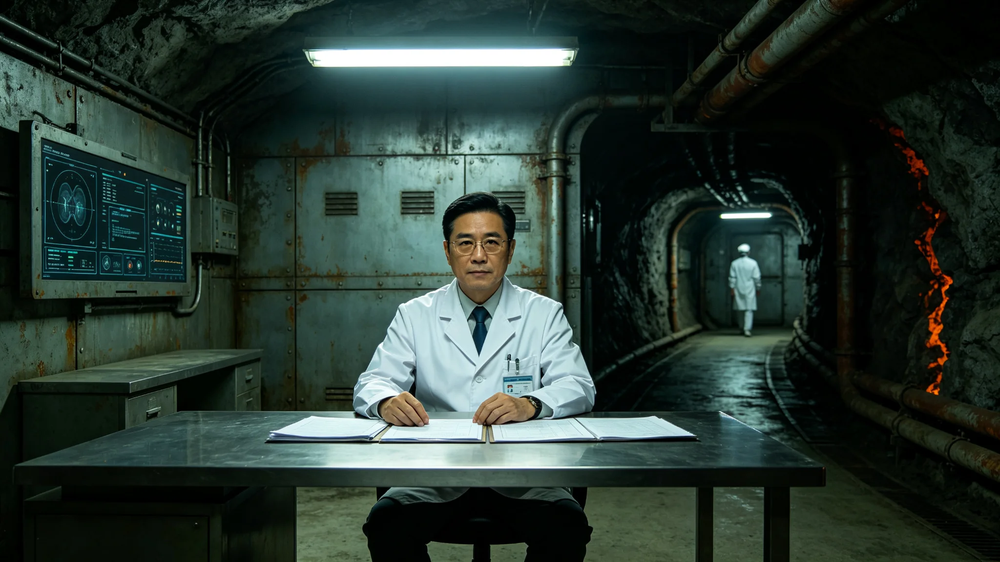

# 基因平准伦理委员会首任医学审查官顾鹤鸣考勤与临床事故通报

**档案所属**：三恒星系文明联合体医学学派议事会 · 伦理审查室
**案卷编号**：MED-GHM-0019
**立卷日期**：3280年10月2日
**密级**：人事内部

## 一、基本登记

| 项目 | 登记内容 |
|---|---|
| 姓名 | 顾鹤鸣 |
| 性别 | 男 |
| 出生 | 3212年7月，太阳系主带三号轨道城出生 |
| 入册 | 3236年，医学学派见习临床医师 |
| 现任 | 基因平准伦理委员会首任医学审查官 |
| 专业 | 老年医学与临床伦理 |
| 学派 | 医学学派 |

登记照附卷。拍摄于3280年9月30日，着白大褂，左胸绣"ETHICS-REVIEW"。面部有长期审查所致凝重，眉骨突出，眼神审慎。

## 二、考勤记录摘要（3277—3280）

| 年度 | 应出勤 | 实出勤 | 旷工 | 迟到 | 加班 | 备注 |
|---|---|---|---|---|---|---|
| 3277 | 248 | 248 | 0 | 1 | 47 | 不良反应事件审查 |
| 3278 | 248 | 247 | 0 | 2 | 78 | 伦理法修订准备 |
| 3279 | 248 | 248 | 0 | 0 | 112 | 伦理法执行 |
| 3280 | 270 | 268 | 0 | 3 | 149 | 截至立卷日 |

考勤系统注记：3277年肝纤维化不良反应事件（见GS-3277-01）后，顾鹤鸣主持41例受影响者的逐一审查，单月审查峰值 41 例，每例审查平均 3.2 小时。

## 三、临床事故与审查记录

本卷收录其审查的两起临床事故及一次处分。

**事故一（3277年5月）**：某扩大应用机构在未获伦理委员会批准下，将端粒修复干预用于一名68岁公民（低于三期试验年龄下限78岁）。顾鹤鸣审查后裁定：违反GS-3277-01整改措施中"70岁以下人群专项禁忌"，该机构暂停新受试者入组，68岁公民停药观察。机构申诉，伦理委员会维持顾鹤鸣裁定。

**事故二（3279年3月）**：某机构提交一项"设计后代性状"的基因平准审查申请。顾鹤鸣依GS-3279-01第七条裁定：禁止。该机构撤回申请。

**处分（3280年1月）**：顾鹤鸣在一次审查会上，因连日审查疲劳，对一位申请人说"你这个申请不用送了"。该申请人将发言录音并投诉。医学学派纪律处认定其言论违反《审查程序尊重原则》，记警告一次，扣减当季贡献工时折算额度二成，责令书面检讨。

检讨附卷，共三百九十八字。顾鹤鸣在检讨末尾写道："我审了四年别人的申请，却在最该讲程序的会上忘了怎么讲。"

## 四、签名与涂改

案卷末页为其历年审查意见书签名。3236年见习期签名拘谨；3277年起签名流畅；3280年10月2日立卷签名平稳，无涂改。

## 六、审查案件分类

| 案件类别 | 3277—3280累计 | 通过 | 拒绝 |
|---|---|---|---|
| 端粒修复扩大应用 | 412 | 387 | 25 |
| 体细胞重编扩大应用 | 387 | 341 | 46 |
| 70岁以下人群应用 | 87 | 0 | 87(全部拒绝) |
| 生殖系基因修饰 | 12 | 0 | 12(全部拒绝) |
| 后代性状设计 | 6 | 0 | 6(全部拒绝) |
| **合计** | **904** | **728** | **176** |

## 七、处分记录详情

3280年1月处分：

- 处分类型：警告一次；
- 扣减贡献工时折算额度：二成；
- 书面检讨：398字；
- 申诉：顾鹤鸣未申诉；
- 执行：已执行。

## 八、附则

本卷归档。顾鹤鸣后续审查案件另立，不并入本卷。

## 附录：顾鹤鸣审查意见典型样本

"申请将端粒修复用于68岁公民。依GS-3277-01整改措施，70岁以下人群为专项禁忌。本申请不符合禁忌豁免条件，拒绝。"此类拒绝在其审查中占19.5%。

## 补充说明

顾鹤鸣的审查生涯里，百分之十九点五的申请被他拒绝。其中最坚决的，是对七十岁以下人群应用寿命延长干预的全部拒绝，和对生殖系修饰、后代性状设计的全部拒绝。他的那一次处分，恰恰是因为他在疲劳中对一个申请人说了一句"不用送了"——这与他日常的审慎形成了刺眼的反差。他的检讨没有为自己辩解，他只是承认自己累了。一个掌握着"拒绝"权力的人，最危险的时刻不是他严厉，而是他疲倦。
## 审查官延伸
顾鹤鸣在临床事故通报后，未辞职，也未要求调离。他继续在审查官岗位上工作，只是把自己的审查量减半。医学学派接受了这一安排。他的事故记录在档案中仅占两行，但其检讨里那句”我累了”被伦理委员会收入《审查官手册》作为提醒。顾鹤鸣本人此后未再公开发表任何意见。他的沉默不是退缩，而是一个掌握拒绝权力的人，在承认自己疲惫之后，仍选择继续把这份权力用好。
## 审查官附注
顾鹤鸣在临床事故后未辞职，也未要求调离。他继续在审查官岗位上工作，只是把自己的审查量减半。医学学派接受了这一安排。他的事故记录在档案中仅占两行，但其检讨里那句我累了被伦理委员会收入审查官手册作为提醒。顾鹤鸣本人此后未再公开发表任何意见。他的沉默不是退缩，而是一个掌握拒绝权力的人，在承认自己疲惫之后，仍选择继续把这份权力用好。

## 归档附记

本卷自发布之日起，按三恒星系文明联合体档案管理条例归档。凡引用本卷者，须同时引用其交叉关联卷，不得割裂单卷单独引用。本卷所涉数据以发布日为准，后续修订另立新卷，不改本卷原文。各定居点委员会可应公民合理请求，公开本卷中非保密的执行数据。本卷解释权归编制机构，跨卷争议由法学派议事会仲裁。
## 审查官附注续
顾鹤鸣在事故后把审查量减半，继续工作。他的审查意见仍保持一贯的具体与严格。伦理委员会在次年的审查官复评中，将顾鹤鸣的工作列为合格。复评意见未公开，仅在其人事档案中归档。顾鹤鸣本人未对复评结果作任何回应。他的沉默不是退让，而是一个把疲惫转化为更审慎的审查节奏之后，不再需要用言语证明自己的人。

---

**归档编号**：MED-GHM-0019
**立卷**：伦理审查室
**日期**：3280年10月2日
