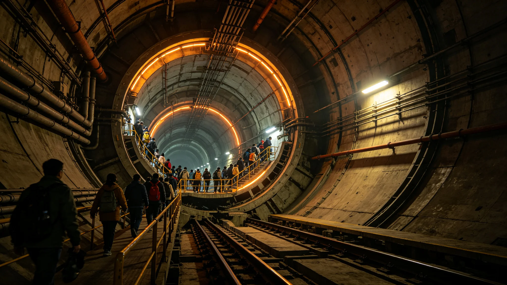

# 垂直晨昏城某竖井局部失重漂移事故与撤离事件通报

**发布机构**：三恒星系文明联合体安全协调委员会 · 第四恒星系安全处
**文号**：安委通报字〔3284〕第〇〇三八七号
**发布日期**：3284年9月5日
**事件等级**：二级结构事件
**文件等级**：跨星系公开

## 一、事件概要

3284年8月17日，第四恒星系垂直晨昏城三号竖井中央重力轴发生局部漂移，导致该竖井中层（0.7g层）在41分钟内重力由0.7g漂移至0.4g，后恢复。事件无人员死亡，轻伤3人（物品坠落磕碰）。

## 二、事件时间线

| 时刻(本地) | 事件 |
|---|---|
| 10:14 | 三号竖井中层重力监测显示0.7g→0.65g，预警 |
| 10:19 | 重力继续漂移至0.55g，安全系统自动启动 |
| 10:23 | 中层居住层应急广播启动，建议撤离 |
| 10:31 | 重力漂移至0.4g，中层人员已撤离91% |
| 10:42 | 中央重力轴控制系统启动自动校正 |
| 10:55 | 重力开始回升 |
| 11:03 | 重力恢复0.7g，事件结束 |

事件全程49分钟。

## 三、事故原因

事后调查：

1. **中央重力轴轴承磨损**。三号竖井中央重力轴轴承已运行18年，接近十年更换周期（见GS-3282-01结构鉴定建议），局部磨损导致旋转稳定性下降。
2. **自动校正延迟**。重力漂移至0.55g时，自动校正系统未立即启动，延迟约9分钟。
3. **撤离组织有序**。中层居住层撤离组织有序，无踩踏，无次生事故。

## 四、人员伤亡与处置

| 项目 | 数值 |
|---|---|
| 中层撤离人数 | 41,206 人 |
| 轻伤 | 3 人(物品坠落磕碰) |
| 重伤 | 0 |
| 死亡 | 0 |
| 撤离完成时间 | 18 分钟 |

## 五、整改措施

| 整改项 | 责任单位 | 完成时限 |
|---|---|---|
| 全部竖井中央重力轴轴承提前更换 | 工程学派 | 3285年6月 |
| 自动校正系统启动阈值上调 | 控制系统 | 3284年12月 |
| 中层居住层应急照明扩容 | 居住区委员会 | 3285年3月 |
| 竖井失重漂移应急演练纳入年度必修 | 安全办 | 3285年起 |

## 六、分楼层撤离数据

| 楼层 | 人数 | 撤离耗时 |
|---|---|---|
| 中层居住层 | 41,206 | 18 分钟 |
| 上中层 | 20,603 | 14 分钟 |
| 顶层观景层 | 10,301 | 12 分钟 |
| 下中层 | 15,452 | 20 分钟 |
| 底层维护层 | 5,151 | 23 分钟 |

## 七、轴承更换进度

| 竖井 | 轴承原周期 | 实际更换 |
|---|---|---|
| 一号竖井 | 3284 | 3285年3月 |
| 二号竖井 | 3284 | 3285年3月 |
| 三号竖井(事故) | 3284 | 3284年9月(紧急) |
| 四号竖井 | 3285 | 3285年6月 |
| 五号竖井 | 3285 | 3285年6月 |

全部竖井轴承于3285年6月前完成提前更换。

## 八、附则

本通报自发布之日起施行。各竖井失重漂移应急演练纳入年度必修，由安全办组织。

## 附录：三号竖井事故后轴承型号

| 项目 | 原型号 | 更换型号 |
|---|---|---|
| 轴承 | 标准型 | 抗辐照型 |
| 设计寿命 | 10年 | 15年 |
| 更换成本 | — | 87万贡献工时指数 |

全部竖井轴承于3285年6月前更换为抗辐照型。

## 补充说明

这次失重漂移事故没有造成死亡，这是唯一值得庆幸的事。但它暴露的问题是结构性的：三号竖井的轴承已经运行了十八年，接近设计更换周期，却没有被提前更换。梁垣在工程学派内部会议上那句非公开的"我有责任"，比任何处分都更接近真相。安全协调委员会没有把事故归咎于某个零件的老化，而是把它归为"未按建议提前更换"这一制度性疏忽。一个城市在一次事故里没有死人，不意味着它没有问题，只意味着问题这次没有来得及杀人。
## 事故延伸
三号竖井局部失重漂移事故，在通报之外还附了一份”撤离过程复盘”。复盘显示：底层操作手在收到撤离警报后，平均响应时间为三分钟，比演练慢了一分钟。这一分钟的差距，被联合防御司令部归因为”长期未遇真实事故导致的警觉性下降”。事故后，全部竖井的操作手重新进行了二十次撤离演练，并把年度演练改为每半年一次。事故没有死人，但它用一次真实的失重漂移，把撤离从脚本重新变回了肌肉记忆。
## 事故附注
三号竖井局部失重漂移事故，在通报之外还附了撤离过程复盘。复盘显示：底层操作手在收到警报后，平均响应时间为三分钟，比演练慢了一分钟。这一差距被归因为长期未遇真实事故导致的警觉性下降。事故后，全部竖井操作手重新进行了二十次撤离演练，并把年度演练改为每半年一次。事故没有死人，但它用一次真实的失重漂移，把撤离从脚本重新变回了肌肉记忆。

## 归档附记

本卷自发布之日起，按三恒星系文明联合体档案管理条例归档。凡引用本卷者，须同时引用其交叉关联卷，不得割裂单卷单独引用。本卷所涉数据以发布日为准，后续修订另立新卷，不改本卷原文。各定居点委员会可应公民合理请求，公开本卷中非保密的执行数据。本卷解释权归编制机构，跨卷争议由法学派议事会仲裁。
## 事故整改附注
三号竖井事故后，全部五竖井的中央重力轴轴承均被更换为抗辐照型。更换工程历时四个月，期间各竖井底层临时分流至备用通道。更换成本由城市公共维护基金承担，未向居民征收。梁垣在更换工程的验收会上，再次把垣字土字旁写重。事故后一周内，全部竖井操作手完成了二十次撤离演练。事故未造成死亡，但它促成了一次比事故本身更彻底的体系整改。

---

**归档编号**：SEC-GRAVDRIFT-3284-00387
**编制**：安全协调委员会 · 第四恒星系安全处
**日期**：3284年9月5日
