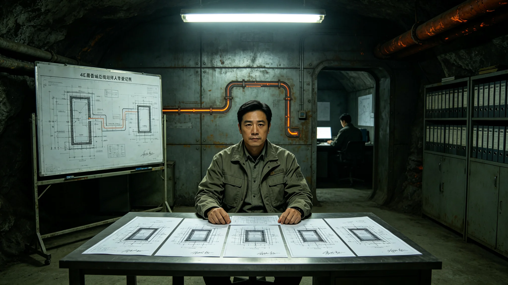

# 垂直晨昏城总规划师梁垣考勤与结构验收签名档案

**档案所属**：三恒星系文明联合体工程学派议事会 · 第四恒星系城市规划处
**案卷编号**：ENG-LY-0033
**立卷日期**：3287年5月30日
**密级**：人事内部

## 一、基本登记

| 项目 | 登记内容 |
|---|---|
| 姓名 | 梁垣 |
| 性别 | 男 |
| 出生 | 3208年3月，第四恒星系晨昏带城出生 |
| 入册 | 3234年，工程学派见习规划师 |
| 现任 | 垂直晨昏城总规划师 |
| 专业 | 城市结构与生态竖井规划 |
| 学派 | 工程学派 |

登记照附卷。拍摄于3287年5月28日，着深灰工装，立于其主持设计的垂直晨昏城结构蓝图前。面部有长期伏案所致颈纹，手指有蓝图墨水残留。

## 二、考勤记录摘要（3282—3287）

| 年度 | 应出勤 | 实出勤 | 旷工 | 迟到 | 加班 | 备注 |
|---|---|---|---|---|---|---|
| 3282 | 248 | 248 | 0 | 1 | 47 | 结构鉴定期 |
| 3283 | 248 | 247 | 0 | 2 | 63 | 垂直森林规划 |
| 3284 | 248 | 248 | 0 | 0 | 112 | 失重漂移事故后整改 |
| 3285 | 248 | 248 | 0 | 3 | 89 | 疏散演练规划 |
| 3286 | 248 | 248 | 0 | 1 | 102 | 密度法典修订 |
| 3287 | 150 | 148 | 0 | 2 | 78 | 截至立卷日 |

## 三、结构验收签名摘录

梁垣主持垂直晨昏城五竖井结构验收，每竖井验收意见书均有其签名。摘录三号竖井验收意见末段：

"三号竖井中央重力轴轴承磨损量在设计范围内，可继续运行。建议每十年更换轴承（已在GS-3282-01结构鉴定中记录）。本竖井验收通过。"

其签名在3282年验收时平稳；3284年事故后，签名中"垣"字土字旁加重笔。

## 四、事故与整改

本卷收录其主持整改的两起事件：

**事件一（3284年8月）**：三号竖井失重漂移事故（见GS-3284-01）。梁垣主持整改，将全部竖井中央重力轴轴承提前更换。整改于3285年6月完成。

**事件二（3285年10月）**：城市疏散演练暴露顶层撤离通道不足（见GS-3285-01）。梁垣主持顶层第三条撤离通道增设，于3286年3月完成。

## 五、处分与检讨

梁垣任职期间无处分记录。但其在3284年事故后，于工程学派内部会议上作过一次非公开检讨，承认"轴承未按建议提前更换，我有责任"。该检讨未记入人事处分档案，仅作会议纪要。

## 六、签名与涂改

案卷末页为其历年验收意见书签名。3234年见习期签名拘谨；3282年起签名流畅；3287年5月30日立卷签名平稳，无涂改。

## 七、主持规划项目清单

| 项目 | 年份 | 梁垣角色 |
|---|---|---|
| 垂直晨昏城五竖井总规划 | 3260 | 总规划师 |
| 生态竖井结构设计 | 3262 | 主设计 |
| 垂直森林种植规划 | 3278 | 规划审定 |
| 3284事故整改 | 3284 | 整改主持 |
| 疏散演练规划 | 3285 | 规划审定 |
| 密度法典修订配合 | 3286 | 技术顾问 |

## 八、签名时间线

| 年份 | 签名特征 |
|---|---|
| 3234(见习) | 拘谨 |
| 3260(总规划) | 流畅 |
| 3284(事故后) | "垣"字土字旁加重笔 |
| 3287(立卷) | 平稳 |

## 九、附则

本卷归档。梁垣后续规划工作另立，不并入本卷。

## 附录：梁垣主持图纸目录

| 图纸 | 完成年 |
|---|---|
| 五竖井总平面 | 3260 |
| 生态竖井剖面图 | 3262 |
| 垂直森林种植图 | 3278 |
| 事故整改图 | 3284 |
| 疏散演练图 | 3285 |

图纸存档于第四恒星系城市规划处档案室，可应安全协调委员会调阅。

## 补充说明

梁垣的档案里，最安静的细节是他在3284年事故后签名里"垣"字土字旁的那一笔加重。一个总规划师在自己参与设计的竖井出了事故之后，没有写一份冗长的检讨，只是在下次签名时把土字旁写重了一些。人事处没有记录这一变化，是整理档案的人注意到的。这种沉默的责任承担，比任何公开道歉都更符合一个工程师的伦理。梁垣不认为自己需要被原谅，他只是把全部五竖井轴承提前更换了。
## 规划师延伸
梁垣在结构验收签名档案中，留下了全部五竖井的签名记录。每一次签名都对应一次重大验收：竖井竣工、人工重力调试、垂直森林引种、事故整改、疏散演练。他的签名从早期的工整，逐渐变得简洁。在3284年事故后的整改验收签名里，他把”垣”字土字旁写重了一笔。这一细微变化被整理档案的人注意到，但梁垣本人从未提及。他的责任承担，不在公开声明里，在那一笔里。
## 规划师附注
梁垣在结构验收签名档案中，留下了全部五竖井的签名记录。每一次签名都对应一次重大验收：竖井竣工、人工重力调试、垂直森林引种、事故整改、疏散演练。他的签名从早期的工整，逐渐变得简洁。在事故后的整改验收签名里，他把垣字土字旁写重了一笔。这一细微变化被整理档案的人注意到，但梁垣本人从未提及。他的责任承担，不在公开声明里，在那一笔里。

## 归档附记

本卷自发布之日起，按三恒星系文明联合体档案管理条例归档。凡引用本卷者，须同时引用其交叉关联卷，不得割裂单卷单独引用。本卷所涉数据以发布日为准，后续修订另立新卷，不改本卷原文。各定居点委员会可应公民合理请求，公开本卷中非保密的执行数据。本卷解释权归编制机构，跨卷争议由法学派议事会仲裁。
## 规划师附注续
梁垣在五竖井结构验收全部完成后，申请卸任总规划师。他的申请被城市规划处接受。卸任时，他把全部五竖井的设计图原件移交档案室，只带走了自己的考勤卡。他未出席任何卸任仪式。梁垣此后未再参与任何城市规划工作，其档案在卸任满三年后转入不活跃状态。他的全部贡献，已固化在五竖井的结构里。

---

**归档编号**：ENG-LY-0033
**立卷**：第四恒星系城市规划处
**日期**：3287年5月30日
