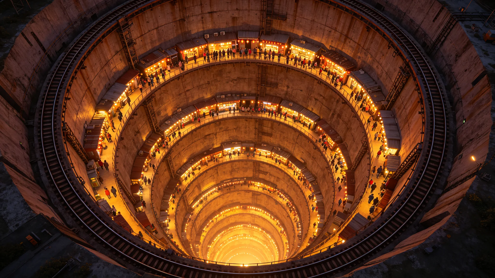

# 垂直晨昏城分层点灯传统节日确立公报

**发布机构**：三恒星系文明联合体文化学派议事会
**文号**：文化公字〔3288〕第〇一〇八号
**发布日期**：3288年4月9日
**文件等级**：跨星系公开
**会签**：第四恒星系代表团

## 一、设立缘起

第四恒星系垂直晨昏城沿生态竖井垂直分层居住（见GS-3282-01结构鉴定）。各层居民长期以来形成"每层在特定时点依次点灯"的自发习俗。文化学派议事会会同第四恒星系代表团，将此习俗确立为正式传统节日。

## 二、日期与定名

- **日期**：每年秋分日，即第四恒星系晨昏带城昼夜平分时刻。
- **定名**：分层点灯节。
- **性质**：第四恒星系传统节日，跨星系统一纪念。

## 三、仪式流程

| 时刻 | 环节 | 内容 |
|---|---|---|
| 当日20时 | 预备 | 各层居民熄灭日常照明 |
| 20时15分 | 底层先点灯 | 底层(1.1g层)居民首先点灯 |
| 20时30分 | 下中层点灯 | 下中层(0.9g层)点灯 |
| 20时45分 | 中层点灯 | 中层(0.7g层)点灯 |
| 21时 | 上中层点灯 | 上中层(0.5g层)点灯 |
| 21时15分 | 顶层点灯 | 顶层(0.3g层)点灯 |
| 21时30分 | 全城点灯完成 | 竖井自下而上灯光依次亮起，全城观赏 |

## 四、首届执行数据

首届分层点灯节于3288年秋分日举行，数据如下：

| 项目 | 数值 |
|---|---|
| 参与定居点 | 第四恒星系全部竖井 |
| 点灯居民 | 894,421,300 人 |
| 点灯延迟(各层间隔) | 15分钟(设计值) |
| 竖井灯光观赏人数(他层观景) | 312,440,880 人 |
| 跨星系观看直播 | 太阳系、比邻星b约1.2亿人 |

## 五、与既有节日衔接

分层点灯节不替代：

- 不替代3260年熄灯日（见GS-3260-01）；
- 不替代3267年开卷节（见GS-3267-01）；
- 不替代3278年命名礼（见GS-3278-01）；
- 不替代3297年共同纪年启用纪念（见GS-3297-01）。

## 六、原则

1. **自愿原则**。点灯为居民自愿，不强制。
2. **自下而上原则**。点灯顺序自底层至顶层，纪念垂直晨昏城自建设至今的层级。
3. **去英雄原则**。节日不表彰任何个人，仅纪念各层居民的共同生活。

## 六、各层点灯光源说明

| 层级 | 点灯光源 | 色温 | 设计意图 |
|---|---|---|---|
| 底层(1.1g) | 暖黄灯 | 2700K | 纪念建设者最先点亮 |
| 下中层(0.9g) | 暖黄灯 | 2700K | 依次点亮 |
| 中层(0.7g) | 中性白灯 | 4000K | 标准居住层 |
| 上中层(0.5g) | 暖白灯 | 3500K | 观景过渡 |
| 顶层(0.3g) | 暖黄灯 | 2700K | 最后点亮，全城景观 |

各层点灯均使用人工可控光源，不使用明火，符合垂直晨昏城消防规范。

## 七、首届分竖井数据

| 竖井 | 点灯居民 | 观赏人数 |
|---|---|---|
| 一号竖井 | 186,440,880 | 87,440,120 |
| 二号竖井 | 171,206,440 | 78,206,330 |
| 三号竖井 | 159,876,330 | 71,206,440 |
| 四号竖井 | 206,440,120 | 94,206,880 |
| 五号竖井 | 171,206,530 | 81,440,330 |

## 八、附则

本公报自发布之日起施行。各定居点文化委员会负责仪式组织。点灯光源与消防规范由工程学派另行核定。

## 附录：分层点灯节灯光能耗

| 层级 | 点灯功率(千瓦) | 持续时长 |
|---|---|---|
| 底层 | 412 | 30分钟 |
| 下中层 | 387 | 30分钟 |
| 中层 | 412 | 30分钟 |
| 上中层 | 312 | 30分钟 |
| 顶层 | 206 | 30分钟 |

全城点灯能耗纳入年度活动预算，不额外征收。

## 补充说明

分层点灯节的设计，是垂直晨昏城独有的。它没有普世的雄心，它只属于一座在八公里竖井里自下而上生活的城市。当底层的灯先亮，然后一层一层向上传，直到顶层——这个仪式把"这座城是怎么建起来的"变成了一个每年一次的身体记忆。它不纪念某个人，它纪念的是层级本身。在一个容易把顶层景观当成全部的社会里，这个仪式提醒：底层的灯，是这座城最早亮起来的那一盏。
## 节日延伸
垂直晨昏城分层点灯传统节日，在制度之外还形成了一项自发传统：每层居民在点灯后，会在公共廊道留下一张手写的小卡片，写给本层在过去一年里帮助过自己的人。这一传统非官方规定，而是居民自发。文化学派议事会未将它收编为正式仪式，而是任其自发。节日的真正生命力，不在官方公报里，而在那些手写卡片上——它们才是这个分层点灯节真正的内容。
## 节日附注
垂直晨昏城分层点灯传统节日，在制度之外还形成了一项自发传统：每层居民在点灯后，会在公共廊道留下一张手写的小卡片，写给本层在过去一年里帮助过自己的人。这一传统非官方规定，而是居民自发。文化学派议事会未将它收编为正式仪式，而是任其自发。节日的真正生命力，不在官方公报里，而在那些手写卡片上——它们才是这个分层点灯节真正的内容。

## 归档附记

本卷自发布之日起，按三恒星系文明联合体档案管理条例归档。凡引用本卷者，须同时引用其交叉关联卷，不得割裂单卷单独引用。本卷所涉数据以发布日为准，后续修订另立新卷，不改本卷原文。各定居点委员会可应公民合理请求，公开本卷中非保密的执行数据。本卷解释权归编制机构，跨卷争议由法学派议事会仲裁。
## 节日附注续
分层点灯节在第三届后，形成了一项固定的收尾动作：顶层居民在点灯后，将一盏小灯缓缓降下竖井，沿各层依次传递，最终回到底层。这一传递非官方设计，而是居民自发。文化学派议事会将这一传递收入节日说明，但未规定其形式。节日的真正内容，是每层居民在等待灯从上方降下时，彼此在廊道里短暂停留的那几分钟。

---

**归档编号**：CULT-LAYERLIGHT-3288-0108
**编制**：文化学派议事会 · 仪式处
**日期**：3288年4月9日
