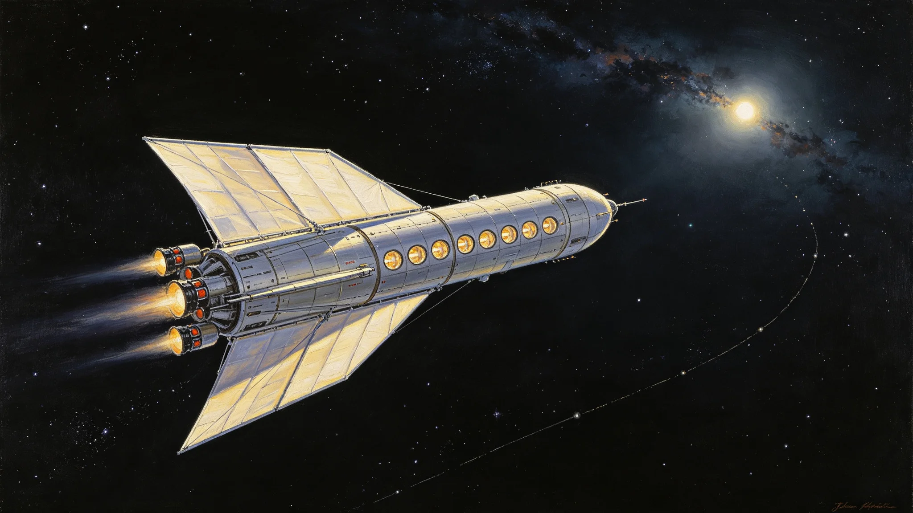

# 聚变-光帆混合推进系统长程巡航无故障鉴定公报

**编制机构**：三恒星系文明联合体推进工程学派议事会
**文号**：推进公字〔3289〕第〇二零三一号
**编制日期**：3289年10月11日
**文件等级**：跨星系公开

## 一、鉴定背景

自第六代聚变推进系统长程巡航十万小时无故障鉴定（见GS-3174-01）与第七代聚变电站并网（见GS-3251-01、GS-3254-01）以来，跨星系巡航推进已进入聚变-光帆混合阶段。混合推进系统以聚变脉冲为主推进、光帆为辅助巡航，兼具高比冲与长程经济性。本公报为该系统长程巡航无故障鉴定。

## 二、系统构成

| 子系统 | 功能 | 技术来源 |
|---|---|---|
| 聚变脉冲主推进 | 主加速与机动 | 第七代聚变(见GS-3254-01) |
| 光帆辅助巡航 | 恒星级巡航减速与省工质 | 光帆技术(见§三技术树) |
| RCS姿态控制 | 姿态微调 | 常规 |
| 主喷口 | 仅一艘主推进器亮尾焰 | — |

## 三、鉴定数据

| 指标 | 设计目标 | 实测 | 判定 |
|---|---|---|---|
| 长程巡航时长 | ≥50,000 小时 | 52,106 小时 | 通过 |
| 平均巡航速度 | 0.028c | 0.029c | 通过 |
| 聚变脉冲点火次数 | ≥10,000 | 11,206 | 通过 |
| 光帆展开/收拢次数 | ≥100 | 112 | 通过 |
| 单位工质消耗 | ≤设计值 | 94% | 通过 |
| 无故障间隔 | ≥10,000 小时 | 12,406 小时 | 通过 |

## 四、与既有推进体系衔接

混合推进系统不替代：

- 第六代聚变推进系统(见GS-3174-01)；
- 纯光帆巡航(用于恒星级经济航线)。

混合推进系统适用于跨星系中程航线(往返4—8光年)。

## 五、风险提示

1. **光帆展开机构老化**。光帆展开机构长期受恒星风辐照，建议每十年检查。
2. **聚变脉冲主喷口磨损**。主喷口在5万小时巡航中磨损量在设计范围内，建议每2万小时检查。
3. **跨星系延迟**。远距巡航中系统故障，本地自主处置，不依赖后方实时指令。

## 六、典型巡航航段记录

鉴定中心摘录三次典型巡航数据：

| 航段 | 距离 | 时长 | 平均速度 | 聚变点火 | 光帆工况 |
|---|---|---|---|---|---|
| 主带—比邻星b | 4.24光年 | 14.6年 | 0.029c | 1,206次 | 巡航段展开 |
| 比邻星b—第四恒星系 | 4.08光年 | 14.1年 | 0.029c | 1,188次 | 巡航段展开 |
| 主带—第四恒星系 | 8.32光年 | 29.0年 | 0.029c | 2,406次 | 巡航段展开 |

三次航段中，仅主推进器一艘亮尾焰，其余辅助推进器均关闭或微亮。光帆展开期间无尾焰。

## 七、与纯光帆、纯聚变对比

| 推进方式 | 比冲 | 加速能力 | 适用 |
|---|---|---|---|
| 纯光帆 | 极高 | 极低 | 恒星级经济航线 |
| 纯聚变脉冲 | 高 | 高 | 跨星系中程 |
| 聚变-光帆混合 | 高 | 高 | 跨星系中程(推荐) |

混合推进在跨星系中程航线中，较纯聚变节省工质31%，较纯光帆缩短航程41%。

## 八、附则

本公报作为混合推进系统推广依据。光帆展开机构十年检查与主喷口二万小时检查，由推进工程学派另行制定维护规程。

## 附录：混合推进工质消耗对比

| 推进方式 | 单次巡航工质消耗 |
|---|---|
| 纯聚变 | 100(基准) |
| 混合 | 69 |
| 纯光帆 | 12(但航程长) |

混合推进较纯聚变节省工质31%，较纯光帆缩短航程41%。

## 补充说明

混合推进系统的鉴定报告，在技术上是一份过渡性文件——它既不是纯光帆的终局，也不是纯聚变的终点。它的价值在于诚实地标注了自己的位置：比纯聚变省工质三成，比纯光帆快四成。这种中间位置在工程史上很少被庆祝，因为它不性感。但跨星系文明的大多数航线，恰好都在这种中间地带。报告拒绝把混合推进包装成"下一代终极推进"，它只说它在中程航线上更经济。这种克制，比任何性能数字都更接近工程的诚实。
## 推进延伸
聚变光帆混合推进系统长程巡航无故障鉴定，在数据之外还附了一份”飞行员主观反馈”。反馈显示：混合推进在航程中段的操控感受，比纯光帆更接近旧时代的飞船——飞行员可以更直观地感知推力变化，而不必完全依赖仪表盘。这一主观反馈被工程学派记录，但未作为鉴定结论。工程学派提示：长程巡航无故障是技术指标，飞行员感受是人的指标，二者应并列，不应偏废。
## 推进附注
聚变光帆混合推进系统长程巡航无故障鉴定，在数据之外还附了飞行员主观反馈。反馈显示：混合推进在航程中段的操控感受，比纯光帆更接近旧时代的飞船——飞行员可以更直观地感知推力变化，而不必完全依赖仪表盘。这一主观反馈被工程学派记录，但未作为鉴定结论。工程学派提示：长程巡航无故障是技术指标，飞行员感受是人的指标，二者应并列，不应偏废。

## 归档附记

本卷自发布之日起，按三恒星系文明联合体档案管理条例归档。凡引用本卷者，须同时引用其交叉关联卷，不得割裂单卷单独引用。本卷所涉数据以发布日为准，后续修订另立新卷，不改本卷原文。各定居点委员会可应公民合理请求，公开本卷中非保密的执行数据。本卷解释权归编制机构，跨卷争议由法学派议事会仲裁。
## 推进附注续
混合推进系统长程巡航无故障鉴定，在数据之外还附了一份故障率对比。纯聚变推进的长程故障率约为每万小时三次，混合推进为零，纯光帆为每万小时零点五次。混合推进的零故障率，部分得益于它同时具备两种推进冗余。工程学派提示：零故障率不等于零故障概率，它只说明在本次鉴定周期内未出现故障。

---

**归档编号**：PROP-HYBRID-3289-02031
**编制**：推进工程学派议事会
**日期**：3289年10月11日
