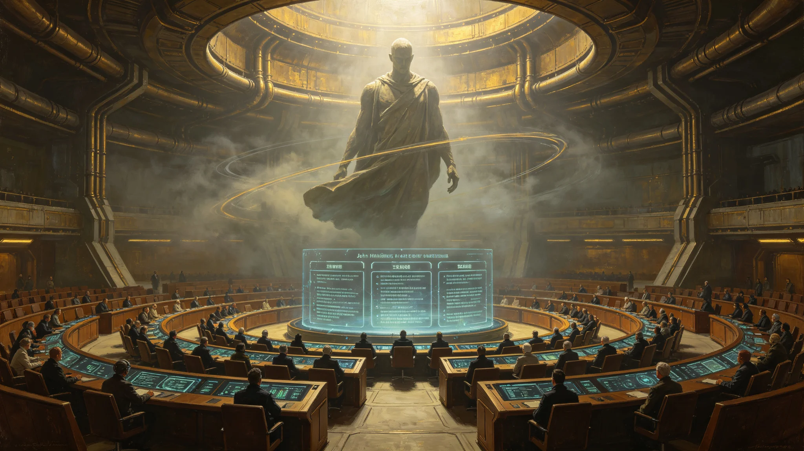

# 跨星系AI辅助决策与人类最终责任归属制度确立公报

**发布机构**：三恒星系文明联合体法学派议事会
**文号**：法学派公字〔3293〕第〇四一二号
**发布日期**：3293年9月1日
**文件等级**：跨星系公开
**会签**：医学学派议事会 · 联合防御司令部

## 一、背景

自第七代全自主工业母机（见GS-3275-01）与AI辅助决策系统在民事领域广泛应用以来，AI辅助决策已渗透至医疗诊断、法律裁判、公共服务等环节。军用分支已在3269年《自动化军用系统伦理审查》（见GS-3269-01）与3276年《AI辅助决策军事应用红线》（见GS-3276-01）中确立。民事分支尚缺统一制度。本公报据此确立民事领域AI辅助决策与人类最终责任归属制度。

## 二、制度要点

**第二条（人类最终责任原则）**

新增："在任何民事AI辅助决策场景中，最终决策权与责任永远归属于人类决策者。AI辅助决策系统仅提供建议，不替代人类决策。人类决策者有权且有义务审查AI建议，并对其最终决策承担责任。"

**第三条（可解释性）**

新增："民事AI辅助决策系统的建议须可解释、可复盘。人类决策者须能理解AI建议的依据，并能在决策记录中说明采纳或拒绝的理由。"

**第五条（人类审查义务）**

原条文：无。
新增："人类决策者在采纳AI建议前，须进行实质审查，不得'一键采纳'。对涉及人身、财产、重大权益的决策，人类审查义务加重。"

**第七条（责任链）**

新增："AI辅助决策错误造成损害的，责任归属如下：
1. 人类决策者未尽审查义务的，由人类决策者承担主要责任；
2. AI系统训练数据存在系统性缺陷的，由系统提供方承担相应责任；
3. 人类决策者已尽审查义务但未能发现AI错误的，由系统提供方承担主要责任。"

## 三、应用清单

| 场景 | AI辅助 | 人类最终责任 | 审查义务 |
|---|---|---|---|
| 医疗诊断 | 辅助建议 | 主治医师 | 加重 |
| 法律裁判 | 量刑参考 | 法官 | 加重 |
| 公共服务审批 | 材料预审 | 审批人 | 标准 |
| 教育认证 | 能力评估辅助 | 评审专家 | 标准 |

## 四、与既有制度衔接

- 本制度为民事分支，不替代3269年军用自动化伦理（见GS-3269-01）与3276年军用AI红线（见GS-3276-01）。
- 与3294年主审法官沈默闻审判笔录（见GS-3294-01）相衔接：其为本制度首案人事侧写。
- 与3298年AI辅助决策误诊致医疗纠纷首例（见GS-3298-01）相衔接：该事件为本制度首案实例。

## 六、分场景审查义务详表

| 场景 | 决策事项 | 人类审查义务 | 审查流程 |
|---|---|---|---|
| 医疗诊断 | 病情判断 | 加重：体格检查+辅助检查 | 主治医师实质审查 |
| 法律裁判 | 量刑 | 加重：证据复核 | 法官实质审查 |
| 公共服务审批 | 材料预审 | 标准：形式审查 | 审批人复核 |
| 教育认证 | 能力评估 | 标准：同行评审 | 段四专家评审 |
| 居住权分配 | 配额审批 | 标准：形式审查 | 审批人复核 |

## 七、"一键采纳"禁令

新增条款："禁止任何AI辅助决策系统设'一键采纳'按钮。人类决策者须逐项审查AI建议，并在决策记录中说明采纳或拒绝理由。"

本禁令自3293年10月1日起执行。3298年AI误诊首例(见GS-3298-01)验证本禁令必要。

## 八、附则

本公报自发布之日起施行。各定居点旧有AI辅助决策使用细则，凡与本制度抵触者，一律修订。AI建议可解释性技术标准由工程学派另行制定。

## 附录：AI建议可解释性技术标准

| 标准 | 要求 |
|---|---|
| 决策依据可追溯 | 100% |
| 决策记录可导出 | 100% |
| 人类审查记录留存 | 100% |
| 一键采纳按钮 | 禁止 |

技术标准由工程学派另行制定，自3293年10月起执行。

## 补充说明

AI责任制度的核心，不是技术条款，而是那一句"人类最终责任永远归属人类"。这句话在3293年听上去像是一个常识，但在一个AI已经渗透到医疗、裁判、公共服务每一个决策点的时代，它是一个必须被反复写进条文的常识。制度的危险不在于AI会犯错——AI一定会犯错——而在于人类会逐渐习惯把责任推给AI。这份制度用"一键采纳禁止"和"人类审查义务加重"两个具体条款，把"人不能把自己的判断外包给机器"这件事，变成了一个可执行的流程。
## 责任延伸
跨星系AI辅助决策与人类最终责任归属制度，在条文之外还确立了一项技术标准：任何AI辅助决策系统，必须为每一条建议生成可导出的决策依据记录，且记录须在系统中保留至少二十年。这一标准使”人类最终责任”从一个抽象原则，变成了一个可审计的流程。若某一决策在二十年后被质疑，责任审查者可以调阅当时的AI建议依据、人类审查记录、人类最终决定，三段缺一不可。
## 责任附注
跨星系AI辅助决策与人类最终责任归属制度，在条文之外还确立了一项技术标准：任何AI辅助决策系统，必须为每一条建议生成可导出的决策依据记录，且记录须在系统中保留至少二十年。这一标准使人类最终责任从一个抽象原则，变成了一个可审计的流程。若某一决策在二十年后被质疑，责任审查者可以调阅当时的AI建议依据、人类审查记录、人类最终决定，三段缺一不可。

## 归档附记

本卷自发布之日起，按三恒星系文明联合体档案管理条例归档。凡引用本卷者，须同时引用其交叉关联卷，不得割裂单卷单独引用。本卷所涉数据以发布日为准，后续修订另立新卷，不改本卷原文。各定居点委员会可应公民合理请求，公开本卷中非保密的执行数据。本卷解释权归编制机构，跨卷争议由法学派议事会仲裁。

---

**归档编号**：LAW-AIRESPONSIBILITY-3293-0412
**编制**：法学派议事会 · 制度修订处
**日期**：3293年9月1日
