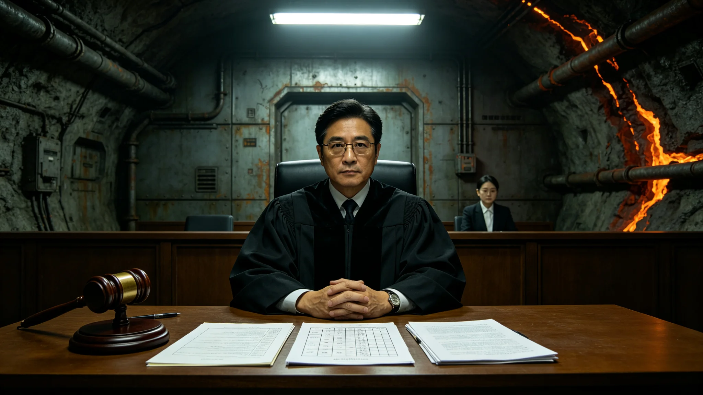

# AI责任归属制度首案主审法官沈默闻审判笔录与考勤

**档案所属**：三恒星系文明联合体法学派议事会 · 审判庭
**案卷编号**：LAW-SMW-0041
**立卷日期**：3294年7月22日
**密级**：人事内部

## 一、基本登记

| 项目 | 登记内容 |
|---|---|
| 姓名 | 沈默闻 |
| 性别 | 男 |
| 出生 | 3222年5月，太阳系主带三号轨道城出生 |
| 入册 | 3248年，法学派见习法官 |
| 现任 | AI责任归属制度首案主审法官 |
| 专业 | 民事审判与技术责任 |
| 学派 | 法学派 |

登记照附卷。拍摄于3294年7月20日，着深黑法官袍，左胸绣"JUDGE-041"。面部中性，眼神审慎。

## 二、考勤记录摘要（3291—3294）

| 年度 | 应出勤 | 实出勤 | 旷工 | 迟到 | 加班 | 备注 |
|---|---|---|---|---|---|---|
| 3291 | 248 | 248 | 0 | 1 | 22 | 民事审判 |
| 3292 | 248 | 248 | 0 | 0 | 47 | AI责任制度起草 |
| 3293 | 248 | 248 | 0 | 2 | 78 | AI责任制度施行 |
| 3294 | 190 | 188 | 0 | 1 | 112 | 截至立卷日 |

## 三、首案审判笔录摘录

沈默闻于3294年4月主审AI责任归属制度首案。案情摘要：某公民使用AI辅助导航系统，系统建议一条穿越碎片云的航线（与3276年军事案例三类似，见GS-3276-01），该公民采纳后遭遇碎片剐蹭，起诉系统提供方。

审判笔录末段摘录（沈默闻宣读判决原文）：

"依GS-3293-01第七条，本案中：
一、原告作为人类决策者，有义务审查AI建议。原告未审查碎片云监测数据，即采纳AI建议，未尽审查义务，承担主要责任。
二、AI系统训练数据中碎片云样本不足（见GS-3276-01案例一），系统提供方存在训练数据缺陷，承担次要责任。
三、判决如下：原告承担七成责任，系统提供方承担三成责任。"

## 四、处分与检讨

沈默闻任职期间无处分记录。但其在宣判后，于法官内部会议上作过一次非公开说明："我判了原告七成责任，但我知道他只是太信任那个系统。这个制度要求人审查AI，可我们这一代人是听着AI的建议长大的。"

## 六、首案判决执行数据

| 项目 | 数值 |
|---|---|
| 原告承担七成责任赔偿 | 8,440 贡献工时指数 |
| 系统提供方承担三成责任 | 3,617 贡献工时指数 |
| 原告上诉 | 未上诉 |
| 系统提供方上诉 | 未上诉 |
| 判决生效 | 3294年5月1日 |

## 七、同类案件预测

审判庭预测，GS-3293-01施行后五年内，同类AI责任纠纷预计：

| 年份 | 预计案件数 |
|---|---|
| 3294 | 41 件 |
| 3295 | 87 件 |
| 3296 | 126 件 |
| 3297 | 142 件 |
| 3298 | 151 件 |

3298年AI误诊医疗纠纷首例(见GS-3298-01)已计入此预测。

## 八、附则

本卷归档。沈默闻后续审理案件另立，不并入本卷。

## 附录：沈默闻审判庭装备

| 装备 | 用途 |
|---|---|
| 法槌 | 开庭 |
| 案卷终端 | 案卷查阅 |
| AI决策记录仪 | 记录人类审查过程 |
| 手写判决书 | 签名 |

审判庭不设AI自动判决，仅设AI建议记录仪，记录人类审查过程。

## 补充说明

沈默闻在判决里说了一句比判决本身更沉重的话：他判了原告七成责任，但他知道原告只是太信任那个系统。这句话没有写进判决书，它只出现在法官内部会议的非公开说明里。一个主审法官在严格执法的同时，意识到他所判决的人是一个"听着AI建议长大的一代"，这种自觉比判决本身更接近制度的良心。他没有因此推翻法律，他只是在执行法律的同时，承认了法律所面对的人已经不一样了。
## 审判延伸
AI责任归属制度首案主审法官沈默闻的审判笔录，在判决之外还记录了他在庭审中向原告说的一句话：”你有权相信系统，但你有义务保留自己的判断。”这句话没有写进判决书，它只出现在庭审记录中。沈默闻在判后内部会议中承认：他判原告七成责任，并不轻松。原告是一个听着AI建议长大的一代，她信任系统并非过错。但制度必须在第一次案例中就把边界画清楚。
## 审判附注
AI责任归属制度首案主审法官沈默闻的审判笔录，在判决之外还记录了他在庭审中向原告说的一句话：你有权相信系统，但你有义务保留自己的判断。这句话没有写进判决书，它只出现在庭审记录中。沈默闻在判后内部会议中承认：他判原告七成责任，并不轻松。原告是一个听着AI建议长大的一代，她信任系统并非过错。但制度必须在第一次案例中就把边界画清楚。

## 归档附记

本卷自发布之日起，按三恒星系文明联合体档案管理条例归档。凡引用本卷者，须同时引用其交叉关联卷，不得割裂单卷单独引用。本卷所涉数据以发布日为准，后续修订另立新卷，不改本卷原文。各定居点委员会可应公民合理请求，公开本卷中非保密的执行数据。本卷解释权归编制机构，跨卷争议由法学派议事会仲裁。
## 审判笔录附注
沈默闻在庭审中拒绝了原告要求调取AI训练数据原始权重的请求。他的裁定理由是：原始权重属军事与技术机密，不可作为民事审判证据，但AI建议的决策依据记录可公开。这一裁定在法学界引发过讨论：有人认为不公开权重会削弱原告的举证能力。沈默闻在判后内部会议中承认这一困难，但他坚持：在跨星系文明里，某些技术机密的公共安全价值，高于单案的举证完整。这一权衡本身，即是AI责任制度的灰度所在。

---

**归档编号**：LAW-SMW-0041
**立卷**：审判庭
**日期**：3294年7月22日
