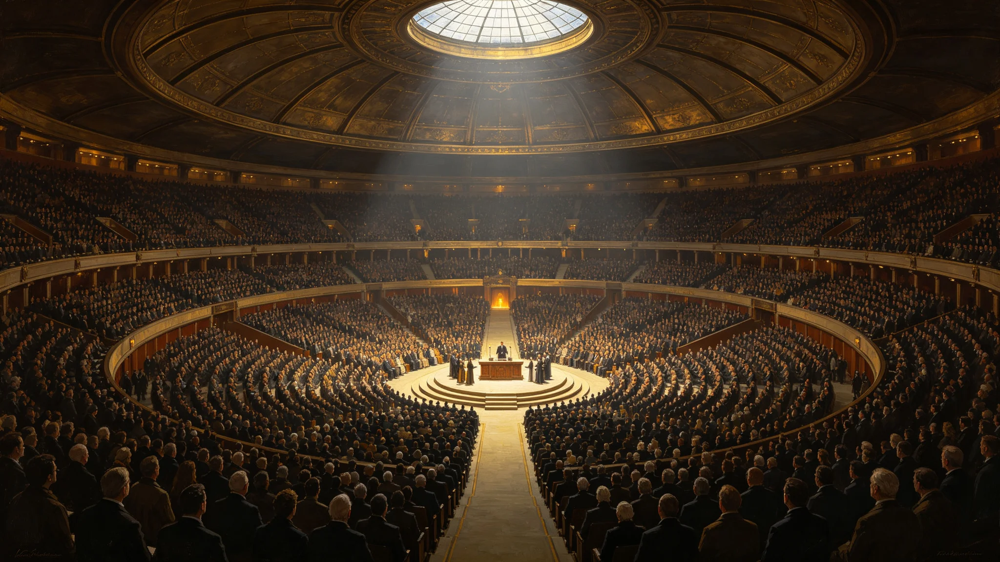

# AI与人类共治时代共同纪年启用与跨年纪念仪式公报

**发布机构**：三恒星系文明联合体文化学派议事会
**文号**：文化公字〔3297〕第〇二一六号
**发布日期**：3297年11月30日
**文件等级**：跨星系公开
**会签**：法学派议事会 · 各学派议事会

## 一、背景

自3293年《跨星系AI辅助决策与人类最终责任归属制度》确立（见GS-3293-01）以来，AI辅助决策已与人类决策在民事各领域并行。文化学派议事会会同各学派，提议自3298年1月1日起启用"共同纪年"，以纪念AI与人类共治时代的正式开端。

## 二、共同纪年说明

- **启用日**：3298年1月1日。
- **纪年方式**：仍以公元年为序，3298年为共同纪元元年。即"共同纪元元年"等于公元3298年。
- **说明**：共同纪年不改写既往纪年，仅自3298年起新增纪元称谓。既往正典编号GS-YYYY-01不变。

## 三、跨年纪念仪式流程

| 时刻(3297年12月31日) | 环节 | 内容 |
|---|---|---|
| 23时 | 预备 | 各定居点跨年广场亮灯 |
| 23时30分 | 倒计时 | 各定居点广播宣读自3251年能源无偿化以来大事记 |
| 23时59分 | 熄灯 | 与3260年熄灯日（见GS-3260-01）同式，熄灭日常照明一分钟 |
| 0时整(3298年1月1日) | 点灯 | 共同纪元元年开始，各定居点点灯 |
| 0时15分 | 公共朗读 | 各定居点朗读GS-3293-01第二条"人类最终责任原则" |
| 0时30分 | 结束 | 不组织官员讲话 |

## 四、原则

1. **人类最终责任原则**。共同纪元不意味着AI与人共治平等，而是人类在保留最终责任前提下，与AI辅助决策共同运作。
2. **自愿参与原则**。跨年仪式为公民自愿。
3. **非庆祝原则**。本仪式不庆祝"AI时代到来"，而纪念人类在保留最终责任前提下进入与AI辅助决策共同运作的新阶段。

## 五、与既有纪念日衔接

共同纪年启用不替代：

- 不替代3260年熄灯日（见GS-3260-01）；
- 不替代3267年开卷节（见GS-3267-01）；
- 不替代3278年命名礼（见GS-3278-01）；
- 不替代3288年分层点灯节（见GS-3288-01）。

## 六、纪年换算说明

共同纪年启用后，历法换算如下：

| 表述 | 对应 |
|---|---|
| 共同纪元元年 | 公元3298年 |
| 共同纪元二年 | 公元3299年 |
| 共同纪元三年 | 公元3300年 |
| 既往文书纪年 | 仍用公元年，不改写 |
| 正典编号GS-YYYY-01 | 仍用公元年 |

共同纪年为新增称谓，不替代公元年，不改写既往正典编号。

## 七、首届跨年执行数据

| 项目 | 数值 |
|---|---|
| 参与定居点 | 全部 |
| 跨年广场参与人数 | 1,206,771,330 人 |
| 自愿熄灯一分钟 | 79.4% |
| 公共朗读参与率 | 88.2% |
| 跨星系直播观看 | 约2.4亿人 |

## 八、附则

本公报自发布之日起施行。各定居点文化委员会负责仪式组织。共同纪年称谓在公文、教学、纪念仪式中逐步推广，既往文书不改写。

## 附录：共同纪年公文使用过渡

| 公文类型 | 3298年 | 3300年 |
|---|---|---|
| 历法日期 | 公元年为主 | 公元年为主 |
| 纪念仪式 | 可加"共同纪元元年" | 可加 |
| 正典编号 | 不改 | 不改 |
| 教学教材 | 逐年推广 | 推广 |

共同纪年为新增称谓，不改写既往。

## 补充说明

共同纪年的启用，在历法上几乎没有实际变化——公元年继续，正典编号不改。它只是在纪念仪式里多了一个称谓。但这个称谓的意义在于：它标志着人类第一次在制度文本里承认，AI已经成为决策的一部分，而人类在保留最终责任的前提下，与它共同运作。这不是一个庆祝AI胜利的仪式，它是一个承认"我们已经不一样了"的仪式。熄灯一刻、公共朗读人类最终责任原则，这些设计都在提醒：共同不等于平等，共治不等于放权。
## 纪年延伸
AI与人类共治时代共同纪年启用，在制度之外还形成了一项文化变化：公文与教学中逐渐出现”共同元年”这一新称谓。这一称谓不改写既往，不替换公元年，仅在纪念仪式与新公文的开篇并列使用。文化学派议事会提示：共同纪年的意义不在历法，而在它承认了一个事实——人类在保留最终责任的前提下，已经与AI共同决策。这不是平等，而是共治；不是放权，而是共担。
## 纪年附注
AI与人类共治时代共同纪年启用，在制度之外还形成了一项文化变化：公文与教学中逐渐出现共同元年这一新称谓。这一称谓不改写既往，不替换公元年，仅在纪念仪式与新公文的开篇并列使用。文化学派议事会提示：共同纪年的意义不在历法，而在它承认了一个事实——人类在保留最终责任的前提下，已经与AI共同决策。这不是平等，而是共治；不是放权，而是共担。

## 归档附记

本卷自发布之日起，按三恒星系文明联合体档案管理条例归档。凡引用本卷者，须同时引用其交叉关联卷，不得割裂单卷单独引用。本卷所涉数据以发布日为准，后续修订另立新卷，不改本卷原文。各定居点委员会可应公民合理请求，公开本卷中非保密的执行数据。本卷解释权归编制机构，跨卷争议由法学派议事会仲裁。
## 纪年附注续
共同纪年启用后的首个跨年纪念仪式，在三恒星系同时举行。仪式的核心动作是熄灯一刻与公共朗读人类最终责任原则。仪式不设焰火，不设颁奖。文化学派议事会在仪式后统计：约七成公民参与了熄灯一刻。议事会未追求更高参与率，它认为共同纪年的意义不在参与人数，而在它被正式写进公文的那一刻。

---

**归档编号**：CULT-COMMONERA-3297-0216
**编制**：文化学派议事会 · 仪式处
**日期**：3297年11月30日
