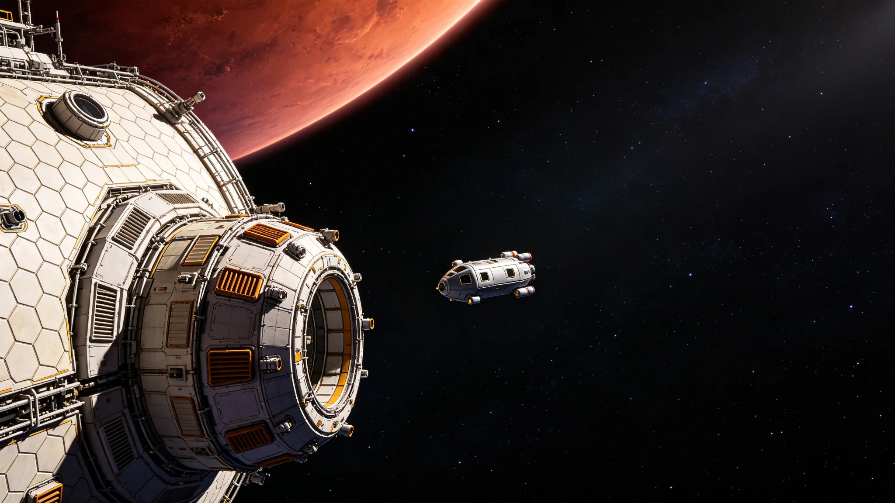

# 第五恒星系原生生物圈初步普查与四级隔离分级公报

**发布机构**：联合体跨星系接触事务局 · 生物安全联合工作组
**发布日期**：3302年6月30日
**文件等级**：接触期内部，跨星系公开摘要版

## 一、普查背景

"闻笛号"先遣中继舱于3301年内完成第五恒星系方向轨道进入（见GS-3304-01）。自3302年1月起，随队无人探测器对该恒星系内一颗位于宜居带外侧、大气含氧的类地行星开展为期半年的不接触式普查。本公报为普查阶段生物安全结论，所有采样均在轨道加压舱内完成，探测器未释放任何非密封载荷至行星表面。

## 二、普查方法与平台

| 项目 | 配置 |
|---|---|
| 轨道观测平台 | 闻笛号尾部加压观测舱，三级密封 |
| 无人释放器 | 3台一次性进入探测器，穿透大气后即焚毁，不回收 |
| 数据通道 | 光帆脉冲通信，单趟往返时延4.2—5.1小时 |
| 生物安全等级 | 按四级隔离（BSL-4口径）预设，全程无活体样本带回 |

进入探测器通过大气时采集悬浮颗粒与低空气溶胶，光谱与质谱数据实时回传；不做表面着陆，不释放机械臂，不与地面任何物体接触。此为联合体《跨星系接触生物安全规程》对"未确认生物圈"的标准动作，与第四恒星系地下卤水原生微生物隔离（见GS-3107-01）同一规程。

## 三、初步普查结果

**（一）大气与光谱**

行星大气以氮、氧为主，二氧化碳分压偏低；平流层存在持续的季节性吸收带，光谱特征与地球早期生物圈的叶绿素吸收带相似但不重合——吸收峰略向短波偏移。工作组判读：该行星存在某种进行光合作用的原生生命，但色素体系与地球植物不同。

**（二）气溶胶颗粒**

悬浮颗粒中检出含碳有机聚集体，粒径0.2—2微米，在昼夜温度循环下出现规律性丰度涨落。工作组无法排除为生命代谢产物，但同样无法排除非生物有机合成。结论：**疑似生物圈，未证实**。

**（三）光谱生命指征甄别**

详细的光谱模型与误报分析见GS-3304-01。本工作组仅就生物安全部分结论：在"疑似"与"证实"之间，必须按**证实**的最高隔离等级处置，不得按"疑似"降级。

## 四、四级隔离分级决定

| 级别 | 适用情形 | 本行星定级 |
|---|---|---|
| 一级 | 无生物圈迹象 | 否 |
| 二级 | 疑似但无光谱生命指征 | 否 |
| 三级 | 确认存在原生微生物，无宏观生命 | 暂不定 |
| 四级 | 确认存在宏观或复杂生物圈，或不能排除 | **暂定四级** |

决定：在轨道探测器未完成第二轮复核前，将该行星及近行星空间暂列为**四级隔离区**。一切释放、着陆、采样载荷活动冻结；先遣队与后续人员不得携带任何行星大气成分返回联合体其他恒星系；闻笛号返航时须在第五恒星系方向中继站完成全程密封消毒，不直接返回三恒星系母港。

## 五、对接触日程的影响

1. 接触事务局原拟3303年启动的"初步贸易准入"程序（见GS-3307-01）中，涉及行星表面人员往来的条款暂缓，仅保留轨道层面非接触信号接触。
2. 跨星系迁徙（见GS-3310-01）向第五恒星系方向的配额暂不开放，已报名人员转入候补。
3. 生物安全联合工作组向接触事务局提交第二轮探测器方案，预算与发射窗口另报。
4. 本决定不预设该行星是否"宜居"——隔离等级是工程动作，不是价值判断。

## 六、遗留与待复核

- 第二轮探测器拟增加长期驻留轨道观测，连续观测两个行星季节，以判定光合吸收带是否随季节迁移。
- "色素体系与地球不同"这一观察点，已移交文明多样性保护工作组备案（见GS-3317-01）：若确为独立生命起源，其文化与认知形态可能与联合体既有文明全然不同，接触节奏须相应放慢。
- 本公报为接触期内部结论，跨星系公开摘要版删除了轨道坐标与大气参数细节。

## 五、隔离成本与年度预算

| 项目 | 金额（星元） |
|---|---|
| 闻笛号轨道观测舱运维 | 180万 |
| 无人进入探测器（3具）制造与发射 | 95万 |
| 中继站密封消毒耗材 | 32万 |
| 生物安全联合工作组人员经费 | 64万 |
| 年度合计 | 371万 |

隔离成本由联合体深空接触专项预算列支，不向三恒星系居民分摊。生物安全工作组说明：四级隔离不是"拒绝接触"，而是"在弄清楚对方是什么之前，先把门关好"。门内的灯可以亮，门外的鞋不进门。工作组同时指出：若第二轮探测器证实无独立生命指征，隔离等级可降为三级，预算相应缩减；若证实存在复杂生物圈，则升格为永久隔离区，预算另列。

## 六、遗留争议

部分跨星系议会议员质疑"四级隔离"过于保守，主张"先接触再观察"。工作组答复：历史上第四恒星系拓荒（见GS-3107-01）因无独立生物圈，未遭遇此问题；第五恒星系方向疑似独立起源，"先接触再观察"的代价可能是不可逆的。工作组拒绝降级，但同意每两年公开一次隔离运行数据，接受议会监督。

---

**编制**：生物安全联合工作组
**会签**：跨星系接触事务局、联合体生态学派咨询组
**日期**：3302年6月30日
