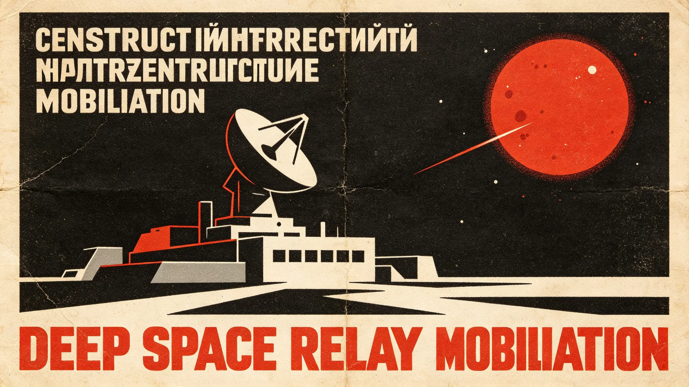

# 第五恒星系接触与准入暂行条例施行公报

**发布机构**：联合体跨星系接触事务局 · 立法协调处
**发布日期**：3303年3月1日
**施行日期**：3303年3月1日
**文件等级**：跨星系公开

## 一、立法背景

闻笛号先遣中继舱已完成第五恒星系方向轨道进入（见GS-3304-01），该星系一颗类地行星经初步普查暂定四级隔离（见GS-3302-01）。此前联合体对外接触仅有第四恒星系拓荒先例（见GS-3102-01临时自治条例、GS-3118-01矿产先勘先得仲裁管辖），而第四恒星系为人类先行抵达、无原生文明的星系；第五恒星系方向疑似存在独立生物圈，接触对象与情形均不相同。经立法协调处起草、跨星系议会特别委员会三读，制定本暂行条例，自即日起施行。

## 二、适用范围

本条例适用于：
1. 第五恒星系方向一切由联合体公民、法人、自治体发起的接触、探测、贸易、移民、科考活动；
2. 由该星系方向发出的任何信号、物体、人员进入联合体辖区；
3. 联合体内部因接触而产生的法律关系。

本条例为暂行，待第二轮生物复核与正式接触后修订为正式法。

## 三、接触分级程序

| 阶段 | 动作 | 审批 |
|---|---|---|
| 零级 | 不接触式轨道观测 | 接触事务局备案 |
| 一级 | 单向信号发出 | 双人复核，接触事务局批准 |
| 二级 | 信号往来、无人员接触 | 接触事务局+外交司联签 |
| 三级 | 密封载荷往返 | 生物安全工作组+联合体外事会联签 |
| 四级 | 人员面对面接触 | 跨星系议会特别委员会三分之二多数 |

任何公民、法人不得越级。顾承曙先遣队3299年推演中擅自发脉冲一事（见GS-3301-01处分记录）即为一级程序缺位的预演，本条例将"双人复核"明文化。

## 四、准入与冻结条款

1. **贸易准入**：轨道层面非接触货物交换可于一级程序后启动（见GS-3307-01），行星表面货物、活体、生物材料一律冻结，直至四级隔离解除。
2. **迁徙准入**：向第五恒星系方向的移民配额冻结；自该方向返回联合体辖区者，须在第五恒星系方向中继站完成全程密封隔离（见GS-3302-01），不得直飞母港。
3. **资源准入**：第五恒星系方向一切矿产、轨道资产、天体登记暂缓，不适用第四恒星系"先勘先得"规则（见GS-3118-01）——接触星系的天体权利归属须待接触级别升至三级后另定。
4. **文化准入**：不得以任何形式向疑似原生文明对象输出联合体文化符号、技术制品、宗教或意识形态；文化接触须待四级程序。

## 五、信号纪律

1. 接触首脉冲须由接触事务局双人复核，副领队与远程各执钥匙一半（见GS-3301-01）。
2. 信号内容限于标定脉冲与最小信息量问候，不得包含联合体星图、人口、军事部署。
3. 任何非授权信号（含个人手持发报设备）一律没收，发报人按《跨星系光通信管理条例》追责。
4. 收到该星系方向任何信号，24小时内由接触事务局统一甄别、统一回复，任何个人不得径自应答。

## 六、过渡安排与罚则

- 本条例施行前已向第五恒星系方向报名的考察、旅游、移民申请，转入候补队列，不退还登记费，按GS-3310-01新迁徙配额规则重排。
- 违反本条例者，按情节处以：警告、冻结接触资格、没收载荷、跨星系驱逐；造成生物安全事故的，按《跨星系检疫与生物安全法》从重。
- 本条例由接触事务局解释，每年3月1日向跨星系议会报告一次执行情况。

## 七、与既有法的衔接

本条例不替代《跨星系迁徙权扩展与自由迁徙法案》（见GS-3166-01）在其他星系的适用，仅对第五恒星系方向作出特别限制；不替代《跨星系资源争端仲裁管辖》（见GS-3118-01、GS-3324-01），仅冻结登记、不预先确权。

## 八、过渡期编制与预算

本条例施行后，接触事务局新增编制如下：

| 岗位 | 人数 | 职责 |
|---|---|---|
| 接触准入审核员 | 6 | 受理贸易、迁徙、资源登记申请 |
| 信号甄别员 | 4 | 双人复核首脉冲与来信 |
| 生物安全联络员 | 2 | 与生物安全工作组对接 |
| 法律咨询员 | 2 | 解释条例与跨星系法衔接 |

年度运行预算约420万星元，由联合体深空接触专项预算列支。过渡期暂定五年，期满评估是否转为正式法。

## 九、过渡申诉

被冻结登记或拒准入者，可在收到决定后30日内向接触事务局申诉委员会申请复核。申诉不停止执行。复核决定为接触事务局终局；涉及宪法权利者，可上诉至跨星系上诉庭。本条例不设"紧急通道"——接触期一切加急申请均不受理。

## 十、与历史拓荒条例的差异

第四恒星系拓荒（见GS-3102-01）为人类先抵、无原生文明，故采"先占先得"；本方向疑似独立生物圈与文明，故采"接触冻结"。立法协调处在三读答辩中强调："同样是去一个新地方，一个是我们去开荒，一个是我们去敲门。开荒可以先占，敲门不能先推。"此答辩被跨星系议会法律委员会引为本条例立法理由。

## 十一、过渡期评估节点

- 3304年：首轮无人探测数据评估。
- 3308年：接触级别是否升至三级。
- 3313年：五年过渡期中期评估。
- 3318年：过渡期届满，决定转正或延长。

---

**公布**：跨星系接触事务局立法协调处
**会签**：联合体外事会、生物安全联合工作组
**施行日期**：3303年3月1日
